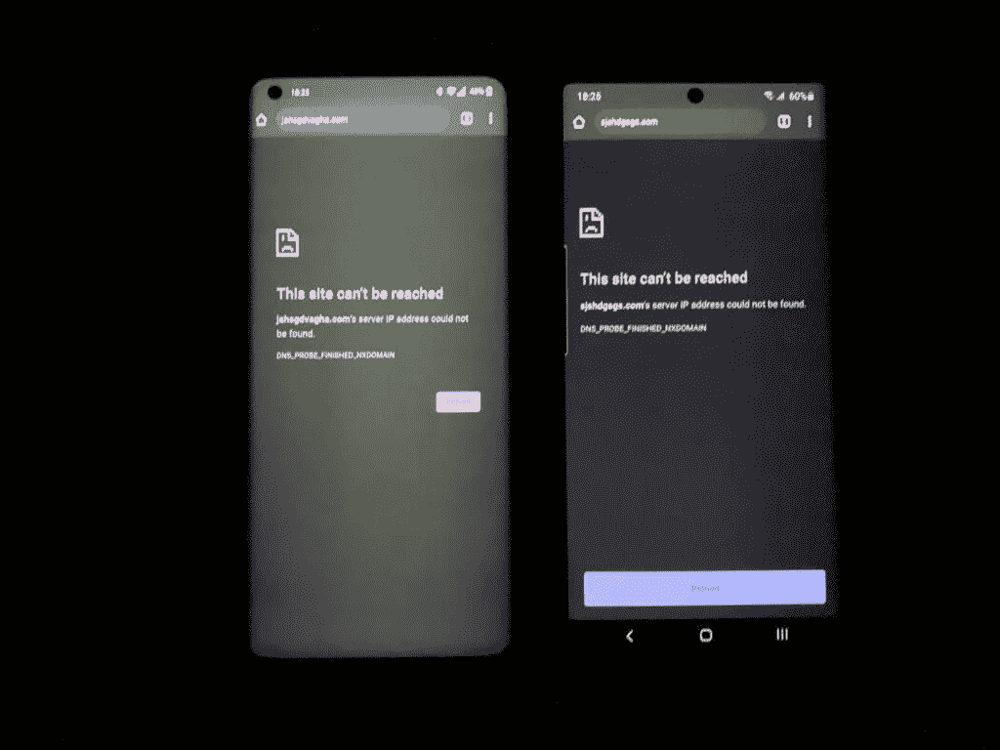
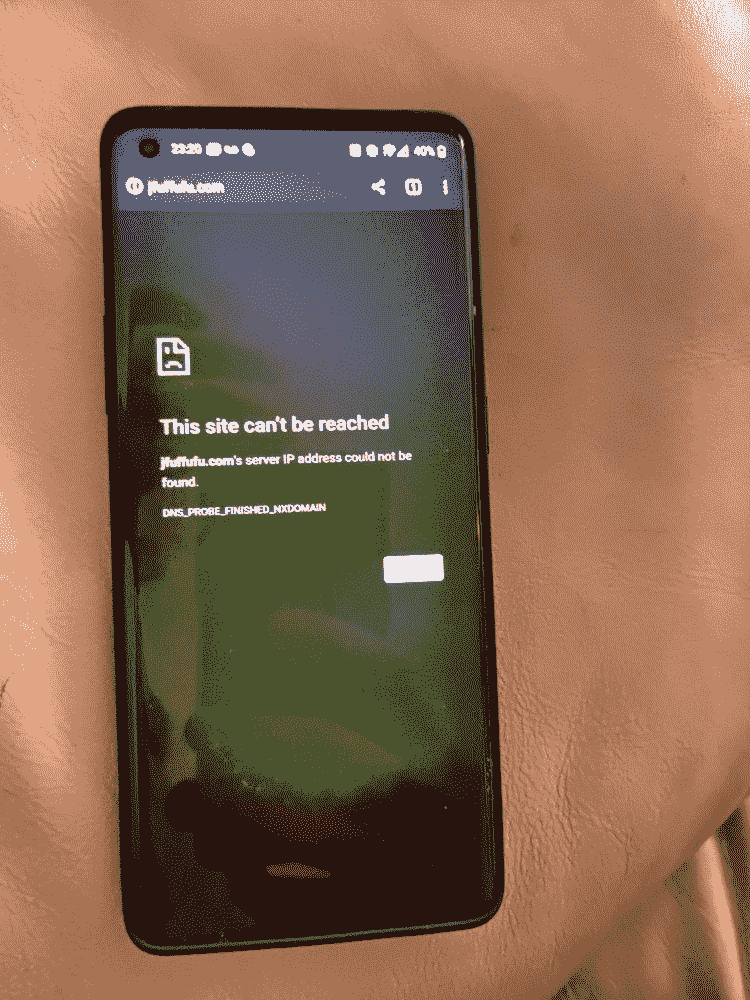

# 一加 8 Pro 遭遇绿屏、黑屏碾压问题；修理来了

> 原文：<https://www.xda-developers.com/oneplus-8-pro-green-screen-black-crush-issue-fix-update/>

一加 8 Pro 拥有一加手机有史以来最大的显示屏。6.78 英寸的 QHD+ Fluid AMOLED 显示屏不仅是 Android 智能手机上最清晰的显示屏之一，也是颜色最准确的显示屏之一。一加没有以任何方式阻止最大限度地发挥显示器的特性，使其感觉尽可能优质——它甚至在手机上添加了一个专用的 [Pixelworks Iris](https://www.xda-developers.com/pixelworks-iris-5-visual-processor-android-display-experience-oppo-find-x2/) 芯片，以提高显示器的输出，完整的封装使手机[获得了有史以来最高的 DisplayMate 评级](https://www.xda-developers.com/oneplus-8-memc-youtube-netflix-vlc/)。然而，实际上，据报道，一加 8 Pro 的显示屏面临着黑色挤压和绿色色调等问题，该公司将在即将到来的更新中解决这一问题。

**[一加 8 场论坛 XDA](https://forum.xda-developers.com/oneplus-8)| |[一加 8 场职业论坛 XDA](https://forum.xda-developers.com/oneplus-8-pro)**

关于一加 8 Pro 显示器色彩输出不一致和不统一的几份报告充斥了 [XDA 论坛](https://forum.xda-developers.com/oneplus-8-pro/how-to/terrible-screen-tint-uniformity-t4084539)、[一加社区](https://forums.oneplus.com/threads/green-screen-and-black-crush-issues.1215452/)和 [Reddit](https://www.reddit.com/r/oneplus/comments/g5kwgu/there_seems_to_be_major_issues_with_the_display/) 。用户主要抱怨两个问题——黑色挤压和绿色色调。黑色挤压指的是面板(通常是有机发光二极管)用像素化取代屏幕上的黑色，而绿色色调(有些不言自明)意味着在灰色或深色阴影上有一个绿色滤镜，尤其是在低亮度下。

黑色挤压和绿色色调是平庸显示器的标志，根本无法接受，尤其是在一加吹嘘最高的显示器基准评级并在手机上贴上 900 美元的价格标签之后。

 <picture></picture> 

Oneplus 8 Pro (left) vs Samsung Galaxy Note 10+ (right); Image by OnePlus Community user [WhateverSuitsU](https://forums.oneplus.com/members/whateversuitsu.1514115/)

根据大多数报道，只有在打开 [DC 调光](https://www.xda-developers.com/oneplus-dc-dimming-optional-feature-future-update/)功能后才能看到绿色，一加甚至承诺在未来的更新中解决这个问题。[三星 Galaxy S20 Ultra 也受到绿色问题的困扰](https://pocketnow.com/samsung-is-at-work-to-fix-the-green-tint-issue-on-galaxy-s20-ultras-display)，同样的问题也即将得到解决。由于一加也使用三星面板，我们可以预计一加 8 Pro 的修复将足以缓解这个问题。

然而，没有一个正式的回应；这是因为协作不良还是仅仅是三星制造的特定显示面板的属性，我们稍后会知道。

 <picture></picture> 

Image by OnePlus Community user [Tungmeister](https://forums.oneplus.com/members/tungmeister.1779340/)

在谈到绿色色调问题时，一加分享了以下声明:

一加重视用户反馈，并致力于提供最佳的智能手机体验。我们的团队目前正在调查这些报告，以确定对我们的用户最好的解决方案，我们将尽快发布更新。关于绿色色调，我们正在努力在下一个 OTA 中解决这个问题。

我们团队的 Dylan 在他的[一加 8 Pro 评测](https://www.xda-developers.com/oneplus-8-pro-review-never-settle-on-hardware/)中提到了显示问题，例如黑色渲染中的*退化、灰度一致性和均匀性*。这些问题中的一些也存在于旧手机中，如一加 7T T7，尽管没有那么严重。虽然旗舰杀手级的头衔可以让用户原谅一加未校准的显示屏，但我们不喜欢一部手机试图去掉头衔中的“杀手”属性，成为真正的旗舰。

顺便说一句，在一加 8 号(回顾版)上没有这些问题，似乎只有职业玩家才有。当我们了解到更多信息时，我们会在这篇文章中添加更多的细节。与此同时，迪伦也在对一加 8 Pro 进行全面的展示审查，所以你可以期待听到更多关于这些问题以及它们可能可以修复的程度。

* * *

**Via 1: [安卓警察](https://www.androidpolice.com/2020/04/23/some-oneplus-8-pro-pre-orders-have-screen-issues-but-fixes-are-coming/)，Via 2: [安卓中枢](https://www.androidcentral.com/some-oneplus-8-pro-users-are-reporting-green-tint-and-black-crush-issues)**