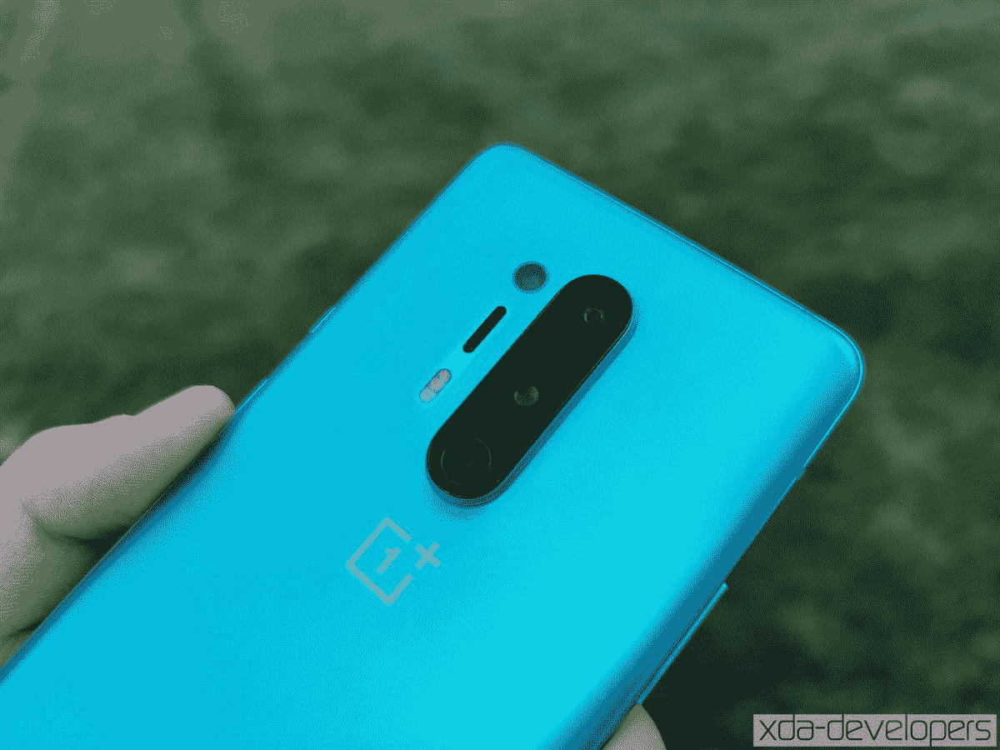

# 一加 8 和一加 8 专业版的最新更新带来了对一加芽的支持，等等

> 原文：<https://www.xda-developers.com/oneplus-8-pro-latest-update-support-for-oneplus-buds-july-2020-security-patches-more/>

# 一加 8 和一加 8 专业版的最新更新带来了对一加芽的支持，等等

最新的 OxygenOS 更新推出了一加 8 和一加 8 专业带来了对即将到来的一加芽的支持，等等。点击下载链接！

 <picture></picture> 

Mass Image Compressor Compressed this image. https://sourceforge.net/projects/icompress/ with Quality:95

**Update 1(****07/23/2020****@****02:12am****ET):**我们已经为全球变型的一加 8 和一加 8 Pro 添加了最新 OxygenOS 更新的下载链接。滚动到底部了解更多信息。下面保留了 2020 年 7 月 19 日发表的文章。

一加正准备在几天后推出一加诺德和 T2 一加巴德。但该公司没有忘记其当前一代旗舰产品。一加正在为一加 8 和一加 8 Pro 推出一系列新的 OxygenOS 更新，带来了最新的【2020 年 7 月安全补丁，以及对一加 Buds 的支持。

**[一加 8 场 XDA 论坛](https://forum.xda-developers.com/oneplus-8) || [一加 8 场亲 XDA 论坛](https://forum.xda-developers.com/oneplus-8-pro)**

该更新目前已在印度地区发现一加 8 专业版，但它也应该在其他地区和其他设备上发布。我们认为更新将尽快到来，因为它包含了对设备上 ARCore 故障的修复，考虑到[一加诺德将通过 AR 活动](https://www.xda-developers.com/oneplus-nord-launch-uly-21-ar-event/)推出，这将是非常需要的。

OxygenOS 的确切版本将因设备和地区而异，但基本的变更日志在所有设备和地区都应该是相同的，除了红色电缆俱乐部(目前为止仍为印度独有)和无线充电。以下是完整的变更日志:

### 变更日志

*   系统
    *   新改编的一加芽，更容易利用无线连接
    *   为您提供了多种时钟样式。可以自行定制。(进入设置>定制>时钟样式)
    *   优化了游戏模式下的触摸体验，增强了用户体验
    *   修正了无线充电器底座自动重启的问题
    *   修复了 ARCore 故障
    *   将 Android 安全补丁更新至 2020.07
    *   将 GMS 包更新至 2020.05
    *   提高系统稳定性
*   网络
    *   提高了 Wi-Fi 传输的性能和稳定性
    *   提高移动网络的连接稳定性，改善用户体验
*   架子
    *   新增红色有线俱乐部会员卡

## 为一加 8 和一加 8 专业版下载 OxygenOS

更新应该逐步推广到所有用户。但是如果您想下载更新，可以从以下链接下载:

### 一加 8

*   印度- 10.5.10
*   全球- 10.5.11

### 一加 8 专业版

*   欧洲- 10.5.11
*   印度-2012 年 5 月 10 日
*   全球- 10.5.12

* * *

*感谢 XDA 资深会员 [Some_Random_Username](https://forum.xda-developers.com/member.php?u=8234677) 的下载链接！*