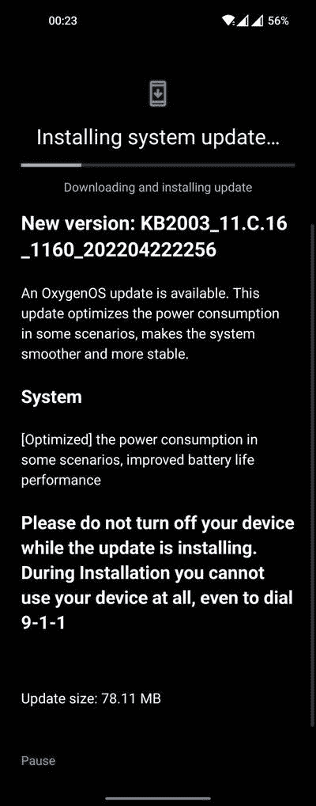

# 一加正在为一加 8 系列和 9R 推出另一个 OxygenOS 12 稳定更新

> 原文：<https://www.xda-developers.com/oneplus-8-series-9r-oxygenos-12-c-16-update/>

早在 3 月份，一加就向一加 8 家族和一加 9R 推出了首个基于 Android 12 的 OxygenOS 12 稳定版本。更新[最近以更新版本(C.15)的形式到达欧洲一加 8 变种](https://www.xda-developers.com/oneplus-8-series-oneplus-9r-oxygenos-12-march-2022-patches/)。然而，该软件似乎是不完整的，充满了错误和不一致，因为用户在安装 Android 12 更新后报告了一个[大范围](https://forums.oneplus.com/threads/oneplus-8-heating-and-battery-drain-very-fast-after-update-c-15.1573325/)[问题](https://forums.oneplus.com/threads/oneplus-8t-after-update.1559248/)。现在，一加为一加 9R 和一加 8 系列发布了全新的 OxygenOS 12，在之前的更新基础上增加了一些优化和错误修复。

 <picture></picture> 

Thanks to OnePlus Community member [G_Mr_....](https://forums.oneplus.com/members/g_mr_.912068/) for the screenshot!

根据一加社区论坛上的许多帖子，一加 8，8 Pro，8T 和一加 9R 的新 OxygenOS 12 稳定更新(内部版本号 **C.16** )已经开始在全球范围内逐步推出。更新带来了以下变化:

*   **系统**
    *   [优化]某些情况下的功耗，提高电池寿命性能

虽然变更日志相当简单，但我们希望有太多的变化来解决这些小故障。据报道，一些用户在安装此更新后面临安全网故障事件，但它在几次重启后自动解决。值得注意的是，底层的 Android 安全补丁级别仍然是 2022 年 3 月。

**XDA 论坛:[一加 8](https://forum.xda-developers.com/c/oneplus-8.10349/) || [一加 8 Pro](https://forum.xda-developers.com/c/oneplus-8-pro.10363/) || [一加 8T](https://forum.xda-developers.com/c/oneplus-8t.11579/) || [一加 9R](https://forum.xda-developers.com/f/oneplus-9r.12183/)**

* * *

## 下载:适用于一加 8 系列和一加 9R 的 OxygenOS 12 C.16

与所有 OxygenOS 更新一样，一加正在分阶段为一加 9R 和一加 8 系列推出最新的 OxygenOS 12 版本。这意味着新版本最初将交付给有限数量的用户，在接下来的几天里将有更广泛的推广。一旦该公司确认更新没有任何重大问题，它将被推送给更多的用户。

您可以等待您的设备在交错的卷展栏上被拾取，或者您可以使用下面提供的下载链接下载更新。当我们得到更多的下载链接时，我们将继续更新这篇文章。

*   **一加 8**
    *   全球(2015_11 年。C.16):
    *   欧洲(2013_11 年。C.16):
    *   印度(2011_11 年。C.16):
        *   完全 OTA
        *   从 C.15 开始递增
*   **一加 8 Pro**
    *   全球(2025_11 年。C.16):
    *   欧洲(2023_11 年。C.16):
    *   印度(2021_11 年。C.16):
        *   完全 OTA
        *   从 C.15 开始递增
*   **一加 8T**
    *   全球(KB2005_11。C.16):
    *   欧洲(KB2003_11。C.16):
    *   印度(KB2001_11。C.16):
        *   完全 OTA
        *   从 C.15 开始递增
*   一加 9R

*感谢 XDA 公认开发者 [mlgmxyysd](https://forum.xda-developers.com/m/mlgmxyysd.8430637/) 和 XDA 资深会员 [Some_Random_Username](https://forum.xda-developers.com/m/some_random_username.8234677/) 的下载链接！*

* * *

**来源:**一加社区论坛( [1](https://forums.oneplus.com/posts/24172164) 、 [2](https://forums.oneplus.com/posts/24172274) 、 [3](https://forums.oneplus.com/posts/24173630) )