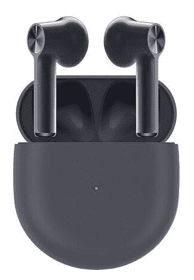

# 一加花蕾现在在美国有灰色的

> 原文：<https://www.xda-developers.com/oneplus-buds-gray-color-us/>

# 一加花蕾现在在美国有灰色的

一加耳塞是该公司第一对真正的无线耳塞，目前在美国上市，颜色为灰色。

当一加花蕾在美国推出时，它们只有光滑的白色。现在，一加已经开放了灰色版本的销售，为消费者在返校季提供了一个时尚、隐秘的选择。

灰色的一加芽配有一个匹配的外壳，并在铬触摸板周围有一个红色的口音，对细节的关注很好。虽然白色的一加 Buds 看起来有点像苹果的 AirPods，但灰色的版本是独一无二的。不过，美丽的诺德蓝颜色选项在美国并不可用。

上个月，我们评论了[一加 Buds，称赞了它们的声音、设计和实惠的价格。该耳塞还支持](https://www.xda-developers.com/oneplus-buds-review/)[谷歌最新的快速配对功能](https://www.xda-developers.com/fast-pair-location-tracking-battery-notifications-new-settings/)，这使得一加耳塞与安卓设备的配对变得快速而简单。

如果你决定选择灰色的一加花蕾，你就不必支付额外费用；这款无线耳塞售价仅为 79 美元。因此，一加耳塞比市场上更高端的无线耳塞更实惠，包括三星 Galaxy Buds Live 和苹果 AirPods Pro，但它们缺乏主动降噪和无线充电等功能。该应用程序还[只支持一加手机](https://play.google.com/store/apps/details?id=com.oneplus.twspods)，所以如果你将它们与另一家制造商的智能手机配对，你将无法更新固件或重新映射双击手势。如果你拥有或计划拥有一台一加设备，它们是一个很好的选择。

 <picture></picture> 

OnePlus Buds

##### 一加芽

使用一加的一副真正的无线耳塞，将自己从电线中解放出来。