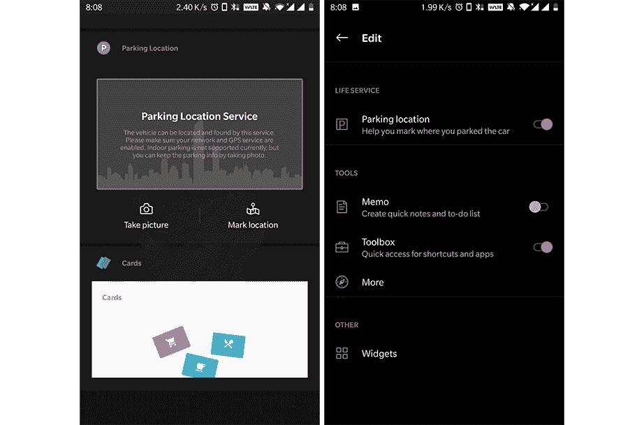

# 一加发射器更新添加了一个停车定位服务来找到你的车

> 原文：<https://www.xda-developers.com/oneplus-launcher-oxygenos-save-parking-location/>

一加的 OxygenOS 结合了传统 Android 的简单性和厚重用户界面的可定制性。虽然主屏幕上的大多数元素几乎都没有动过，但一加智能手机的默认启动器一加启动器通过 Shelf 带来了快捷方式。你可以通过在主屏幕上向右滑动来打开一加启动器上的 Shelf，它可以让你访问你最喜欢的联系人，最近和最常用的应用程序，以及其他以卡片形式组织的有用信息。对启动器的最新更新增加了另一个方便的快捷方式，这个可以帮助你记住你把车停在哪里。

为了以你的名义记住你的停车位，Shelf 需要访问你的 GPS 位置。由于该功能取决于你的一加智能手机的 GPS 定位，目前它仅限于户外停车点或 GPS 仍然可用的地方。然而，在室内或地下停车的情况下，你可以拍摄停车区域的图像来记住你的车辆的位置。

 <picture></picture> 

Screenshots courtesy of OnePlus Community member [Suresh07](https://forums.oneplus.com/members/suresh07.913793/)

该功能是随版本推出的。3.3.2 一加发射器。根据用户在[一加论坛](https://forums.oneplus.com/threads/new-oneplus-launcher-v-3-3-2.1016321/#post-20103675)上分享的信息，它似乎仅限于运行 Android 9 Pie 的设备。其中包括 OnePlus 6/6T 以及更老的 OnePlus 5/5T。但是，我们鼓励您在 OnePlus 3/3T 等旧设备上尝试更新。我们很高兴得知 Android 8.1 Oreo 也支持该功能。

谷歌地图也提供类似的功能，允许你[保存你的停车位](https://www.xda-developers.com/google-maps-v9-49-beta-finally-remembers-your-avoid-tolls-preference-and-saves-your-parking-location/) -除了帮助你[找到可用的停车位](https://www.xda-developers.com/google-maps-starts-showing-parking-availability/)。这可以通过点击地图上表示您当前位置的蓝点，然后点击“保存您的停车”来完成。虽然 Shelf 中的停车位置功能也可能使用 Google Maps API，但易于访问使其更具吸引力。

除了帮助你记住停车位的功能外，launcher 应用程序还对用户界面进行了一定的改进，并改进了搜索应用程序的算法。要获得该功能，请从谷歌 Play 商店更新一加启动器，或者从 APKMirror 获取最新版本。

请注意，尽管一加启动器在 Play Store 中可用，但它只能安装在运行 OxygenOS 的设备上。