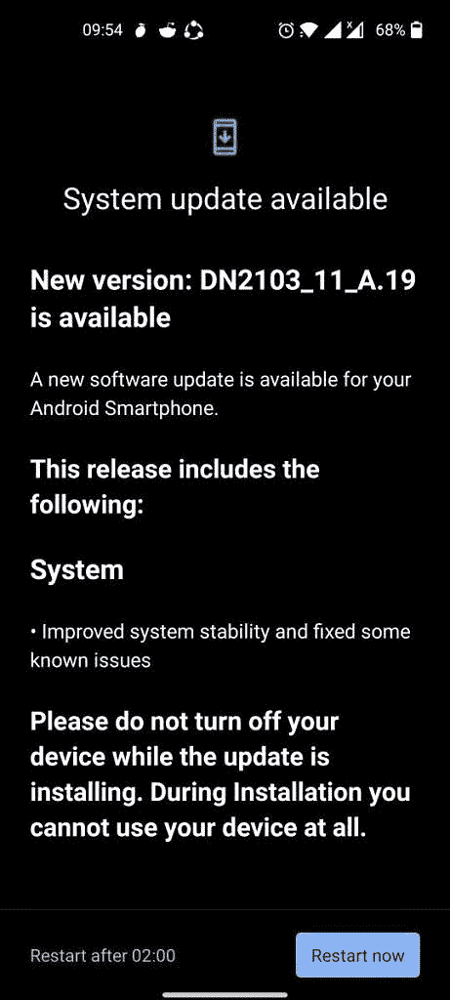

# 一加诺德 2 接收 OxygenOS A.19，其中包含错误修复和改进

> 原文：<https://www.xda-developers.com/oneplus-nord-2-update-bug-fixes-improvements/>

# 一加诺德 2 号收到了另一个更新，修正了一些小错误并有所改进

一加正在向一加诺德 2 推出 OxygenOS A.19，并对几个错误进行了修复和稳定性改进。请继续阅读，了解更多信息。

上个月，一加推出了 OxygenOS A.17，并于 2022 年 2 月向一加诺德 2 号(T1)发布了安全补丁。此后不久，一加向该设备发布了 OxygenOS A.18，修复了一个小错误，并提供了相同的安全补丁。一加现在正在为该设备推出另一个软件更新，最新版本也没有带来太多面向用户的变化。

OxygenOS A.19 已经开始在某些地区向一加 Nord 2 用户推出。这是一个小更新，不包括任何重大变化或最新的安全补丁。相反，更新带来了系统稳定性的改善和一些已知问题的修复。遗憾的是，变更日志没有强调一加在此次更新中解决的问题。

**OxygenOS A.19 变更日志**

*   *   系统
        *   改进了系统稳定性并修复了一些已知问题

与 OxygenOS 的所有官方更新一样，适用于一加诺德 2 的 OxygenOS A.19 正在分阶段向用户推出。这意味着它最初只会接触到少数用户。在一加确认更新没有引入任何新的漏洞后，它应该会更广泛地推出。

 <picture></picture> 

Credit: [Anishsha](https://forums.oneplus.com/members/anishsha.814221/)

如果您还没有收到 Nord 2 的更新，您可以等待 OTA 通知在您的设备上弹出，或者您可以从下面的链接下载固件包并手动刷新。然而，如果你把你的一加诺德 2 作为日常驾驶，我们不建议你选择后者。

**[一加诺德 2 XDA 论坛](https://forum.xda-developers.com/f/oneplus-nord-2-5g.12375/)**

## 为一加诺德 2 下载 OxygenOS A.19

目前，我们只能从 OxygenOS A.17 获得欧洲地区增量更新的下载链接。我们会尽快更新完整固件包的下载链接。

* * *

*感谢 XDA 资深会员 [Some_Random_Username](https://forum.xda-developers.com/m/some_random_username.8234677/) 提供的下载链接！*