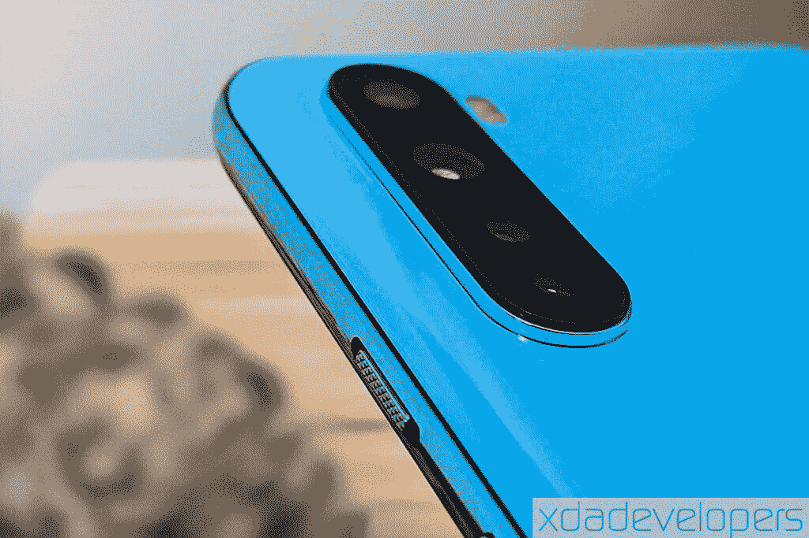

# 一加·诺德相机评论:六个相机够了吗？

> 原文：<https://www.xda-developers.com/oneplus-nord-camera-review-google-camera-mod/>

自从 OnePlus One 推出以来，一加已经从糟糕的数学双关语的主题发展成为爱好者最推荐的品牌之一。在过去六年多的时间里，一加已经显著改变了其智能手机战略；他们开始是一个销售削弱竞争的“旗舰杀手”的品牌，现在销售自己的[顶级旗舰，与最好的](https://www.xda-developers.com/oneplus-8-pro-vs-samsung-galaxy-s20-plus-review-comparison/)竞争。尽管这些战略变化，一加从未偏离其使命，提供目前可用的最佳性能的硬件。然而，一加北部是唯一的例外。

然而，实际上，Nord 并不是一加第一次放弃提供旗舰级硬件。事实上，2015 年的 OnePlus X 是该公司的第一款中端智能手机，但它未能吸引更多的人群，这些人仍然热衷于一加推动的功能多于形式的营销。这迫使该公司在拓展业务之前加强其在发烧友市场的根基。在 X 问世近五年后，智能手机市场的动态发生了变化，因此一加再次重返中端市场。对于该公司来说，销售价格更实惠、价值更高的智能手机以及当前的高端产品系列现在是可行的。

[**一加诺德论坛**](https://forum.xda-developers.com/oneplus-nord) **[一加诺德点评:性价比极高](https://www.xda-developers.com/oneplus-nord-review/)**

虽然一加有望在不久的将来进一步扩展到中端市场和 T2 的入门级市场，但一加北欧已经让世界刮目相看。大量的关注尤其是因为 Nord 象征着品牌从其旅程的起点回到价格段。但是，尽管价格昂贵，一加诺德还是拥有该品牌更昂贵设备的一系列有价值的功能——例如具有 [90Hz 刷新率](https://www.xda-developers.com/smartphone-display-refresh-rates-explained/)的液晶显示器或具有[一加 8](https://www.xda-developers.com/oneplus-8-xda-review/)OIS 的 48MP 相机——以及新功能，例如辅助自拍相机或使用谷歌应用程序代替一加自己的拨号器、联系人或信息应用程序。

就相机而言，一加诺德是该公司功能最丰富的智能手机。虽然我们已经完成了对一加诺德性能的回顾，但这篇文章深入探讨了这款相机实际性能的更多细节。在我开始谈论质量之前，以下部分概述了诺德相机的规格。

* * *

## 一加诺德相机规格

Nord 是第一款拥有六个摄像头的一加设备。这个记录包括四个摄像头在后面，两个摄像头在前面的打孔切口下面。背面的四摄像头包括一个 48MP 主摄像头，该摄像头包含一个[索尼 IMX586](https://www.xda-developers.com/sonys-imx586-48mp-smartphone-camera/) 传感器，在一加 7/7 Pro、7T/7T Pro 和一加 8 上也可以看到。48MP 传感器搭配 f/1.75 光圈镜头。

该阵列上的第二个是一个 8MP 超广角相机，视野跨越 119 宽。8MP 传感器挂在一个 f/2.25 光圈镜头上。除了这两个，一加诺德还配备了一个带有 f/2.5 光圈镜头的 2MP 微距相机和一个带有 f/2.4 光圈镜头的 5MP 深度传感器。

值得注意的是，一加诺德上的主摄像头支持 OIS(光学图像稳定)和 EIS(电子图像稳定)，是最实惠的智能手机之一。为了更容易理解，一加给 OIS 取名为“超级稳定”。此外，诺德使用单独的相机进行超广角和微距摄影——不像一加 7T 使用单个相机进行拍摄。

移动到前面，两个摄像头位于打孔切口中。主摄像头是 32MP 索尼 IMX616 传感器，配有 f/2.45 光圈镜头。第二个是一个 8MP 超广角相机，配有 f/2.45 镜头，有助于 105°的宽视野。

在视频录制方面，一加诺德支持高达 30fps 的 4K 视频捕捉，如果你希望以 60fps 的速度录制，分辨率可以降低到全高清(1080p)。值得注意的是，OIS 只在你以 30 帧/秒的速度录制时有效——无论是 4K 还是 1080p 分辨率。您可以使用 48MP 主摄像头和 8MP 超广角摄像头来录制视频。

相比之下，32MP 主前置摄像头支持以 4K 和 60fps 录制视频。与此同时，辅助摄像头也可以录制 4K 视频，但只能以 30fps 的速度拍摄。与后置摄像头不同，前置摄像头不支持 OIS，EIS 也仅限于主前置摄像头。

在一加诺德的 Super AMOLED 显示屏上，图像和视频显得明亮、生动、清晰。但在这方面，小屏幕可能经常具有欺骗性。因此，在下一节中，我们将在更大、色彩更准确的显示器上评估图像，以了解它们的质量。

* * *

## 一加诺德相机质量

这次一加·诺德相机回顾中使用的图像是由 XDA 的[米沙·拉赫曼](https://www.xda-developers.com/author/mishaalrahman/)、[亚当·康威](https://www.xda-developers.com/author/adamconway/)和我本人拍摄的。

### 

### 主摄像机

一加诺德倾向于用主相机捕捉日光下令人惊叹的色彩。当图像适合更大的屏幕时，图像看起来很清晰。4800 万像素主摄像头配有索尼 IMX586 传感器，默认情况下可捕捉 1200 万像素分辨率的图像，这是 4 合 1 像素宁滨的结果。此外，自动 HDR 功能适用于大多数自然拍摄，有助于更好地突出色彩。以下所有图片都是使用诺德相机应用的默认照片模式拍摄的:

在当前的放大倍率下，图像明亮清晰，没有任何颜色或物体的融合。ISO 值在 100 和 125 之间(包括 100 和 125)可能会让摄影爱好者想要一个稍微大一点的光圈，但这不会让大多数用户感到厌烦。图像中的颜色看起来有点过饱和和过度处理，但一点也不不自然。当你放大图像时，失真变得很明显，但这是一加诺德主相机表现出的第一个弱点。

### 数码变焦

虽然一加诺德没有长焦相机，但 2 倍变焦的控制就放在一加相机应用程序的模式选择器上方。与没有任何放大的图像相比，在 2 倍的情况下，图像在清晰度方面显得远没有那么迷人。此外，随着取景器中曝光的变化，颜色会变淡，而自动 HDR 可能并不总是像预期的那样工作。

一加诺德允许高达 10 倍的数码变焦，但在这种设置下，结果远没有吸引力。

### 12MP 对 48MP

除了 1200 万像素的图像，一加诺德还允许您以 4800 万像素的分辨率拍摄图像。从表面层次的检查来看，除了颜色饱和度的差异之外，您无法发现在两种分辨率设置下捕获的图像之间的任何差异。与 4 合 1 像素宁滨拍摄的 12MP 图像相比，48MP 图像的饱和度较低。当自动 HDR 未能启动或增强图像的对比度时，这种差异会更加明显。

*左边是 12MP 图像，右边是 48MP 图像*

当你仔细观察画面中较暗的区域时，与 12MP 相比，48MP 有更高的阴影，但如果图像在充足的光线下拍摄，就很难看到这一点，如上例所示。

你可以在下面嵌入的 Flickr 相册中看到一加北部所有的日光图片(以及更多)。

### 弱光室外和室内

下面的图片是由一加诺德的主相机在阴天拍摄的。虽然与上面的图像相比，ISO 值没有偏离太多，但一加诺德通过降低相机的快门速度来进行补偿——大概是为了应对云中的白色，从而产生更高的阴影。阴影的增加和低高光会导致图像清晰度降低，尤其是在放大时。

另一方面，在弱光或室内拍摄的图像细节要少得多。一加诺德通过增加 ISO 和降低快门速度来补偿曝光不足，但这导致了更多的颗粒感。显然，智能手机在聚焦前景物体时也会有困难，你可能需要拍摄多张图像以确保图像不模糊。

### 夜景模式

像所有最近的一加智能手机一样，一加诺德具有夜景模式，可以在晚上或光线非常暗的情况下拍照。在这种模式下，智能手机可以捕捉不同 ISO 级别(不同曝光)的多幅图像，并将它们叠加在一起，以创建更明亮的图像。这种将图像编织在一起的过程还允许相机以比传统相机更快的快门速度捕捉图像，保持良好的对比度，并在相当高的 ISO 值下保持低噪声。

*左侧的图像在夜景模式关闭时被点击，而右侧的图像在夜景模式打开时被点击*

正如你从上面的图片中看到的，当夜景模式打开时，物体已经发光的场景看起来比关闭时更亮。

在光线很弱或没有光线的情况下，夜景模式在曝光方面确实有一点点不同，但在对焦方面肯定会有问题。这里有一个例子:

你可以在下面的 Flickr 相册中找到所有一加北部的全分辨率低光图像。

虽然这总结了我们对主要后置摄像头的测试，但接下来的部分将讨论辅助超广角摄像头以及第三 2MP 微距摄像头。

### 超广角

如上所述，一加诺德配备了一个 800 万像素的摄像头作为辅助后置摄像头。这款相机采用 f/2.2 光圈镜头，有助于实现 119°宽视野。值得注意的是，广角镜头的光圈比主相机小。此外，超广角相机缺乏自动对焦功能，因此最适合拍摄户外风景。

虽然你通常会认为用小光圈镜头拍摄的图像会更暗，但一加诺德在后期处理中很好地掩盖了这一点。尽管整体看起来更亮，但部分图像实际上颜色更暗。由于所有这些图像都是在充足的自然光下拍摄的，这些较暗的阴影导致了更多饱和度的错觉。

除了曝光较少，超广角图像也缺乏任何细节。石柱、树木或草地等元素的纹理在广角图像中大多被模糊或丢失。

### 微距照相机

除了 4800 万像素的主摄像头和 800 万像素的超广角摄像头，一加还在一加诺德公司的后置摄像头阵列上分配了 200 万像素的微距摄像头。这款 200 万像素的相机还具有固定的焦距，旨在捕捉 1-1.5 英寸(2.5-4 厘米)远的微小物体。正如你对任何老式的 2MP 定焦相机所期望的那样，结果缺乏任何细节或适当的纹理。看一看:

不用说，这个微距相机的作用只是增加一加诺德的相机数量。就像我们上面提到的，一加诺德拥有一加智能手机中最多的摄像头，也是第一款拥有六个摄像头的一加智能手机。

你可以在 Flickr 上找到所有来自一加诺德非主要相机的照片。

### 自拍

移到前面，主自拍相机在索尼 IMX616 传感器的帮助下以 32MP 捕捉图像。与后置 4800 万像素摄像头不同，前置主摄像头没有利用 4 合 1 像素宁滨来拍摄更亮或更饱和的图像。尽管如此，图像明亮清晰，尤其是在白天。辅助超广角自拍相机捕捉的细节更少，同时也人为地平滑了面部纹理。

自从一加诺德公司推出旨在提高图像质量的产品以来，一加在过去的几个月里已经推出了许多更新产品。下面的图片是几天前应用了最新的软件更新后拍摄的，而 Mishaal 拍摄的图片是安装了发布日软件后拍摄的。这表明一加实施的软件改进有助于提高质量，尽管在皮肤上仍有一些平滑。

我对一加诺德的一个抱怨是，肖像图像中的背景模糊看起来非常不自然，同样的问题也困扰着其他一加设备。边缘检测是不稳定的，您可能会在 2D 平面中分离背景和前景的边界处看到伪像。此外，在拍摄图像期间或之后，没有办法调整模糊的强度。

这里有一些用一加诺德相机拍摄的自拍照的例子。

你可以在下面嵌入的 Flickr 相册中找到这些全分辨率的自拍照。

### 录像

正如我们上面提到的，一加诺德以高达 30 帧/秒的速度录制 4K 视频。OIS 的存在——在这个价格上很少见，在这个范围的其他设备中只在 Pixel 3a/4a 上出现过——能够实现非常稳定的视频，即使你在走路。米莎尔在一段使用主后置摄像头录制的 4K 视频中展示了这一点。

一加诺德提供了令人满意的性能方面的色彩，清晰度，和视频录制的音频质量。

有趣的是，这款智能手机可以使用正面的主摄像头以 60fps 的速度录制 4K 视频。与后置摄像头相比，它缺乏任何形式的稳定性，并且在质量和颜色准确性方面也有所欠缺。看看米莎尔用主前置摄像头录制的视频:

虽然我们可以期待视频有更多的细节和更好的纹理，特别是在脸上，但从任何角度来看，质量都只能被评估为差(双关语)。正面的辅助摄像头也支持视频录制，但质量仅限于 30fps 的 4K。

* * *

## 股票相机 vs 谷歌相机模式

不可否认，谷歌的计算摄影算法，增强了像素阵容，胜过任何其他制造商的相机优化。这鼓励了开发者和爱好者将谷歌相机应用移植到非像素设备上。

一加北部也有一个非官方的谷歌摄像头端口，可从开发商 Wichaya 获得。你可以在[一加诺德 GCam XDA 论坛帖子](https://forum.xda-developers.com/showpost.php?p=83464915&postcount=94)中找到我在一加诺德使用的谷歌相机 APK 的下载链接和支持的配置(*感谢 XDA 资深会员[S4Turno](https://forum.xda-developers.com/member.php?u=4487956)】T3)。*

**[谷歌摄像头端口枢纽](https://www.xda-developers.com/google-camera-port-hub/)**

一加诺德的谷歌摄像头端口支持主摄像头和背面的两个辅助摄像头，以及正面的两个摄像头。它可以用来在后置和前置主摄像头上以高达 30 fps 的速度捕捉 4K 视频，但前置摄像头上没有 4K@60fps 记录。

股票一加相机和谷歌相机应用程序之间的比较让我们很好地了解谷歌相机应用程序如何有效地修补股票相机的缺陷。

### 主要的

由于谷歌先进的 HDR 算法，谷歌摄像头端口的日光图像保持了像素级的对比度，同时保留了自然色彩。相比之下，用库存相机拍摄的图像显得过饱和。谷歌相机在聚焦物体方面也比普通相机做得更好，并且通过像素特有的背景模糊进一步改进。

*左:库存相机。右图:谷歌摄像头*

来自谷歌相机的图像会通过 4 合 1 像素宁滨自动调整到 12MP，该应用程序不支持完整的 48MP 摄影，这对一些用户来说似乎是一种妥协。好的一面是，大多数人实际上并不关心图像的实际分辨率，只要它清晰明亮，所以没有 48MP 模式可能不会阻止每个人使用这种模式。

### 超广角微距相机

就像主相机一样，使用谷歌相机模式拍摄的超广角镜头比用一加·诺德的库存相机拍摄的要清晰得多。GCam 图像的高对比度使远处的物体比普通相机看起来更清晰。这两个相机应用程序都无法捕捉主相机那么多的细节。

*左:库存相机。右图:谷歌摄像头*

但是当谈到微距摄影时，谷歌相机 mod 似乎在一定程度上修复了普通相机的问题。虽然这两张图像都不能真正证明智能手机上单独的宏观传感器所占用的额外空间，但用 stock camera 应用程序拍摄的图像看起来人工温暖，细节较少，而用 Google Camera 拍摄的图像相对更清晰，颜色中性。

### 自拍

一加诺德的谷歌相机模块也支持使用主摄像头和副摄像头自拍。从主 32MP 相机开始，库存相机图像出现曝光过度，因此，尽管显示了体面的细节，但却没有味道。与此同时，来自谷歌相机模块的图像对比度更高，清晰度更高。值得注意的是，前置 32MP 摄像头在 4 合 1 像素宁滨的帮助下可以捕捉 8MP 分辨率的图像。但是，这些图像在曝光方面有所欠缺，尤其是在默认 HDR 设置下。

虽然你可以选择用一加相机应用程序镜像自拍，但谷歌相机模块只拍摄非镜像自拍。

谷歌相机端口弥补了自拍肖像中糟糕的背景模糊，特别是在分隔背景和前景的边缘周围。但是，相似的曝光和颜色趋势非常明显。

最后，关于从前置超广角相机拍摄的图像，用一加诺德拍摄的图像似乎更暗，有大量的噪声。

我觉得谷歌相机模块在所有情况下都提高了一加诺德相机的拍照能力，除了辅助前置相机的自拍。如果你已经有一个诺德，一定要看看我们上面链接的 mod。

你可以在下面的 Flickr 相册中找到所有的股票与谷歌相机模型的全分辨率图像:

* * *

## 一加·诺德照相机结论:六是奇数吗？

谈到性能，一加诺德绝对是一个伟大的设备。尽管预算削减，一加诺德仍然保留了一加 7T 和一加 8 令人兴奋的功能，如 90Hz 流体 Super AMOLED 显示屏，30W Warp Charge 30T 和警报滑块。它还使用了与其价格更高的兄弟产品一加 8 相同的 4800 万像素摄像头，并为取消后者的必要性提出了有力的论据。

一加加大了赌注，在一加北部安装了 6 台摄像机。虽然这个数字比我们在其他一加智能手机上看到的任何数字都高，但微距摄像头和深度传感器几乎没有提供任何好处。同样可悲的是，超广角自拍相机也是如此。为了展示更多的相机，一加*无视其品牌口号，用普通相机满足了*。

但是前面和后面的主摄像头表现非常好，价格也很合理。一加通过软件更新不断提高其设备的成像能力，这是值得肯定的，我们可以期待一加诺德的质量不断提高。总之，如果你不担心两个额外的、毫无意义的相机，Nord 是一个很好的摄影智能手机。

谷歌相机模块确实解决了 Nord 相机应用程序的颜色和曝光问题。它显著提高了智能手机上大多数相机的图像质量，我强烈建议使用它。