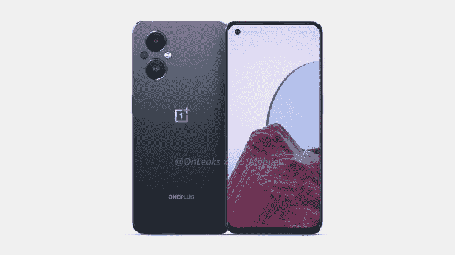

# 一加诺德 N20 将带着 AMOLED 显示屏和 iPhone 风格的设计进入北美市场

> 原文：<https://www.xda-developers.com/oneplus-nord-n20-confirmed-amoled/>

一加诺德 N20 [泄露的时间可以追溯到 2021](https://www.xda-developers.com/oneplus-nord-n20-5g-renders-leak/) 年 11 月，到现在差不多六个月了。从那以后，我们没有听到任何关于它的消息，尽管我们已经知道了这款手机最终会是什么样子。它利用了类似于 [iPhone 的趋势](https://www.xda-developers.com/android-smartphone-iphone-13-boxy-design-theme-2022/),其他一些原始设备制造商也加入进来，推出了方形外观，它还包装了中档规格。现在这款手机已经被官方证实将于本月晚些时候登陆北美。

 <picture></picture> 

Leaked image of the OnePlus Nord N20 from November 2021

在接受 PCMag 采访时，的 Kinder Liu 首先透露了 Nord 系列智能手机的一些细节。自 Nord N100 和 Nord N10 推出以来，它已经超过了该公司的最高预期，成为 T-Mobile 和 MetroPCS 的畅销书。显然，一加去年在美国销售了 250 万部 Nord 智能手机。有了这样的表现，难怪一加会加倍投资 Nord 系列。

一加与 PCMag 分享了一张一加诺德 N20 的官方渲染图，并确认了其屏幕的一些细节。它将采用 6.43 英寸 60Hz AMOLED 屏幕。这意味着原因是在 90Hz LCD 或 60Hz AMOLED 之间有一个选择，该公司选择了 AMOLED 显示器。*刘告诉 *PCMag* “我们的 6.43 英寸 FHD+ AMOLED 显示屏与目前在北美平价设备市场上销售的相比，功耗更低，对比度更好，色彩更鲜艳，色域更广。”。*

 *还将有一个显示指纹传感器和 SuperVOOC 快速充电。刘没有证实任何关于诺德 N20 的其他细节(包括实际充电速度)，尽管去年他泄露了这款设备的规格。鉴于 *@OnLeaks* 分享的图片与一加与 *PCMag* 分享的图片相匹配，这使得之前泄露的规格更有可能是正确的。

根据之前的泄露，一加诺德 N20 预计将在背面安装高通骁龙 695 SoC 和三摄像头阵列。据称，相机阵列由一个 48MP 主传感器和一对 2MP 相机组成。据说前置摄像头的价格为 1600 万英镑。最后，这款手机的尺寸据说是 159.8 x 73.1 x 7.7mm(包括摄像头凸起在内的厚度为 9.6mm)。

一加诺德 N20 将于本月晚些时候在北美上市，但没有给出确切的日期。目前还没有关于国际市场的信息，也没有关于价格的信息。

* * *

**来源:** [PCMag](https://www.pcmag.com/news/exclusive-oneplus-nord-n20-brings-amoled-to-budget-phones)*