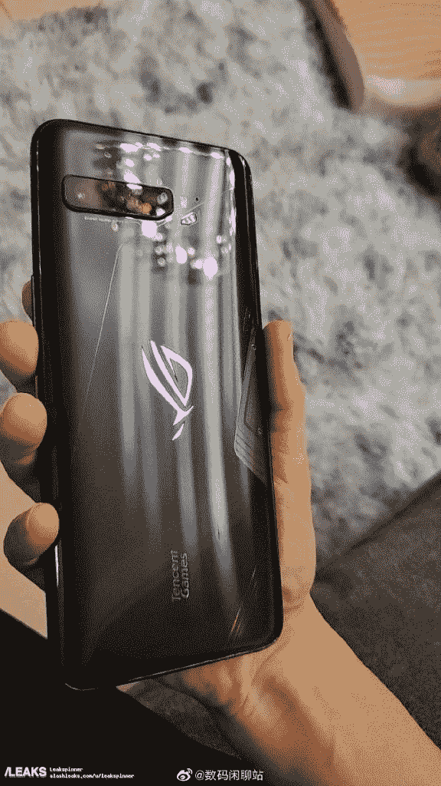

# 一加诺德，三星 Galaxy Note 20，POCO M2 专业，华硕 ROG 手机 3 论坛开放

> 原文：<https://www.xda-developers.com/oneplus-nord-samsung-galaxy-note-20-poco-m2-pro-and-asus-rog-phone-3-xda-forums-open/>

智能手机行业正在为一些激动人心的智能手机发布做准备。其中包括一加凭借一加诺德重返中端市场、三星即将推出的 Galaxy Note 20 系列、华硕 ROG Phone 3 以及 POCO 的下一款中端产品 POCO M2 Pro。除了 Galaxy Note 20 系列以外，所有这些设备预计都将在本月推出。为了迎接发布前的积极讨论和之后的开发，我们将为每一款设备开设 XDA 论坛。

### 北一加

第一次提到一加所谓的中端智能手机是在该公司去年推出 7T 系列几个月后。从那以后，关于规格的说法有了很多修改，甚至智能手机的名字也有了修改。一加最终决定(*没有双关语的意思*)通过官方确认手机[将被称为一加诺德](https://www.xda-developers.com/oneplus-8-lite-oneplus-z-nord-name/)，这很可能是一个新系列的平价智能手机，而不仅仅是一个设备。首款一加诺德手机将在骁龙 765G 移动平台上运行[，而其](https://www.xda-developers.com/qualcomm-confirms-oneplus-nord-5g-snapdragon-chipset/)[双孔自拍相机](https://www.xda-developers.com/oneplus-nord-32mp-8mp-dual-selfie-hole-punch-camera/)已经被“独家戏弄”

[**一加诺德 XDA 论坛**](https://forum.xda-developers.com/oneplus-nord)

这款手机预计将于 7 月 10 日发布，它将吸引更多的人，而不仅仅是那些因一加设备价格上涨而脱离粉丝群体的一加发烧友。据证实，北部地区的成本低于 500 美元，这也是一加开始其旅程的地方。

### 三星 Galaxy Note 20 系列

三星正准备推出 Galaxy Note 20 系列以及多达款新的可折叠智能手机。与 Galaxy S20 系列一样，Note 20 将有三种版本——普通 Note 20、Note 20+和 Note 20 Ultra，这是三星最近在其俄罗斯网站上意外泄露的[。对于其他变种，有太多的](https://www.xda-developers.com/samsung-galaxy-note-20-ultra-mystic-bronze-leak/)[谣言和泄露](https://www.xda-developers.com/samsung-galaxy-note-20-leaks-detail-design-camera-battery-specs/)泄露了这些设备的大部分规格。虽然骁龙 865 已经在预料之中，但三星也可能为美国、中国以及北美和南美其他一些地区以外的市场推出新的 5 纳米 [Exynos 992](https://www.xda-developers.com/samsung-exynos-992-5nm-chip-galaxy-note-20-arm-new-cpu-gpu/) 芯片组。

**[三星 Galaxy Note 20 系列 XDA 论坛](https://forum.xda-developers.com/galaxy-note-20)**

与此同时，该系列中的 Plus 和 Ultra 型号预计将获得 108MP 摄像头，而我们可能会考虑 4000-5000 mah 的电池容量。最后但同样重要的是，Note 20 系列可能会配备 120Hz 的 Super AMOLED 显示屏，但不包括基本型号。

注意:我们将保留三星 Galaxy Note 20 系列的论坛。

### 波科 M2 专业版

除了这些令人兴奋的旗舰产品，我们还期待小米的分拆品牌 POCO 的新设备。POCO M2 Pro 被认为是印度特有的设备，将于 7 月 7 日在 T2 发布。这款手机很有可能是[换标](https://www.xda-developers.com/poco-m2-pro-another-poco-smartphone-mid-range-processor/)全球[红米 Note 9 Pro](https://www.xda-developers.com/xiaomi-launches-redmi-note-9-globally-alongside-mi-note-10-lite/) ( [红米 Note 9 Pro Max 印度](https://www.xda-developers.com/xiaomi-redmi-note-9-pro-max-snapdragon-720g-33w-fast-charging/))。在已经确认的功能中，这款手机将采用背面的四摄像头，33W 快速充电，嵌入电源按钮的指纹扫描仪，以及最有可能在显示屏中央的打孔自拍相机。

**[POCO M2 职业 XDA 论坛](https://forum.xda-developers.com/poco-m2-pro)**

像所有其他 POCO 手机一样，M2 Pro 预计会受到用户和开发者社区的好评。

### 华硕 ROG 手机 3

 <picture></picture> 

Via: SlashLeaks

ROG Phone 3 是华硕专注于游戏系列的下一款手机，它的名字来自该公司广受欢迎的笔记本电脑系列。华硕将于 7 月 22 日发布 ROG 手机 3。它最近在中国监管机构 TENAA 网站上的上市显示，这款游戏智能手机将配备高达 16GB 的 RAM 和 512GB 的存储空间，一块 6000mAh 的大电池和一个超频的骁龙 865 SoC。

**[华硕 ROG 手机 3 XDA 论坛](https://forum.xda-developers.com/asus-rog-phone-3)**

为了补充硬件的力量，ROG Phone 3 将配备以游戏为中心的软件功能，包括[光环照明、刷新率控制和性能提升](https://www.xda-developers.com/rog-phone-sdk-unity-game-developers-support-rog-phone-ii-rog-phone-3/)，并将在[预装谷歌视距](https://www.xda-developers.com/next-asus-rog-phone-pre-loaded-stadia/)。与前几代产品一样，ROG Phone 3 也将支持广泛的游戏配件，如双屏坞站和 Kunai Gamepad，以释放您的游戏玩家体验。