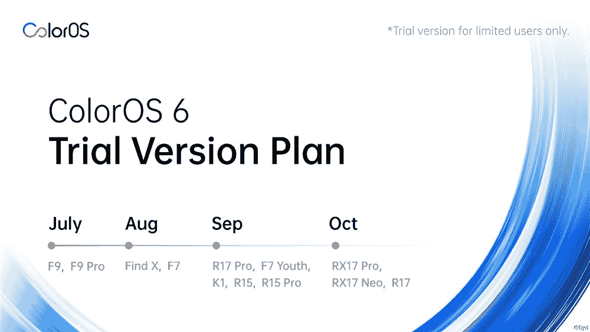

# OPPO 透露 ColorOS 6 (Android Pie)在印度的测试日期

> 原文：<https://www.xda-developers.com/opor-coloros-6-android-pie-beta-update/>

OPPO 制造的智能手机运行 ColorOS，这是一种专注于鲜艳颜色(因此，名称)和详细图标的 Android 皮肤。多年来，OPPO 取得了进步，并为 ColorOS 建立了独立的身份，远离了最初关于它受到 iOS 启发的看法。今年 3 月，OPPO 为其智能手机宣布了 [ColorOS 6](https://www.xda-developers.com/oppo-announces-coloros-6-coming-to-the-r17-r15-r11-and-more/) ，最新版本的 Android 覆盖更加强调极简主义、平面图标和渐变以及性能改进。从那时起，ColorOS 6 更新已经进入了高端设备，如 [OPPO Reno 系列](https://www.xda-developers.com/oppo-reno-10x-zoom-launch-india/)，并且应该很快会推广到印度的其他设备。

OPPO 最近宣布在印度开始 ColorOS 6 更新的 beta 测试阶段。ColorOS 6 基于 Android 9 Pie，某些用户已经开始试用。根据 OPPO 强调的时间表，测试版更新已经推出到 OPPO F9/F9 Pro，而 OPPO F7 和 Find X 将在本月获得更新。此外，OPPO K1、OPPO R15/R15 Pro、OPPO R17 Pro 和 OPPO F7 青年将在 9 月份获得更新，而 OPPO R17 和 OPPO RX17 Pro/RX17 Neo 则在 10 月份的更新名单中。

 <picture></picture> 

ColorOS 6 beta update schedule

在 ColorOS 6 更新带来的一系列功能中，有新的导航手势，扁平和最小化图标，以及新的壁纸。此次更新还关注增加最小视图的空白空间。

此外，还有 GameBoost 2.0，可以提供更流畅、更身临其境的游戏体验。这包括用于更好触摸响应的 TouchBoost，以及用于高帧率持续游戏的准确性和 FrameBoost。此外，ColorOS 6 还包括“人工智能冷存储”，在你退出应用程序后将其冻结，以节省电池的被动消耗。

虽然官方通知说，该更新仅适用于某些用户，但它并不包括注册为 beta 测试员的方法。当 ColorOS 稳定版本在上面列出的智能手机上可用时，我们将更新您的信息。

* * *

**来源: [ColorOS 社区](https://community.coloros.com/thread-17748-1-1.html)**