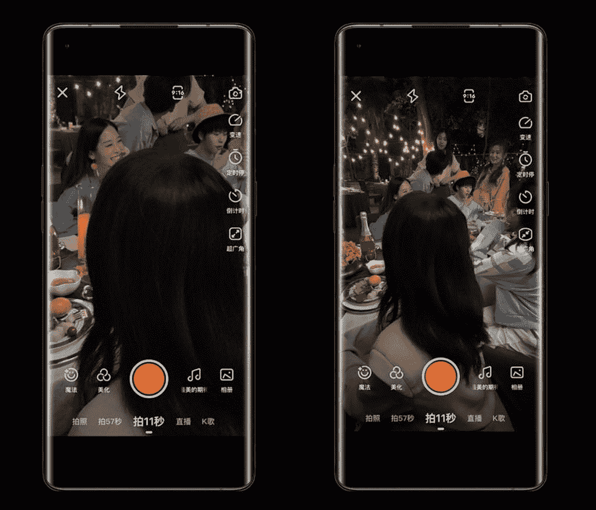

# 下面是 OPPO 基于 Android 10 的 ColorOS 7.2 的新功能

> 原文：<https://www.xda-developers.com/oppo-coloros-7-2-android-10-reno4-pro/>

中国智能手机制造商 OPPO 上周在中国发布了 Reno4 和 Reno 4 Pro T1——仅比 [Reno3 系列](https://www.xda-developers.com/oppo-reno3-pro-5g-quad-rear-camera-china-launch/)晚三个月。OPPO Reno4 系列采用了全新的设计，内部硬件略有改进，软件方面有许多新功能。Reno4 和 Reno4 Pro 是该公司首批搭载 ColorOS 7.2 的两款智能手机，ColorOS 7.2 是 OPPO 定制 Android 软件的最新版本，基于 Android 10。

**[ColorOS 7.1 评测:OPPO 最新的 Android OS 是其迄今为止最好的](https://www.xda-developers.com/coloros-7-1-review-on-oppo-find-x2/)**

虽然 ColorOS 7.1 仅在今年 3 月与 OPPO Reno3 一起推出，但 7.2 版本增加了新功能，特别是针对摄像头。以下是 OPPO 在 ColorOS 7.2 中加入的所有新功能:

#### 超级夜间视频模式

 <picture></picture> 

A screenshot of video recorded on OPPO Reno4's Super Night Video mode

通过 OPPO Reno4，ColorOS 还获得了一个新的视频夜间模式，就像该公司的图像夜景模式一样。该公司声称，“超级夜间视频模式”功能将在夜间或极弱光线条件下拍摄的视频中提高曝光度高达 74%。此外，该功能还将提高夜间视频的清晰度高达 33%。

#### 电影模式

OPPO Reno4 系列预装了 Soloop 应用程序，允许用户在手机上编辑各种视频共享平台的视频。这款手机还拥有一个专门的电影模式，宽高比为 21:9，10 个颜色过滤器，几个预设模板，以及调整原始镜头曝光或快门速度的选项，使其具有电影般的外观。

#### 智能电池节电器

ColorOS 7.2 中的智能电池节省器将学习用户的习惯，并在某些应用程序不太可能被使用时自动将其置于睡眠状态。通过这样做，可以节省智能手机上的电池，并避免夜间消耗，从而将夜间电池消耗提高 10%。

#### 超级省电

在手机电池电量非常低的情况下，用户可以激活超级节电模式来停止一切操作，除了最重要的功能，如打电话或发消息。OPPO 声称，当手机处于超级省电模式时，微信上 1.5 小时的消息传递只会利用 5%的电池。

#### 人工智能修复图像

ColorOS 有一个新功能，可以帮助保存旧图片或模糊图片的数字副本。该功能将通过消除旧图像中的模糊、噪音或颗粒或模糊来自动修复图片。

#### 应用程序预启动

ColorOS 现在能够通过学习您的使用习惯，甚至在您点击应用程序图标之前，在后台预启动应用程序。正如预期的那样，该功能减少了应用程序的启动时间，提供了更快的体验。

#### OPPO 实验室

OPPO Labs，类似于 Realme Lab，将被添加到 ColorOS 7.2 中，以便用户可以在测试时体验即将到来的和实验性的功能。

#### 相机 SDK

OPPO 发布了一个相机 SDK，它将允许第三方应用程序开发人员使用 Reno4 上所有相机的功能以及 stock Camera 应用程序中原生支持的所有功能。例如，SDK 将允许 Instagram 等应用程序[扩展对 OPPO 美颜或 HDR 模式](https://www.xda-developers.com/oppo-google-camerax-api-third-party-camera-apps-beauty-hdr/)的支持，或者使用除主相机之外的任何相机直接在 Instagram 内拍照。

 <picture></picture> 

Using the ultra-wide-angle camera on a third-party app

通过谷歌的 CameraX Jetpack 支持库，这已经成为可能，该库允许开发者充分利用预装的相机功能，包括来自谷歌相机应用的功能。同样，SDK 也将允许开发人员在非库存相机应用程序上利用 OIS 等内置硬件功能，在 OPPO 智能手机上开放广泛的相机功能。

* * *

**来源:[微博/ColorOS](https://www.weibo.com/3402761920/J5gpa05wZ)**