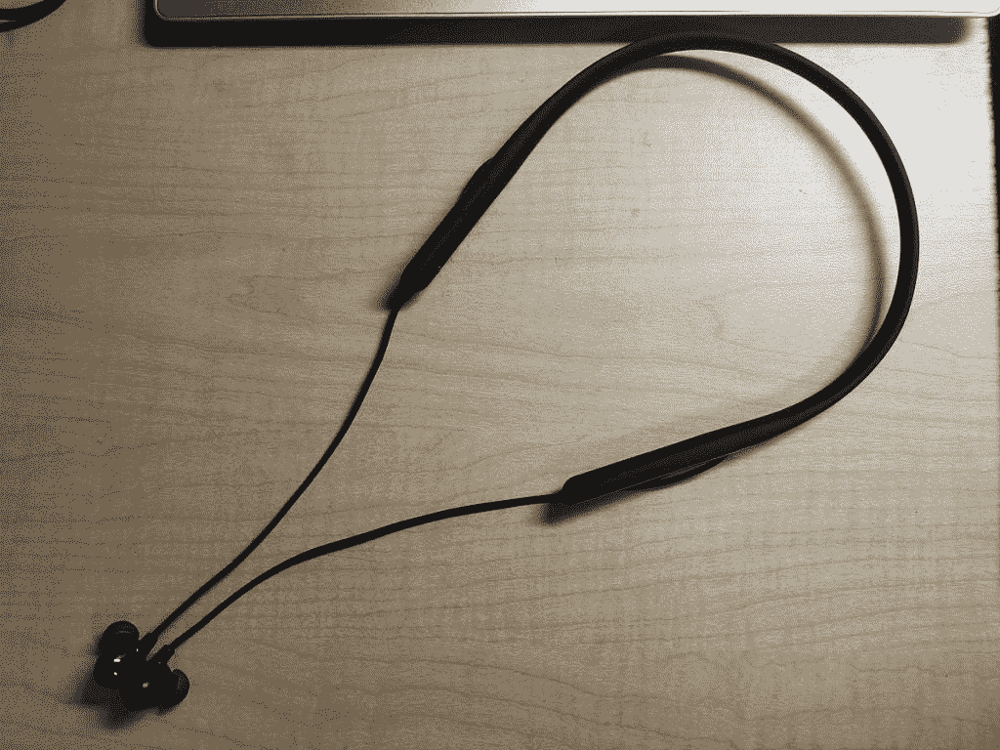

# OPPO Enco Q1 无线降噪耳机评论—精准营销

> 原文：<https://www.xda-developers.com/oppo-enco-q1-wireless-earphones-review/>

耳机很棒。他们让你听你想听的，而不打扰别人。更重要的是，他们让别人听他们想听的，而不会打扰你。今天我们要来看看 OPPO Enco Q1 无线降噪耳机。

当许多公司都在追逐真正的无线潮流时，OPPO 却选择了完全不同的东西。这些耳机有一个僵硬的领口，类似于 LG Tone 系列，但它很灵活，轮廓分明。有一个领口有它自己的优点和缺点，我稍后会谈到。OPPO 正在宣传 Enco Q1 长达 22 小时的电池寿命、主动噪音消除、出色的声音和令人难以置信的舒适性。这些说法有多准确？标题泄露了吗？也许是，也许不是。请继续阅读，寻找答案。

* * *

## 第一印象之类的

“哦，天哪，他又开始谈论那个盒子了，是不是？”

是的，是的，我是。OPPO Enco Q1 的盒子其实很大。它只有大约一英寸高，但在其他两个维度上都接近一英尺。不过，大小是有原因的，这与耳机的构造有关。除了耳机本身，OPPO 还包括一些手册，一根充电线和一堆更换技巧。有趣的是，这里实际上有四种尺寸；安装的吸头大小介于中型和大型替换吸头之间。没有充电盒，但那是因为这些不是真正的无线耳机。

 <picture></picture> 

The wires are pretty long

Enco Q1 的设计与较老的 LG Tone 型号非常相似。有一个颈带，这是电池和控制装置的位置，耳机通过电线连接。在真正的无线耳机时代，你可能想知道为什么你会想要一副既有线又有额外的颈带重量的耳机。好吧，也许你永远都不想，那也没关系。但是乐队有几个很好的理由，我稍后也会谈到。

完成了第一印象，OPPO Enco Q1 有你常用的方便提示电源和连接状态等。哦，他们还有一个叫主动噪音消除的小东西。也许你以前听说过？如果你想在嘈杂的环境中听一些东西，主动噪音消除可以很好，我非常兴奋地看到 OPPO 包括它。然而，它的实际效果如何呢？好吧，让我们从实际回顾开始寻找答案。

* * *

## 控制

由于 OPPO Enco Q1 有一个颈带，所以你不会在 oi 上找到电容触摸控制。相反，在表带的左侧有四个物理按钮。一个按钮用于改变均衡器模式和切换噪声消除。音量摇杆用于改变音量或当前音乐曲目。最后一个用于打开或关闭 Enco，启用配对模式，播放或暂停音乐，以及接听或挂断电话。您也可以快速双击来触发手机上的语音助手。

这里没有什么超级花哨的东西，但这意味着它也非常容易记住(并习惯于)哪个按钮做什么，并且当你做一些事情时，你得到适当的触觉反馈总是很好的。与带电容控制的耳机不同，意外暂停音乐或跳过曲目要难得多。

OPPO 在这里选择了一种更简单、功能更少的控制方式，在我看来，它工作得很好。

* * *

## 人体工程学和使用

我之前提到过，但是这个东西有领口。对许多人来说，这可能有点令人不快。毕竟，领子会很重，会碍事。OPPO 在其网站上表示，“你几乎不会注意到它的存在”，老实说，这是真的。通常，无论一个品牌在网站上宣称什么，你都需要持怀疑态度，但这至少是产品页面上完全正确的一件事。除非我在做仰卧起坐或一些需要大量运动的事情，否则我甚至不会注意到我穿着 Enco Q1，因为它只有 42 克重。

既然我已经滔滔不绝地谈论了领口，让我们实际上来谈谈耳机如何适合。OPPO Enco Q1 实际上有四种尖端尺寸。这意味着如果它们不适合你，有很多选择。一旦你找到合适的小费的大小，Q1 的 Enco 是非常舒适的。我一直戴着它们，直到电池没电，我的耳朵也不会感到疼痛或不舒服。

当你戴上耳机时，有两件事要记住。首先，你需要把它们拧进耳朵里。如果你习惯了隔离噪音的入耳式耳机，这不会是什么新鲜事。第二个涉及噪声消除功能。因为 OPPO Enco Q1 使用麦克风对着你的耳朵来消除噪音，如果你在该功能激活时拧入它们，它们可能会发出高音调的尖叫噪音。我通常只是忍受这种可能性，但在你戴上耳机时关闭噪音消除是个好主意。

当它们不在你的耳朵里时，OPPO Enco Q1 的颈带可以非常方便地握住和固定耳机。把它们从你的耳朵里拿出来，粘在一起(为此每个花蕾后面都有一块磁铁)，然后忘掉它们。好吧，忘记他们，直到你身体前倾。将耳机连接到颈带的电线相当长。虽然这有利于可达性和入耳式舒适性，但这意味着当你没有耳机时，它们可能会碍事。例如，当俯身在水槽上时，确实有弄湿它们的危险。它们是 IPX4 级的，但这并不意味着它们不会破裂，因为 IPX4 只适用于轻微的水花。

将耳机固定在一起的磁铁也不是很强，我已经让它们分开过几次。这无论如何都不是什么大不了的事，但绝对是值得记住的事情。

最后一件事，我保证。OPPO Enco Q1 的额定 IPX4。这意味着你不必担心在雨中或高强度锻炼时穿着它们。显然，你不应该和他们一起去游泳，但是一场突如其来的阵雨不会引起任何问题。

* * *

## 电池和充电

我一直戴着 Enco Q1，直到电池用完。由于启用了主动噪音消除功能，OPPO 声称 Enco Q1 可以持续播放大约 15 个小时。如果没有主动噪声消除，这一数字将跃升至 22 小时。再次，这里的营销是准确的，至少对于 ANC 模式是如此。我可以毫不费力地从 Enco Q1 播放器中获得 15 小时或更长的播放时间。我很少在没有启用 ANC 的情况下使用它们，所以我个人不能说 22 小时的估计有多准确，但我倾向于相信它。这 15 个小时的游戏时间对于几乎任何一般使用情况来说都绰绰有余，而且不用担心每隔几个小时就要充电，这真是太好了。

现在我们来谈谈电池寿命的另一端:充电过程。OPPO 表示，Enco Q1 充电大约需要两个小时，这并不算快。但是，如果你可以在晚上把它们插上电源，你就不需要快速充电了。谢天谢地，OPPO Enco Q1 可以用 USB-C 充电，所以你不需要随身携带微型 USB 电缆。你的手机充电器会工作得很好。

* * *

## 声音和噪音消除

功能和播放时间都很好，但声音呢？如果音质很差，功能就没什么意义了。没必要担心。OPPO Enco Q1 听起来很棒，这要归功于 11.8 毫米的动态驱动器。默认的情商配置文件非常适合我的喜好。高音和人声都很清晰，但需要时也会有低音。

当然，如果你是喜欢重低音的人，我刚才说的可能听起来不太好。也许 Tronsmart Spunky Pro 听起来更像你的果酱。幸运的是，OPPO Enco Q1 配备了几种不同的 EQ 模式:音乐、电影和游戏。如果这些对你都不起作用，总有你的手机内置均衡器。ColorOS 相当糟糕，但它有一个均衡器，如果你有三星，一个 UI 有一些非常先进的声音控制。

但是噪音消除功能呢？我承认我有点怀疑这是否真的有效，但是在使用了一个多月后，我很开心。显然，它并不完美。这些只是入耳式耳机，不是耳机。但是对于他们必须使用的东西，OPPO Enco Q1 提供了可靠的降噪体验。

实际上，我已经开始在讲座中使用噪音消除来帮助排除咳嗽和嗅嗅等噪音。在往返家的火车上，Enco 设法屏蔽掉轨道上车轮发出的几乎所有噪音。我甚至开始把耳机音量调得比平时低，因为要克服的背景噪音少了很多。不用说，我真的很喜欢这里的噪音消除功能，我希望更多的耳机拥有它。

我们已经讨论了音质和噪声消除，但还有一件事需要讨论:麦克风。除了所有用于消除噪音的麦克风，OPPO Enco Q1 至少还有一个用于其他常规功能，如电话、视频通话和 Duolingo 等应用程序。实际上，我用这些手机打了数量惊人的电话，从来没有人抱怨电话通话的清晰度。

* * *

老实说，我对 OPPO Enco Q1 非常满意。从舒适的设计到令人惊叹的电池续航时间和出色的音质，他们做了太多正确的事情。这并不意味着它们是完美的，因为磁铁肯定可以更强，但 OPPO 在设计它们方面做得很好。

你可以在网上花大约 100 美元买到一双 OPPO Enco Q1。这并不算便宜，但只是苹果降噪耳机价格的一半。除非你真的想要真正的无线降噪耳机，这些都是相当不错的选择。当然，如果你一开始就不关心噪声消除，那也没什么关系。但是，22 小时的播放时间和出色的声音，噪音消除并不是购买这些产品的唯一原因。Anker Soundcore Spirit Pro 可能“只有”50 美元，但声音远没有那么好，播放时间还不到 OPPO Enco Q1 的一半。

我知道一副耳机要 100 多美元有点过分，但我真的认为这些东西值这个价。不幸的是，他们有点难找。很多国家都没有正式出售。如果你在中国，你可以直接从 OPPO 的网站获得。印度的用户可以从亚马逊印度为₹7,990.购买对于其他地区，检查亚马逊或易贝。根据卖家的不同，你可以以低至 80 美元或 90 美元的价格买到它们。

**[购买亚马逊的 OPPO Enco Q1 无线降噪耳机](https://www.amazon.in/OPPO-ENCO-Cancelling-Headphone-Bluetooth/dp/B07X3W95PL/?tag=xdaportalin-21)**