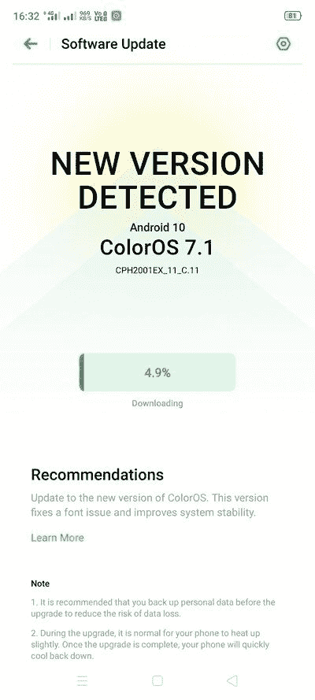

# OPPO F15 和 OPPO A91 正在使用 Android 10 获得 ColorOS 7 稳定更新

> 原文：<https://www.xda-developers.com/oppo-f15-a91-getting-coloros-7-stable-update-android-10/>

# OPPO F15 和 OPPO A91 正在使用 Android 10 获得 ColorOS 7 稳定更新

OPPO 现在已经开始在全球范围内为 OPPO F15 和 OPPO A91 推出基于 Android 10 的 ColorOS 7 更新的稳定版本。请继续阅读！

在本月早些时候为 OPPO R15 推出 ColorOS 7 口味的安卓 10 更新后，OPPO 现在正在为另外两款手机做同样的事情:OPPO F15 和 OPPO A91。不过，不要让命名惯例迷惑了你，因为这是 OPPO 品牌重塑战略的又一个例子。该公司最初于 2019 年 12 月在中国推出了 OPPO A91，并决定一个月后在印度发布与 [OPPO F15](https://www.xda-developers.com/oppo-f15-mediatek-helio-p70-48mp-camera-fast-charging-india-launch/) 完全相同的手机。让事情变得更加复杂的是，OPPO A91 还有一个[全球版本。非中国型号共享一个通用固件，因此新的 ColorOS 7/Android 版本与这两款手机兼容。](https://www.oppo.com/en/smartphone-a91/)

ColorOS 7 引入了谷歌在 Android 10 中推出的所有新功能，如全系统黑暗模式和全屏手势。OPPO [彻底修改了他们的定制皮肤](https://www.xda-developers.com/oppo-coloros-7-review/)，同时将其集成到 Android 10 之上，因此这两部手机的所有者现在可以享受更干净的 UI、重新设计的图标、优化的游戏空间等等。OPPO F15/A91 当前稳定的 Android 10 版本标记为 **CPH2001PUEX_11。C.11** ，现在在印度和其他几个亚洲国家都可以下载。

 <picture></picture> 

*Thanks to Twitter user [@Sanjeev90488373](https://twitter.com/Sanjeev90488373/status/1286617928083763200) for the screenshot!*

展开以下部分，查看此更新的完整变更日志:

### 用于 OPPO F15 和 OPPO A91 的 ColorOS 7 (Android 10)更新变更日志

*   视觉的
    *   全新的无边框设计使视觉更具吸引力，操作更高效。
    *   添加了 OPPO Sans 作为默认字体。新字体给人耳目一新的感觉，非常符合 OPPO 对美感和科技融合的追求。
*   智能边栏
    *   优化的用户界面和改进的单手操作。
    *   将应用程序拖出智能边栏，以分屏模式打开它。
    *   增加了两个设置:辅助球不透明度和全屏隐藏辅助球。
    *   优化了更多应用程序的浮动窗口功能。
    *   添加了一个气泡:当你从智能侧边栏的浮动窗口中打开一个应用程序时，会显示一个气泡。轻按气泡以折叠并打开应用程序。
*   屏幕上显示程序运行的图片
    *   优化的 3 指屏幕截图:使用 3 个手指触摸并按住屏幕，滑动手指以调整屏幕截图大小。使用 3 个手指触摸并按住屏幕，向外滑动手指以捕捉长截图。
    *   增加了截图设置:可以调整截图预览浮动窗口的位置，设置截图声音。
    *   优化的截图预览浮动窗口:截图后向上拖动释放分享，或向下拖动释放长截图。
*   导航手势 3.0
    *   新手势:从屏幕两侧向内滑动，然后按住以切换到上一个应用程序。
    *   优化的手势:横向模式下支持所有手势。
*   系统
    *   新增黑暗模式:保护你的眼睛，同时降低功耗。
    *   增加了聚焦模式:当你学习或工作时，保护你不受外界干扰。
    *   添加了所有新的充电动画。
    *   优化了快速设置用户界面，便于单手操作。
    *   向左或向右滑动以忽略横幅通知。
    *   增加了屏幕录制的暂停功能。
    *   增加了一个浮动窗口和屏幕录制设置。
    *   为文件删除、计算器按键和指南针指针增加了新的声音。
    *   优化的系统预装铃声。
    *   增加了对讲浮动提示的可访问性。
    *   添加了彩色辅助功能模式，以改善视障用户的用户体验。
    *   新增近期任务管理功能:可以查看近期任务的内存信息，锁定应用。
*   比赛
    *   优化游戏空间的视觉交互。
    *   优化了游戏空间的启动动画。
*   主屏幕
    *   更多现场壁纸。
    *   增加了美术+静态壁纸。
    *   自定义在主屏幕上向下滑动时是打开全局搜索还是打开通知抽屉。
    *   自定义主屏幕上应用程序图标的大小、形状和样式。
    *   在锁定屏幕上向上滑动以切换解锁方式。
    *   优化了密码解锁的图形设计，方便单手操作。
    *   支持锁定屏幕上的动态壁纸。
    *   更多屏幕外时钟样式。
    *   增加了一个简单的主屏幕模式，具有更大的字体和图标以及更清晰的布局。
*   安全性
    *   使用随机 MAC 地址将您的手机连接到 Wi-Fi 网络，以避免定向广告并保护您的隐私。
*   工具
    *   在快速设置或智能边栏中，您可以在浮动窗口中打开计算器
    *   在录像中增加了修剪功能。
    *   增加了天气(动态)铃声，自动适应当前天气。
    *   在天气中增加了适应天气的动画。
*   照相机
    *   优化了相机用户界面以获得更好的用户体验。
    *   优化了定时器用户界面和声音。
*   照片
    *   优化了相册用户界面，以实现清晰的层次结构和快速查找照片。
    *   增加了专辑推荐，可以识别 80 多个不同的场景。
*   通信
    *   OPPO Share 现在支持与 vivo 和小米设备共享文件。
    *   优化了联系人用户界面，以获得更高效的体验。
*   设置
    *   搜索设置现在支持模糊匹配，并包含搜索历史。
*   应用程序
    *   Soloop 视频编辑器:只需轻轻一按，即可创建您的视频。
    *   添加了 DocVault，这是一款便于管理和使用您的数字身份证的应用程序(仅在印度销售的手机上提供)。

那些运行基于 ColorOS 6 的 **CPH2001PUEX_11。A.33/A.35** 版本应该马上在手机上得到 OTA 提示。OPPO 还没有在他们的下载门户上发布侧载友好包，但用户可以通过访问设置>软件更新和点击齿轮菜单中的试用版来强制更新。

* * *

**来源: [ColorOS 社区](https://community.coloros.com/thread-47984-1-1.html)**