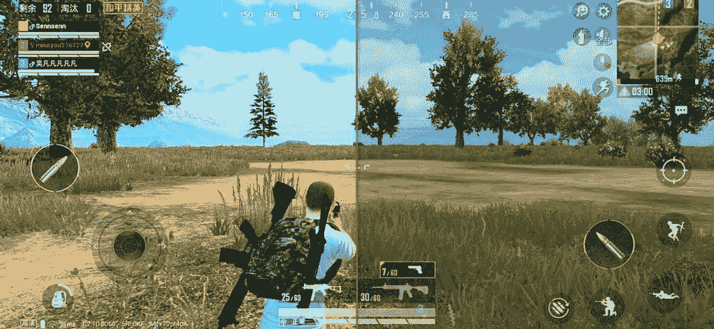

# OPPO 和高通推出“Game Color Plus”和“双 Wi-Fi”技术来增强移动游戏

> 原文：<https://www.xda-developers.com/oppo-qualcomm-game-color-plus-dual-wi-fi-technology-mobile-gaming/>

在正在中国上海举行的[中国数字娱乐博览会暨会议](http://en2019.chinajoy.net/)上，Oppo 和高通借此机会推出了他们的两项最新创新，这两项创新将增强游戏体验:Game Color Plus，一项提高游戏图像质量的技术，以及双 Wi-Fi，一项提高网络速度的技术。

## 游戏颜色加

游戏 Color Plus 是 Oppo 和高通技术合作的成果。这项技术由[高通骁龙精英游戏](https://www.xda-developers.com/qualcomm-snapdragon-855-snapdragon-elite-gaming-3d-sonic-sensor/)和骁龙的自适应技术提供支持，两家公司在用户界面设计、参数调整、性能和功率测试以及漏洞修复方面进行合作。简而言之，这项技术旨在通过增强游戏场景的细节、色彩饱和度和对比度来提高游戏视觉质量。

 <picture></picture> 

Game Color Plus on PUBG Mobile: Left is Enabled, Right is Disabled

由于这项合作，Oppo 成为第一家利用 Game Color Plus 的智能手机制造商。由于这项技术不是 Oppo 专有的，而是以高通为中心的，我们可以期待它在未来进入其他原始设备制造商。

## 双 Wi-Fi

除了游戏 Color Plus，Oppo 还宣布了其运行 ColorOS 6 的手机的双 Wi-Fi 技术。这项技术得到了 DBS/DBDC(双频同步/双频双并发)芯片技术的支持。信息来源表明，这已经可以在 Oppo Reno 上找到，尽管我们不确定这是否只针对最新的高通骁龙 855-sporting [Oppo Reno 10x](https://www.xda-developers.com/oppo-reno-10x-zoom-launch/) 或甚至[标准 Oppo Reno](https://www.xda-developers.com/oppo-reno-10x-zoom-launch-india/) 也是如此。双 Wi-Fi 也是[联发科超引擎游戏技术](https://www.xda-developers.com/mediatek-helio-g90-series-hyperengine-game-technology-launched/)的一个亮点，该技术在联发科 G90 系列几天前发布。

借助双 Wi-Fi 技术，兼容的智能手机可以同时连接到两个不同的 Wi-Fi 热点。这些热点可以配置相同或不同的 SSID，也可以设置在一台双频路由器或两台不同的路由器上。Oppo 的双 Wi-Fi 技术通过使用基于策略的路由和链路聚合和分流技术，使设备能够连接到两个 Wi-Fi 连接。这提高了设备的整体连接速度，也改善了游戏中的网络体验，因为您不太可能面临两个有效连接的网络中断。

* * *

**你对游戏 Color Plus 和双 Wi-Fi 有什么想法？请在下面的评论中告诉我们！**