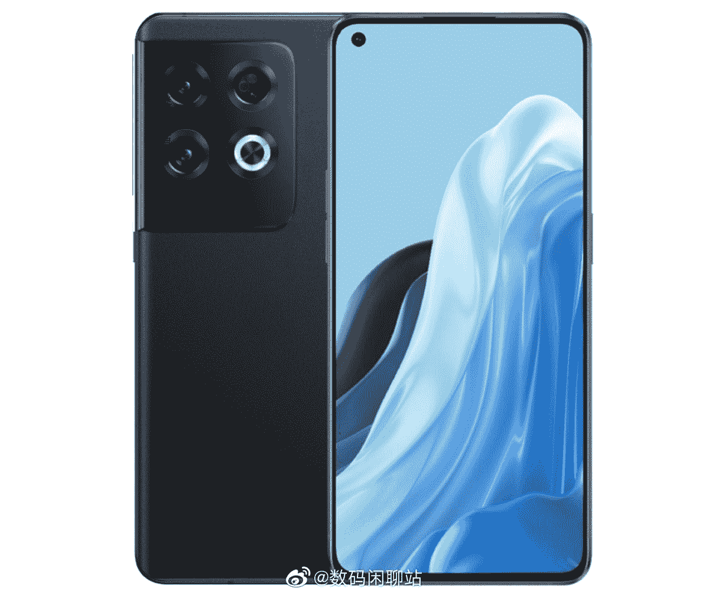

# Oppo Reno 8 可能是从未出现过的一加 10

> 原文：<https://www.xda-developers.com/oppo-reno-8-leak/>

一加 10 Pro 终于在国际上发布了，尽管一加的新设备历来都有普通版和“Pro”版，但这次没有普通的一加 10。然而，由于 Oppo Reno 8 的新泄漏，我们可能会对常规的一加 10 有所了解。

一加和 Oppo 都是同一母公司(步步高电子公司)旗下的品牌，经常共享手机设计——每部一加手机通常都有一部外观相似或相同的 Oppo 手机。例如，去年的 Oppo Reno 7 T1 看起来几乎和 T2 的一加诺德 N20 T3 一模一样。

微博上可靠的泄密者 Digital Chat Station 现在分享了即将发布的 Oppo Reno 8 的新闻渲染图和一些规格。这款手机与一加 10 Pro 有着惊人的相似之处，尽管并不完全相同——据报道，雷诺 8 的屏幕更小(6.55 英寸对 6.7 英寸)，相机阵列的侧面也没有哈苏品牌。50MP 主摄像头和角落打孔摄像头与一加 10 Pro 对齐，黑色似乎与黑色一加 10 Pro 相同。泄漏没有分享任何其他颜色，如果他们存在的话，但一加 10 Pro 也有“翡翠森林”绿色。

 <picture></picture> 

Source: Digital Chat Station

鉴于较小的屏幕和类似的布局，这似乎很可能是一加计划用于非专业一加 10 的设计，或者至少是相同的设备框架。不过，即将推出的 Reno 8 不会使用 OxygenOS，因为 Oppo 的手机使用略有不同的 ColorOS 软件体验。

一加 10 Pro 拥有 6.7 英寸 120Hz AMOLED 屏幕，高通骁龙 8 Gen 1 SoC，5,000mAh 电池，80W 有线快速充电(北美仅限 65W)，50W 无线充电，显示指纹传感器和三个后置摄像头。手机在国内用 Oppo 的 ColorOS 12.1，其他地方用 OxygenOS 12.1，都是基于 Android 12。

**来源:** [微博](https://m.weibo.cn/detail/4755174356684484)

**Via:** [Twitter](https://twitter.com/yabhishekhd/status/1511524341493739536)