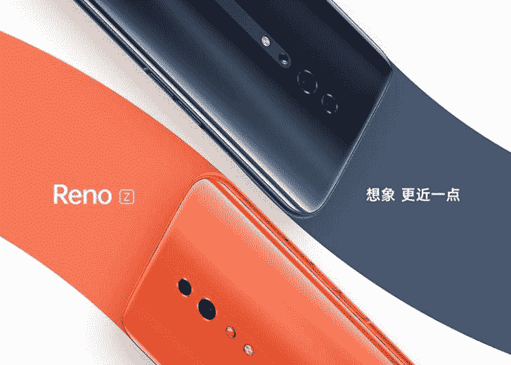

# OPPO Reno 获得两种新颜色，OPPO Reno Z 透露

> 原文：<https://www.xda-developers.com/oppo-reno-new-colors-oppo-reno-z/>

步步高电子的领先品牌 Oppo 最近一直在推出非常非常有趣的设备。去年的 Oppo Find X 是第一款开启无凹槽移动相机趋势的智能手机，这一趋势后来被主要参与者加入，如[小米](https://www.xda-developers.com/xiaomis-redmi-flagship-pop-up-selfie-camera/)、[一加](https://www.xda-developers.com/oneplus-7-pro-telephoto-lens-3x-lossless-zoom/)，甚至[三星](https://www.xda-developers.com/samsung-galaxy-a80-rotating-camera/)。今年的 Oppo Reno 试图通过引入一种更奇怪的方法来延续这一趋势。它有一个弹出式摄像头，与一加 7 Pro 和小米红米 K20 类似，但它采用了旋转“鲨鱼鳍”机制，看起来更美观。

**[OPPO 雷诺 XDA 论坛](https://forum.xda-developers.com/oppo-reno)**

Oppo Reno 和 Oppo Reno 10x Zoom 这两款高端机型都是对 Oppo 设计质量的考验，虽然它们的设计已经非常吸引人，但这款手机现在有两种新的颜色可供选择，包括一种看起来很像橙色的新珊瑚色选项和一种“灵感”版，我们猜测这款手机更像是一种“限量”或“特别”版，有深蓝色和紫色色调，以及大量的绘画和金色细节。甚至盒子和文件都装饰在这些细节上，它还包括一系列特殊的贴纸。

此外，还发布了一款新的低端设备 Oppo Reno Z。它放弃了最初让 Oppo Reno 吸引人的大部分东西:旋转摄像头被替换为常规的泪珠形凹槽，常规 Oppo Reno 中的骁龙 710 被替换为联发科 Helio P90 芯片组。存储/RAM 选项似乎也很尴尬:有一个 6GB RAM 版本，存储容量为 256 GB，但 8GB RAM 型号实际上将存储容量降至 128GB。退一步说，这是个奇怪的决定。

 <picture></picture> 

OPPO Reno Z

其他规格包括 4035 毫安时电池，20W VOOC 3.0 充电，以及基于 Android Pie 的 ColorOS 6。Reno Z 将有夜黑、星紫、珠白、珊瑚橙四种颜色可选。CNY 将于 6 月 6 日在中国开始销售，售价 2499 英镑(362 美元)。你对 Oppo 的新产品有什么看法？请在评论中告诉我们。

* * *

**来源 1: [GSMArena](https://www.gsmarena.com/oppo_reno_two_new_colors_coral_orange_inspiration_edition-news-37299.php) /来源 2:[GSMArena](https://www.gsmarena.com/oppo_reno_z_up_for_reservations_in_china_sales_begin_on_june_6-news-37300.php)**