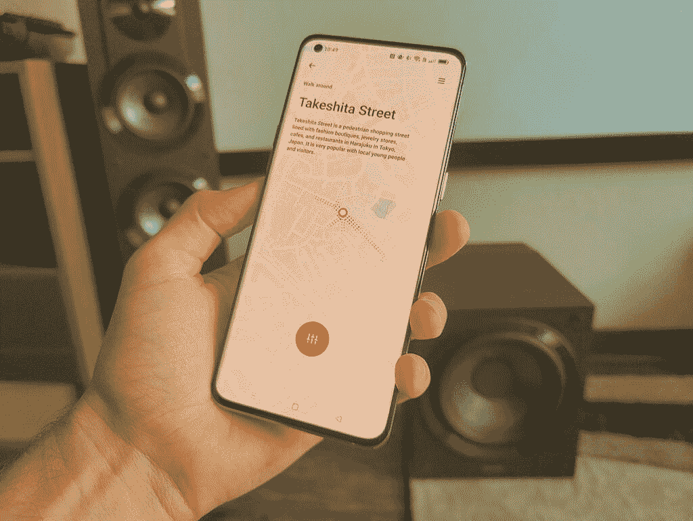

# 使用 OPPO 的 O Relax 聆听、放松或探索

> 原文：<https://www.xda-developers.com/oppos-o-relax/>

找到合适的环境声音应用程序是一个乏味的过程，因为大多数这类应用程序都充斥着低质量的声音、广告和糟糕的用户界面。我们这些依赖自然声音循环、白噪声或 ASMR 的人往往会发现自己有一系列不同的应用程序来服务于这些目的。OPPO 用户可以使用名为 O Relax 的独家应用程序，这是你需要的最后一个环境声音应用程序。配备高品质的音频和可定制的体验，您将能够沉浸在平静的体验中，帮助您放松。

重要的是每天花几分钟来缓解压力，消除生活中的混乱。您的手机现在可以成为您的私人冥想空间，O Relax 是 ColorOS 12.1 中免费提供的。OPPO Find X5 Pro 以及大多数其他 OPPO 设备都可以让您访问这个令人惊叹的避难所应用程序。

 <picture></picture> 

OPPO Find X5 Pro

* * *

## 听

收听模式允许您访问大量不同的音频文件，您可以将这些文件添加到场景中并微调音量。从包括环境声音、音乐、有色噪声或具有不同主题的特殊协作项目的预设开始。

 <picture></picture> 

O Relax Summer Seashore

环境声音是创造你自己的音频环境的好方法，可以帮助你入睡、放松或冥想。如果你想淹没来自发光二极管、电器或任何种类的电子设备的噪音污染，尝试不同颜色的噪音。粉红色的噪音非常适合抵消 LED 噪音的嗡嗡声，这通常会让耳朵敏感的人感到讨厌。

当您创建自己的环境天堂时，您可以使用来自自然、生活、城市、ASMR 等的声音。当您发现新声音时，它们会被下载并存储在本地，以便在没有互联网连接的情况下播放。你可以利用这个功能在登机前将一些自定义声音排队，然后用一些好看的耳机淹没飞行中的噪音。

* * *

## 放松

放松部分是一些用来缓解压力的游戏。一个简单的泡泡发生器使用音频和视觉来创造令人满意的体验。当你戳破泡泡时，OPPO Find X5 Pro 强大的触觉反馈可以带来即时的满足感。

 <picture></picture> 

O Relax Unwind Game

深呼吸练习是达到完全放松的好方法。这个游戏使用触觉反馈和音频提示，所以你甚至不用看手机就可以跟着玩。试着仰卧，将手机放在胸前，因为你会感觉到振动与你的呼吸相匹配。探索其他有趣的小游戏，找到平静和令人满意的方式来彻底放松。

* * *

## 探索

沉浸在一个听觉世界中，灵感来自不同城市的特定位置。游历北京、深圳、曼谷、东京和雷克雅未克等地。每个城市都有明显不同的声音，可以在安静和热闹之间调节。一张地图会告诉你这些声音是从哪里来的，并附有该地区的描述。

 <picture></picture> 

O Relax Explore

当你厌倦了地球上的城市时，在 360°视频中探索一个外星球。轻按环境的部分以查看关于外星世界的自定义视觉效果和信息。触觉反馈与视频同步，这导致了与环境的非常有趣的连接。

* * *

OPPO Find X5 Pro 有一个令人惊叹的内置扬声器，可以整夜让你的房间充满宁静的声音。由于用来制作 O Relax 声音的高质量音频文件，当搭配一些漂亮的扬声器时，一切听起来都更好。感受雷暴的低音，或通过您喜欢的扬声器播放音频，沉浸在城市街道的氛围中。杜比全景声的加入使这种体验比以往任何时候都更好，

在 OPPO 手机上访问 O Relax，例如新款 Find X5 Pro。在下面的 XDA 论坛上了解更多关于这款手机的信息。

[**OPPO 找 X5 Pro 论坛**](https://forum.xda-developers.com/c/oppo-find-x5-pro.12525/)

*我们感谢 OPPO 赞助这篇文章。我们的赞助商帮助我们支付与运行 XDA 相关的许多费用，包括服务器成本、全职开发人员、新闻撰稿人等等。虽然您可能会在门户内容旁边看到赞助内容(这些内容将始终被标记为赞助内容),但门户团队对这些帖子不承担任何责任。赞助内容、广告和 XDA 仓库完全由一个独立的团队管理。XDA 绝不会通过接受金钱来赞扬一家公司，或以任何方式改变我们的观点或看法，从而损害其新闻诚信。我们的意见不能被收买。*