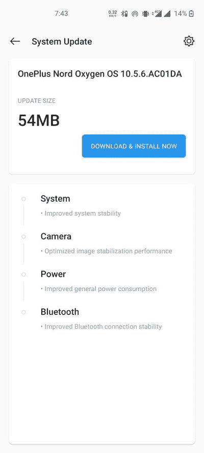

# 一加北部的 OxygenOS 10.5.6 改进了蓝牙连接

> 原文：<https://www.xda-developers.com/oxygenos-10-5-6-oneplus-nord-improves-bluetooth-connectivity-optimizes-image-stabilization/>

# 适用于一加北部的 OxygenOS 10.5.6 改进了蓝牙连接并优化了图像稳定性

最新的 OxygenOS 更新在一加北部推出，带来了许多与相机、系统和蓝牙相关的改进。

又是一天，又是一轮软件更新！这一次，一加带着新的 OxygenOS 回到了一加北部。标记为 OxygenOS 10.5.6 的最新更新附带了一个相对较小的 changelog，但它确实包含了对相机、系统和蓝牙的优化和修复。然而，Android 安全补丁级别(SPL)与此 OTA 没有任何变化。

**[一加诺德 XDA 论坛](https://forum.xda-developers.com/oneplus-nord)**

一加诺德的前一次更新带来了微距相机质量的提高。OEM 继续推动与相机相关的修复，因为最新的版本专门针对图像稳定性能领域。一加还[强调了](https://forums.oneplus.com/threads/oxygenos-10-5-6-for-the-oneplus-nord.1290954/)新固件中与一般功耗和蓝牙连接相关的一些改进。

**[一加诺德点评:性价比超高](https://www.xda-developers.com/oneplus-nord-review/)**

OxygenOS 10.5.6 更新的完整变更日志可在下面找到:

*   系统
    *   提高系统稳定性
*   照相机
    *   优化的图像稳定性能
*   力量
    *   改善了总体功耗
*   蓝牙
    *   改进的蓝牙连接稳定性

 <picture></picture> 

Thanks to OnePlus Community member [Sagar366](https://forums.oneplus.com/members/sagar366.926060/) for the screenshot!

* * *

## 下载适用于一加北部的 OxygenOS 10.5.6

一如既往，一加遵循的是一种渐进的推广模式。该公司将首先向少数用户推出新的更新。如果在初始阶段没有出现重大问题，在接下来的几天里，推广将扩展到更多的设备。如果您还没有收到 OTA 更新，并且您不想等待它，您可以从下面的索引中获取适合您的型号的更新包，并立即免费下载。我们提供了增量 OTA 和全 OTA 的链接。

*   全球:OxygenOS 10.5.6.AC01AA
*   印度:OxygenOS
*   欧洲:OxygenOS 10.5.6.AC01BA

* * *

*感谢 XDA 资深会员 [Some_Random_Username](https://www.xda-developers.com/download-oneplus-6-6t-receive-oxygenos-1035-ram-optimizations-buds-support-more/%E2%80%9Dhttps://forum.xda-developers.com/member.php?u=8234677%E2%80%9D) 的下载链接！*