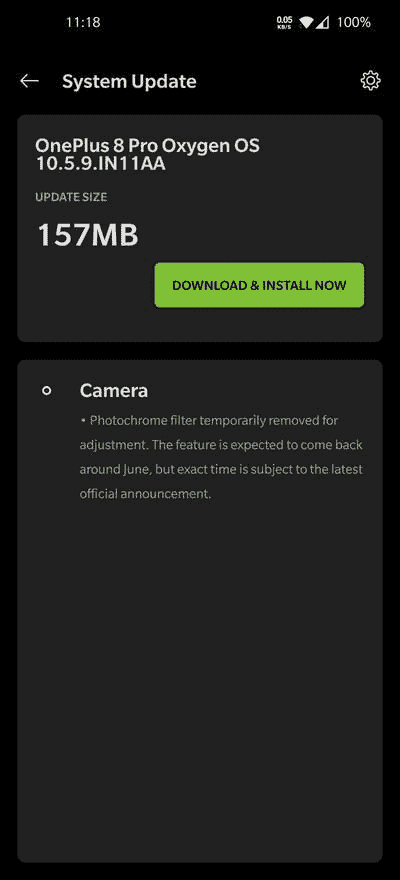

# 【更新 2:10 . 5 . 10 重新启用】OxygenOS 10.5.9 禁用了一加 8 Pro 的滤色器摄像头，即使在全球变型上也是如此

> 原文：<https://www.xda-developers.com/oxygenos-10-5-9-disables-oneplus-8-pro-color-filter-camera-even-global-variant/>

**更新 2(美国东部时间 06/10/2020 @ 05:38AM):**一加 8 Pro 上的 Photochrom 滤镜已经在 OxygenOS 10.5.10 上重新启用。

**更新 1(美国东部时间 05/29/2020 @ 05:15PM):**一加表示，这次更新意外地出现在一些一加 8 Pro 设备上，对于这些设备，Photochrom 滤镜将在未来的更新中重新启用。

一加 8 Pro 配备了一个四后置摄像头，48MP 索尼 IMX689 备受关注。但最近几天，就最近几天的媒体报道而言，初级传感器落后于 5MP 彩色滤光片相机。虽然一加宣传它的相机滤镜可以应用于一加 8 Pro 上新的“光致变色模式”的最终拍摄，但该传感器实际上能够透过一些塑料物体和非常薄的衣服。

**[一加 8 Pro XDA 论坛](https://forum.xda-developers.com/oneplus-8-pro) || [在亚马逊上预订一加 8 Pro](https://www.amazon.in/b/?node=21439725031&tag=xdaportalin-21)**

由于争议不断升级，一加迅速通过微博发表了官方道歉[，并宣布他们将暂时禁用彩色滤光片摄像头。该公司随后](https://www.weibo.com/3871046669/J2z9UgzY7)[澄清](https://www.xda-developers.com/oneplus-8-pro-color-filter-x-ray-infrared-see-through-camera-temporarily-disabled-future-update/)称，移除将只发生在 HydrogenOS 上，这是一加为中国设备提供的安卓皮肤，不应该影响运行 OxygenOS 的一加 8 Pro 的全球版本。

有趣的是，一加现在已经开始在全球范围内推出一加 8 Pro 的新稳定更新，猜猜会发生什么？它**确实移除了**光致变色滤镜！这一版本的变更日志( **10.5.9.IN11AA** )表明，该公司将在做出必要的调整后，在 6 月份的某个时候重新引入这一相机模式，尽管目前还不知道适当的时间表，稍后将宣布。

 <picture></picture> 

Thanks to XDA Member [Dezzmond99](https://forum.xda-developers.com/member.php?u=7791305) for the screenshot!

这款设备的印度变种也是捡了一个版本号差不多的新 OTA(**10 . 5 . 9 . in 1da**)，但是 changelog 完全不一样。基本上和[之前的稳定版](https://www.xda-developers.com/oneplus-8-pro-oxygenos-10-5-7-8-april-2020-security-patch-display-camera-system-optimizations/) ( **10.5.8.IN11DA** )为一加 8 Pro 带来【2020 年 4 月安全补丁是一样的。有可能一加也移除了印度版的彩色照片滤镜，只是忘了写一个新的修改日志，但是我们还没有测试过。到目前为止，欧洲版还没有新的 OTA。

## OxygenOS 10.5.9 下载链接

所有地区版本的更新正在批量推出，但是您可以跳过队列，从下面的索引中下载适合您的模型的版本。手动侧装很容易——你所需要做的就是将系统更新程序中的“本地升级”选项指向你下载的 ZIP 文件。

### 一加 8 专业版

*   国际(in1aa)-oxygen OS 10 . 5 . 9
*   印度(11 年)–oxygen OS 10 . 5 . 9

*感谢 XDA 资深会员 [Some_Random_Username](https://forum.xda-developers.com/member.php?u=8234677) 提供下载链接！*

* * *

## 更新 1:意外 OTA

产品营销团队的一名一加工作人员在一加官方论坛上说了以下[:“嗨，otto，对于任何困惑，我深表歉意，但这个 OTA 无意中进入了有限数量的设备。我们将在下一次 OTA 中重新启用该过滤器。”一如既往，一旦重新启用 Photochrom 过滤器的更新推出，我们将为您提供增量和完整的 OTA 下载。](https://forums.oneplus.com/threads/update-on-color-filter-camera.1228622/page-15#post-21659551)

* * *

## 更新 2: OxygenOS 10.5.10 重新启用了一加 8 Pro 上的 Photochrom 滤镜相机

一加曾提到，国际单位的 Photochrom 过滤器的禁用是偶然的，将推出一个版本来逆转这一变化。OxygenOS 10.5.10，[最近开始推出](https://www.xda-developers.com/oneplus-8-8-pro-oxygenos-update-camera-system-network/)，重新启用运行国际固件的一加 8 Pro 设备上的摄像头。该更新最初适用于印度单位(11DA 年)，但也开始推广到全球单位(11AA 年)。请注意，[印度单元将在暂时禁用](https://www.xda-developers.com/oneplus-8-pro-may-go-on-sale-india-color-filter-camera-disabled-oxygenos-update/)滤色器摄像头的情况下销售，计划在 6 月底进行更新，将在印度变体上重新启用滤色器摄像头。