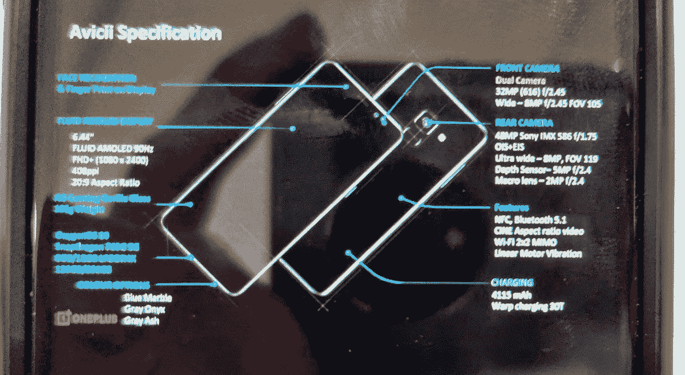

# OxygenOS 暗示了一加北部一种新的“灰灰”颜色

> 原文：<https://www.xda-developers.com/oxygenos-hints-new-gray-ash-color-oneplus-nord/>

如果你在过去几天一直生活在岩石下，一加北部终于来了。骁龙 765G 智能手机采用 90Hz AMOLED 显示面板，带显示指纹扫描仪，30W 快速翘曲充电技术，5G 支持-基本上是一系列非常有吸引力的价格下的良好属性。在发布会上，该公司决定仅提供两种颜色的 Nord，即“蓝色大理石”和“灰色缟玛瑙”。事实证明，一加可能有另一种颜色的作品，尽管我们不确定他们是否有任何计划很快发布它或为特殊场合保留它。

**[一加诺德 XDA 论坛](https://forum.xda-developers.com/oneplus-nord)**

XDA 资深会员和我们信任的一加情报人员 [Some_Random_Username](https://forum.xda-developers.com/member.php?u=8234677) 在分析工程模式应用程序时发现了关于一加诺德第三种颜色变体的暗示。对于那些不熟悉这个应用程序的人来说，它预装在每一部运行 OxygenOS 的一加手机上。这款高通制造的应用在 2017 年[因特权升级后门](https://www.xda-developers.com/oneplus-root-access-backdoor/)获得了安卓社区的巨大关注，尽管它的唯一目的是协助 OEM 工程师进行硬件测试。

**[亲身体验一加诺德:真正的 OnePlus X 继任者](https://www.xda-developers.com/oneplus-nord-hands-on/)**

在剖析了最新 OxygenOS 版本中的最新工程模式应用程序后， *Some_Random_Username* 发现了以下字符串:

```
 <string name="str_sm7250_color0_title">Gray Onyx</string>
<string name="str_sm7250_color1_title">Blue Marble</string>
<string name="str_sm7250_color2_title">Gray Ash</string> 
```

`sm7250`部分对应于高通骁龙 765/765g/768 SOC 的型号名称，但我们对颜色名称更感兴趣。正如我们之前提到的，列表中的前两种颜色已经发布了，但是“灰灰”的颜色还没有发布。更有趣的是，第三种颜色的存在确实与著名泄密者埃文·布拉斯在 Nord 发射前发布的[泄露幻灯片](https://web.archive.org/web/20200709200236/https://twitter.com/evleaks/status/1281218974462742530)中的细节相符。

 <picture></picture> 

Notice "Gray Ash" as one of the color options

与旗舰产品一加 8 系列不同，一加诺德目前还没有运营商专属的型号。“灰灰”可能是即将到来的航母发射的专属颜色，但这只是我们目前的猜测。

* * *

你觉得一加诺德的新颜色怎么样？请在下面的评论中告诉我们！