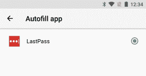

# 使用 Android Oreo 的 Autofill API 的密码管理器可能容易出现数据泄露

> 原文：<https://www.xda-developers.com/password-manager-autofill-api-data-leak/>

自动填充是随着 Android 8.0 奥利奥的发布而引入的最大、最广为人知的新功能之一。许多不同的密码管理应用程序，如 LastPass，已经在其应用程序中实现了这个新的 API。虽然它可以被证明是[相对于以前使用辅助功能服务的自动填充实现的相当大的改进](https://www.xda-developers.com/android-os-autofill-framework-will-finally-resolve-a-long-standing-lag-issue-with-password-managers/)，但是有一个潜在的安全缺陷需要考虑。上个月，GitHub 发布了一份白皮书，记录了 Android Oreo 自动填充 API 中的一个固有缺陷，该缺陷可能会**导致您的密码管理器泄露比您允许的**更多的个人数据。我们将对马克·墨菲(Mark Murphy)于 2017 年 8 月 8 日在他的 GitHub 页面上发表的白皮书(更为人所知的是 [CommonsWare](https://commonsware.com/) )做一个快速概述。

* * *

## Android Oreo 的自动填充 API 中存在潜在的数据泄漏缺陷

### 这个缺陷是如何工作的？

Android Nougat(以及更低版本)和 Google Chrome 等浏览器中的自动填充实现非常简单。通常，密码管理应用程序会使用辅助功能服务来扫描登录框的屏幕内容，并根据找到的内容推荐自动填充数据。当它工作的时候，它会导致相当大的延迟。

在 Android Oreo 上，这有点不同，因为自动填充 API 现在正式支持密码应用程序。第三方密码应用程序不再需要辅助功能服务，因为它们现在可以充当自动填充服务的角色，通过自动填充框架与应用程序通信。当用户聚焦于一个小部件时，系统会打包一些关于该小部件/表单的信息，并将其发送到自动填充应用程序。然后，应用程序返回相关的自动填充数据，如密码、电子邮件、信用卡或任何其他类型的敏感数据。Android 系统充当存储数据的应用程序和请求数据的应用程序之间的中介。

 <picture></picture> 

Autofill App in Android 8.0 Oreo

然而，恶意应用程序或恶意软件实际上可以利用自动填充功能为自己获取更多数据。恶意活动可以**请求使用不可见或隐藏的小部件**输入额外的自动填充数据。当用户同意填充一个可见的小部件时，比如登录表单或类似的东西，不可见的小部件也会在你看不到的情况下获得额外的数据。如果泄露的信息是您的密码、地址或信用卡详细信息，这将非常危险！

上面的截图展示了一个恶意测试应用程序利用了这个安全缺陷。

### 谷歌对这个问题的回答

根据 CommonsWare 的说法，这个安全问题还没有谷歌发布的公开解决方案。然而，我们知道谷歌意识到了这个问题。CommonsWare 表示，谷歌工程师承认该问题存在于一份私人问题跟踪报告中，但很难(如果不是不可能的话)实际修补它或推出一个修复程序。

但是**这并不意味着使用**自动填充是完全不安全的，因为谷歌正在采取另一种方法来确保数据安全。该公司正在**推动让自动填充服务处理他们那边的问题**，因此，正试图提高开发者的意识，以改善他们的自动填充提供商，并使他们更加安全。提议的具体内容是什么？

首先，自动填充提供程序**应该对它们的数据**进行分区。开发人员应该将存储在分区中的用户数据分开，而不是将所有自动填充数据保存在一个池中。例如，地址/电话分区、信用卡分区、密码/用户名分区等。自动填充服务应该基于聚焦的小部件一次只交还一个分区的数据。这是自动填充应用上的[公共可用页面](https://developer.android.com/reference/android/service/autofill/AutofillService.html)之一，保护自己不将数据泄露给看不见的小工具。

谷歌工程师表示，密码管理器的开发者还应该做一些其他事情。例如，自动填充提供程序应该只将数据交还给最初提供数据的特定应用程序。这应该通过验证应用程序的包名和公共签名来完成，这样即使修改过的 APK 也不能访问它。另一件事是，自动填充应用程序在实际提供数据之前需要认证，认证活动通知用户将向请求数据的应用程序提供哪种数据。这个建议实际上有很多错误，最重要的一个是这些建议实际上并没有被谷歌执行。

请记住，上述许多建议来自 CommonsWare 的私人问题跟踪报告，而不是来自任何谷歌官方文档页面。关于使用自动填充 API 的应用程序如何保护自己免受这种攻击的更深入、更技术性的分析，我们强烈建议您阅读 CommonsWare 的[完整白皮书。](https://github.com/commonsguy/AutofillFollies/blob/master/WHITE_PAPER.md)

### 有哪些应用不会受到这一缺陷的影响？

我们已经就此漏洞联系了 1Password、Enpass 和 LastPass 的开发人员，这 3 个应用背后的安全团队已经**声称**它们是**安全的**，尽管我们尚未证实这些说法。

正如我们在上面的陈述中看到的，1Password 要求用户在填写数据之前进行身份验证，并提前通知他们将填写哪些数据。这也有助于解决静默填充问题，因为对于每个要求自动填充数据的活动，都会出现一个验证弹出窗口。

Enpass 永远不会向请求的应用程序透露整个钥匙链，无论是恶意的还是正版的。只有与请求应用程序的包名匹配的已保存项目才会呈现给用户。他们还证实，他们将按照谷歌的建议采取更多措施。

此外，LastPass 向我们证实，虽然他们在 Android Oreo 发布之前不知道这个问题，但他们的应用程序确实使用数据分区来保护用户，并进行其他检查以确保 LastPass 只填充与条目相关的应用程序。

虽然使用这 3 个应用程序应该完全没有问题，但如果你想完全置身事外，你应该完全禁用手机上的自动填充功能，直到你可以与密码管理器开发人员确认他们的应用程序不会受到这种攻击。幸运的是，这很容易做到，只需进入设置>系统>语言和输入>高级，找到“自动填充服务”偏好设置，点击它，然后选择“无”。

正如我们上面所说的，我们不知道谷歌是否真的能解决这个问题，所以使用可信的应用程序或简单地禁用该功能是你保持安全的唯一方法。如果你想阅读更多关于这个问题的内容和所有相关的细节，你应该阅读 GitHub 上的原始白皮书。

* * *

*本文于 2017 年 9 月 13 日更新，以更准确地反映 LastPass、Enpass 和 1Password 回复的含义。*