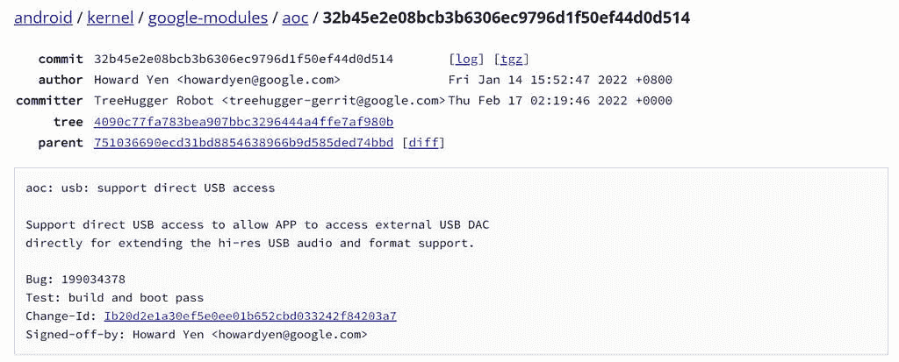

# 谷歌 Pixel 6 可以在 Android 12L QPR3 上使用更多 USB 设备

> 原文：<https://www.xda-developers.com/pixel-6-direct-usb-access-android-12l/>

本月早些时候，随着 Android 12 QPR3 Beta 1 的发布，谷歌开始对 Android 的季度平台发布进行公开测试。测试版没有详细的变更日志，几天前[更新了这个日志，以修复 Pixel 6](https://www.xda-developers.com/android-12-qpr3-beta-1-1-pixel-6/) 上的错误，但发现了一个有用的变化:Pixel 6 上的直接 USB 访问支持。

XDA 认可的开发者 Freak07 在 Twitter 上指出，Android 12L QPR3 Beta 1.1 中的内核包括对直接 USB 访问的支持。该功能允许更多外部 USB DACs 和 3.5 毫米耳机连接器工作，并修复了 Tidal、Neutron 和 USB Audio Player Pro 等音频应用程序的问题。

 <picture></picture> 

Commit in AOSP that enables Direct USB Access on Pixel 6

假设谷歌没有改变方针，这一变化应该意味着下一个主要的 Pixel 功能下降(目前定于 7 月)应该会改善 Pixel 6 和 Pixel 6 Pro 对 USB 音频设备的支持。Freak07 还能够将本月稳定的 Android 12L/12.1 更新中发现的更改反向移植到内核，该更新确实修复了中子播放器和其他 USB 音频应用程序的问题。

如果你有一个根/解锁的 Pixel 6，并且你想现在就尝试新的 USB 功能*而不刷新 QPR3 Beta 1.1 或等待几个月，那么[最新版本的 Freak07 的 Kirisakura-Kernel 定制内核](https://forum.xda-developers.com/t/kernel-25-03-2022-android-12-android-12l-kirisakura-2-0-1-for-pixel-6-pro-aka-raviole.4358435/post-86637233)针对 Pixel 6 系列包括后端口代码。*

 *Pixel 6 和 Pixel 6 pro 刚刚收到 Android 12L，3 月份的安全补丁，[威瑞森 C-Band 5G 支持](https://www.xda-developers.com/pixel-6-c-band-5g/)，3 月份的 Pixel 功能在[上周的一次合并更新中下降](https://www.xda-developers.com/pixel-6-android-12l/)。其他 Pixel 手机在本月早些时候收到了相同的更新，但不支持 C 波段 5G。

**来源:** [Freak07(推特)](https://twitter.com/mile_freak07/status/1507397884941115428)*