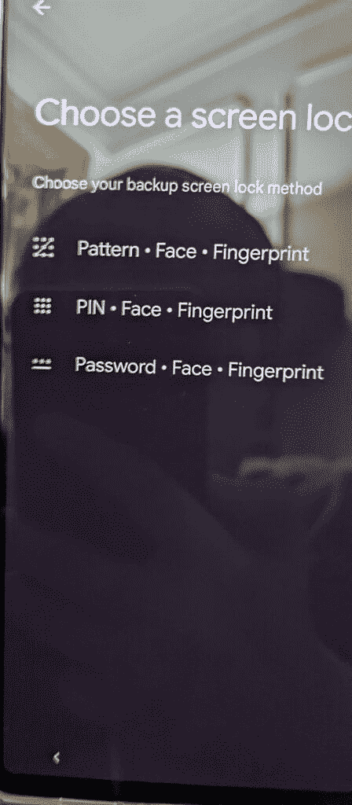

# Pixel 6 Pro 用户在初始设置时会发现面部解锁功能

> 原文：<https://www.xda-developers.com/pixel-6-pro-face-unlock-option-setup/>

# Pixel 6 Pro 用户在初始设置时会发现面部解锁功能

一位 Reddit 用户在设置他们的新 Pixel 6 Pro 时发现了尚未发布的面部解锁选项，但该功能尚未上线。

Pixel 6 Pro(也有改变颜色的贴纸)

在去年推出 Pixel 6 系列的前几天，我们了解了很多关于谷歌最新旗舰产品的信息。关于 Pixel 6 和 Pixel 6 Pro 的泄露展示了他们的设计，确认了硬件规格，甚至强调了一些新的软件功能。虽然这些泄露的信息大多是准确的，但当谷歌最终揭开这些设备的盖子时，暗示 Pixel 6 系列[将采用面部解锁](https://www.xda-developers.com/pixel-6-support-facial-recognition-pixel-stand/)的泄露被证明是错误的。

推出的 Pixel 6 和 Pixel 6 Pro 没有面部解锁支持，谷歌从其营销材料中删除了所有提及该功能的内容。但该公司似乎还没有放弃这一功能。上个月末，XDA 承认开发者 Freak07 [在 Android 12 QPR3 Beta 1.1](https://www.xda-developers.com/google-pixel-6-pro-face-unlock-support-evidence/) 的 PowerHAL 配置文件中发现了与该功能相关的新变化，这表明谷歌仍在研究该功能。现在，一名 *Reddit* 用户在设置他们的新 Pixel 6 Pro 时发现了面部解锁选项。

 <picture></picture> 

Credit: u/welp_im_damned

正如你在附图中看到的，面部解锁选项在初始设置时出现在“选择屏幕锁定”页面上。遗憾的是，用户在初始设置时无法设置面部解锁，该功能在设备设置中也不可用。

值得一提的是，我们还没有在稳定频道上看到任何其他关于该功能的报道。一名用户在最初的 *Reddit* 线程的评论中也证实，它不会在运行 Android 12L 测试版的 Pixel 6 Pro 的设置过程中出现。

虽然我们不确定为什么面部解锁选项随机只为一个用户弹出，但 *9to5Google* 报道称，自最初的 sd1a . 210817 . 015 . a4(2021 年 10 月)构建以来，Pixel 6 Pro 上就存在有问题的设置页面。正如你所料，谷歌目前还没有就此事发布任何官方信息。但我们希望该公司会在该功能准备就绪时发布公告。

* * *

**来源:** [Reddit](https://www.reddit.com/r/Android/comments/u0m4on/i_was_setting_up_my_new_pixel_6_and_when_it_said/i47ftk7/)

**Via:** [9to5Google](https://9to5google.com/2022/04/10/pixel-6-pro-face-setup/)