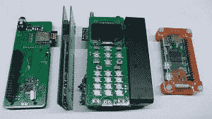
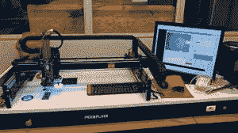

# ZeroPhone 是一款 DIY 智能手机，由树莓派 Zero 打造而成

> 原文：<https://www.xda-developers.com/project-zerophone-news/>

Raspberry Pi Zero 是由非营利组织 Raspberry Pi Foundation 设计的一款价值 5 美元的计算机，它是同类产品中对开发者最友好的计算芯片之一。谷歌甚至认可了它——搜索巨头[最近发布的 AIY 视觉套件](https://www.xda-developers.com/google-aiy-vision-kit/)可以让你把一个普通的旧树莓派 Zero 变成一个可以进行图像识别的人工智能平台。但迄今为止最令人印象深刻的项目之一可能只是 ZeroPhone，一款自己动手的智能手机。

这是来自拉脱维亚里加的 22 岁的 Arsenijs piugins 的创意，不可否认它并不是世界上最有吸引力的东西- *TechRadar* ，采访 piugins 的人将它描述为“PCB 三明治”。但 Pič ugins 的目标是将价格保持在 100 美元以下，并且 ZeroPhone 的规格对你来说非常令人印象深刻。

 <picture></picture> 

Source: ZeroPhone

这款手机运行 Raspbian Lite，并配有开源 UI 开发套件，采用 1.3 英寸 128 x 64 单色有机发光二极管屏幕，配有 1GHz 的 Broadcom BCM2835 应用处理器和 512MB DDR2 RAM。它有 WiFi 功能和 2G 移动数据支持(皮尤金斯说它将获得 3G 调制解调器)，并通过微型 USB 充电。它可以通过 HDMI 输出视频，通过 3.5 毫米耳机插孔输出音频，并发送和接收任何用 Python 编写的应用程序的命令。

不过，它不适合心脏虚弱的人。皮尤金斯说，ZeroPhone 的组装难度适中，最好由稍微熟悉焊接的人来尝试。但如果这没有吓到你，它的功能多得令人难以置信——ZeroPhone 通过 Raspberry Pi Zero 的 GPIO 扩展头支持附加设备，并且只需一点点努力就可以做任何事情(Pič ugins 举了一个例子，通过将笔记本电脑主板拆焊并连接到 Zero phone，可以对其 BIOS 进行重新编程)。

 <picture></picture> 

Source: ZeroPhone

ZeroPhone 本周进入第一个众筹阶段，Pič ugins 希望提供一系列案例作为支持者奖励。如果你对第一步感兴趣，请点击链接查看这个采访。

* * *

[**树莓派 Zero:Project Zero phone**](http://www.techradar.com/news/project-zerophone-the-ambitious-diy-raspberry-pi-phone)