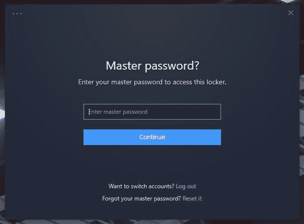
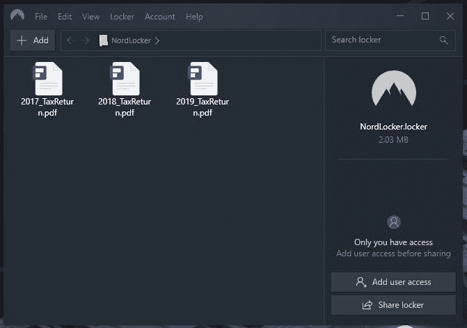
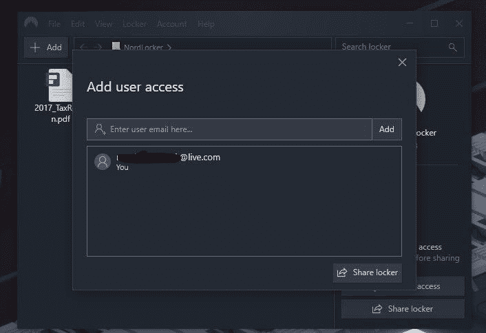

# 网上诈骗越来越多。使用 NordLocker 保护您的敏感文件

> 原文：<https://www.xda-developers.com/protect-sensitive-files-nordlocker/>

在线诈骗越来越多，尤其是在医疗方面。诈骗者试图冒充医疗保健系统中的某个人来访问计算机。最容易受到这些骗局伤害的人总是我们年长的家庭成员。现在是时候检查你的电脑了，确保你没有被黑客访问的危险文件。

## 加密您的文件

使用 [NordLocker](http://nordlocker.net/xdadevelopers) 保护您的文件安全。这个简单而强大的加密软件将帮助您轻松加密您的敏感数据。免费软件可以在几分钟内下载并安装完毕。Nordlocker 会给你一个文件夹，你可以把文件拖到里面，进行加密。若要访问您的文件，您需要输入密码才能访问您的安全文件夹。

 <picture></picture> 

NordLocker password screen

 <picture></picture> 

NordLocker encrypted files

NordLocker 支持所有文件类型，包括文档、照片、视频、档案，以及你能想到的任何其他文件。你可以免费加密 2GB 的文件，并可以选择解锁无限的文件。

## 您应该加密哪些文件？

确定哪些文件应该加密的最好方法是，带着你是黑客的心态检查你的电脑。您可以利用哪些文件？寻找税务文件、医疗记录、个人照片和财务信息。

在你的计算机上有一个加密的文件夹是对骗子的另一层防御。这些类型的骗子打电话给易受攻击的人，并说服他们安装恶意软件，从而允许他们远程访问目标计算机。一旦他们被连接，他们将搜索你的电脑最敏感的文件。这些是您需要保留在这一额外保护层后面的文件。

## 安全共享您的文件

也许管理这些敏感文件的一个聪明方法是使用 NordLocker 的安全共享功能。你可以在自己的电脑上保存父母或祖父母的税务、医疗和财务文件。当他们需要访问时，您可以将他们添加为 NordLocker 的授权用户。

 <picture></picture> 

Approve other NordLocker users for file access

您可以批准其他 NordLocker 用户查看和访问您为他们批准的特定文件夹。如果某人未获批准，他们将无法查看您的 NordLocker 文件夹中的任何内容。这是共享密码加密文件最简单的方法之一，不会有文件落入他人之手的风险。

使用我们的会员链接下载 NordLocker。

[**下载诺德洛克**](http://nordlocker.net/xdadevelopers)

###### 我们感谢诺德洛克公司赞助了这篇文章。我们的赞助商帮助我们支付与运行 XDA 相关的许多费用，包括服务器成本、全职开发人员、新闻撰稿人等等。虽然您可能会在门户内容旁边看到赞助内容(这些内容将始终被标记为赞助内容),但门户团队对这些帖子不承担任何责任。赞助内容、广告和 XDA 仓库完全由一个独立的团队管理。XDA 绝不会通过接受金钱来赞扬一家公司，或以任何方式改变我们的观点或看法，从而损害其新闻诚信。我们的意见不能被收买。