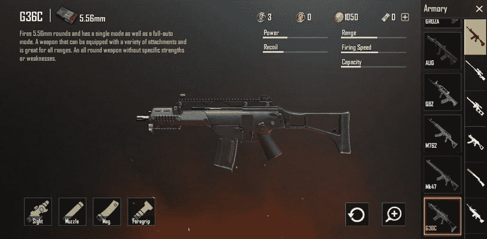
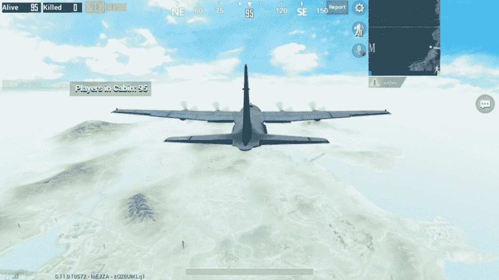

# PUBG Mobile Royale Pass 第 6 季更新，计划于 3 月 20 日推出新的 G36C 步枪和 Tukshai 车辆

> 原文：<https://www.xda-developers.com/pubg-mobile-royale-pass-season-6-update-g36c-tukshai/>

# PUBG Mobile Royale Pass 第 6 季更新，计划于 3 月 20 日推出新的 G36C 步枪和 Tukshai 车辆

PUBG Mobile 的 Royale Pass 第六季更新定于明天进行，将引入 G36C 步枪、Tukshai 和动态天气系统等新功能。

PUBG Mobile 遵循一个季节系统进行排名，这反过来又对分层和匹配产生影响。这些季节持续几个月，接着是新的季节，通常是新的更新。即将到来的稳定 PUBG Mobile 更新继承了 PUBG Mobile Beta v0.11.5 更新中正在[测试的几个功能，包括新的 G36C 步枪，Tukshai 车辆以及选定地图上的动态天气系统。](https://www.xda-developers.com/download-pubg-mobile-beta-v0115/)

 <picture></picture> 

G36C Rifle

PUBG Mobile 的新更新定于明天，即 3 月 20 日，将在不要求服务器离线维护的情况下进行。这个新的更新也带来了新的排名赛季和皇家通行证赛季。

 <picture></picture> 

Dynamic Weather on Erangel map

更新的完整变更日志如下:

*   **【皇室通行证】 :**
    *   玩家现在可以直接从皇家通行证页面查看整个地区和你的朋友的 RP 排名。
    *   精英通行证加购买现在有额外的奖励，除了立即获得 25 个等级。
    *   每周挑战现在奖励更多积分。现在只需轻轻一点就可以获得积分奖励。
*   **周年** :
    *   产卵岛上的生日派对！
    *   在比赛期间点燃烟火和收集箱子。
    *   比赛结束后打开收集的箱子，获得周年纪念奖励。
    *   找到比赛中随机产生的生日蛋糕，给你一个惊喜！
*   **将军 :**
    *   动态天气添加到 Erangel 和 Miramar。
    *   增加了一种新武器: **G36C 步枪**(仅限维肯迪)
        *   发射 5.56 毫米子弹，可以装备枪托，取代维肯迪的 SCAR-L。
    *   增加了新的 Sanhok 专属交通工具- **图克谢一辆三轮大巴**。这将取代吉普车，达契亚和迷你巴士。
    *   **订阅**将于 4 月初开始。
        *   有两种方案:Prime 和 Prime Plus。
        *   这两个计划都有免费的每日 UC、Royale Pass points、每日 80%的板条箱折扣、从 BP 商店购买等等。
        *   这两个计划的好处是可以叠加的。
    *   当玩家没有在商店连续多次赢得高于某一质量的物品时，他们将获得代金券。增加了与厄运有关的相关称号和成就。
    *   **房卡:1-在氏族商店使用**调整为每 10 天购买 1 次。
    *   在氏族系统中增加了一个机器人头像。

与我们分享的变更日志并没有提到对“生存到黎明”事件模式的改变，因为在测试版中是活动的。因此，我们将不得不看看这些变化是否已经被纳入，因为它们对游戏性和影响策略是重要的。

* * *