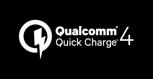

# 高通宣布快速充电 4.0 技术，现在与 USB 供电兼容

> 原文：<https://www.xda-developers.com/qualcomm-announces-quick-charge-4/>

在纽约的一次活动中，高通展示了其充电技术的最新进展: **Quick Charge 4.0** 。基于之前快速充电技术的成功，快速充电 4.0 承诺提供更快的充电时间和更高的效率水平，以便移动消费者花更少的时间拥抱墙壁。

高通发现，人们在寻找新智能手机时，四大关注点中有三个与电池容量或电池充电速度有关，他们的目标是利用快速充电 4.0 来继续改善他们的强大市场地位，超过 150 家公司支持快速充电，帮助减轻这些担忧。

 Quick Charge 4.0 声称可以将搭载[高通骁龙 835](http://www.xda-developers.com/snapdragon-835-announced-samsung-10nm-finfet-early-2017/) 芯片的旗舰智能手机的使用时间延长 **5 小时，只需 5 分钟**充电，据高通称可以“五用五”。只需 15 分钟的充电时间，高通声称它可以快速为手机充电至 50%的电量。

高通再次改进了他们的双电荷并行充电技术(现在称为“Dual Charge++”)，与 Quick Charge 3.0 相比，充电速度加快了 20%，效率提高了 30%，温度降低了 5 摄氏度，而 Quick Charge 3.0 本身也比以前的技术有所改进。

快速充电 4.0 还采用了高通 INOV(最佳电压智能协商)电源管理算法的第三版。INOV 的这一版本包括实时热管理，高通称这是技术行业的首创。INOV 3.0 通过确定和选择当前热条件下的最佳功率传输水平来实现优化。

快速充电 4.0 的一个主要关注点是改善安全和保护功能，增加了多个额外的保护层，以帮助防止电池过度充电。Quick Charge 4.0 保留了许多现有功能，如 3 层过压保护、3 层过流保护和 4 层过温保护，并增加了新功能，如检测所用电缆的质量和状况的能力。

不过，最重要的变化之一是增加了与 USB 电源传输 (USB PD)兼容的**，这是一个最好的时机，紧随谷歌在新的 [Android 7.0 兼容性文档](http://www.xda-developers.com/android-7-0-compatibility-document-released-plenty-of-changes-in-tow/)中“强烈建议】设备仅支持与 USB PD 兼容的充电方法之后(有一点点暗示，谷歌“可能会要求所有 type-C 设备在未来支持与标准 type-C 充电器的完全互操作性”)。**

为了实现最佳的 QC 4.0 性能，高通还推出了两款新的电源管理 SMB1380 和 SMB1381。这些 PMIC 专为低阻抗设计，峰值效率高达 95%，并支持电池差分检测等高级功能。SMB3180/1 将于 2016 年底上市。

高通的 Quick Charge 4.0 快速充电技术将用于下一代高通骁龙处理器，从高通骁龙 835 开始。Snapdragon 835 预计将于 2017 年上半年开始在商业设备中发货。

* * *

**你对高通的快充 4.0 有什么看法？请在下面的评论中告诉我们！**