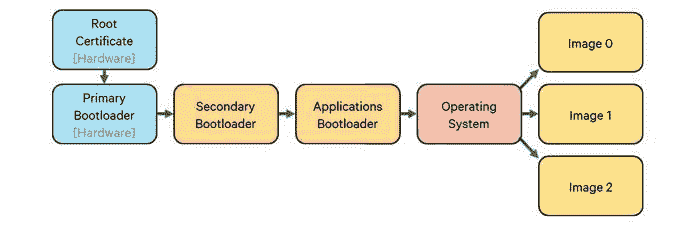

# 高通继续致力于安全领域

> 原文：<https://www.xda-developers.com/qualcomm-maintains-its-dedication-to-security-with-secure-boot/>

# 高通继续致力于安全领域

高通详细描述了他们自己的安全启动过程，以向他们的合作伙伴和客户展示他们对安全性的专注。

沿着 Android Nougat 的[严格执行验证启动](https://www.xda-developers.com/strictly-enforced-verified-boot-with-error-correction-to-come-with-android-7-0-nougat/)和 Windows 的[安全启动功能](https://www.xda-developers.com/microsofts-debug-mode-flaw-and-golden-key-leak-allows-disabling-of-secure-boot/)的路线，高通[也在追求一套基于加密图像认证的安全标准](https://www.qualcomm.com/news/onq/2017/01/17/secure-boot-and-image-authentication-mobile-tech)，以确保安全的启动链。

 <picture></picture> 

A typical secure boot chain. (Qualcomm, Ryan Nakamoto)

正如高通工程师 Ryan Nakamoto 所想的那样，所有带有引导链的设备都有可能受到恶意镜像注入的攻击。如果攻击者在引导链的早期获得对映像的访问权，特别是主引导加载程序或辅助引导加载程序，他们就有能力控制接下来的大部分或全部内容。为了更好地防止这样的攻击，高通的安全引导实现保护了引导链的每个方面**，从第一个 ROM 引导装载程序开始。当该链的一个步骤结束时，该段将验证它未被修改，然后提供一个签名，引导链中的下一个段必须加密验证该签名。如果生成的签名与下面的代码段所期望的不同，那么引导过程将立即结束。**

虽然像 dm-verity 和 Windows Secure Boot 这样的安全引导实现是许多定制 ROM 开发人员的祸根，但它们为非专业用户提供的改进的安全性是至关重要的。

由于微软和高通最近宣布，今年即将推出的设备将能够在骁龙硬件上运行 Windows 10，高通选择在 2016 年底推出其安全启动实施也就不足为奇了。鉴于 2016 年出现的大量 Android 安全恐慌，安全性已成为许多消费者的严重关切，因此高通继续致力于安全软件非常受欢迎。

* * *

[**来源:高通**](https://www.qualcomm.com/news/onq/2017/01/17/secure-boot-and-image-authentication-mobile-tech)