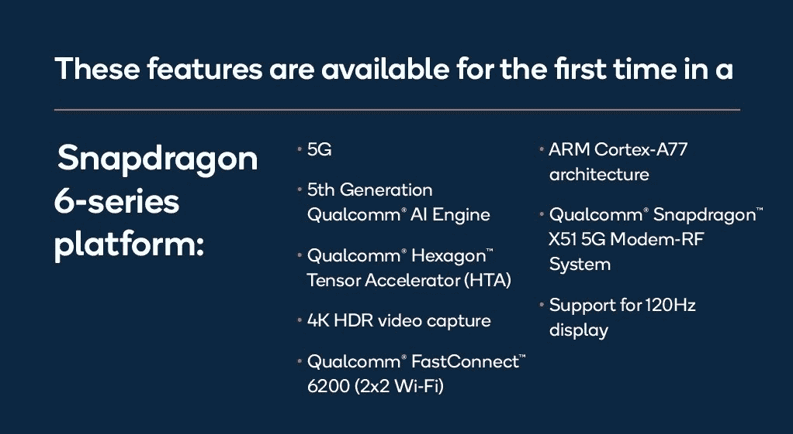

# 高通骁龙 690 将为更实惠的智能手机带来 5G

> 原文：<https://www.xda-developers.com/qualcomm-snapdragon-690-5g-chip/>

在过去的几年里，高通一直处于低端产品市场。这家美国芯片制造商见证了小米和 Realme 等中国智能手机厂商的许多重大设计胜利。2018 年 10 月，它推出了[骁龙 675 移动平台](https://www.xda-developers.com/qualcomm-snapdragon-675-chipset/)，随后在 2019 年 4 月推出了[骁龙 730/G](https://www.xda-developers.com/qualcomm-snapdragon-665-snapdragon-730g/) 。这两款产品成功打入了低端智能手机市场，随后在 2020 年 1 月推出了[骁龙 720G](https://www.xda-developers.com/qualcomm-snapdragon-720g-662-460-navic/) 。所有这三个 SOC 的一个共同点是，它们没有 5G 连接。高通在 12 月推出的[骁龙 765/G](https://www.xda-developers.com/qualcomm-snapdragon-765-processor-specifications-features/) 确实为骁龙 7 系列带来了集成 5G，但骁龙 765(及其超频版本[骁龙 768G](https://www.xda-developers.com/qualcomm-announces-snapdragon-768g-mobile-platform/) )旨在面向中端智能手机市场。这为中低端市场留下了一个缺口。现在，高通终于通过发布骁龙 690 填补了这一空白，这是骁龙 6 系列中首款支持 5G 的移动平台。

骁龙 690 (SM6350)旨在成为骁龙 675 的继任者，理论上它低于骁龙 720G 和骁龙 730G。然而，在实践中，它的 CPU 和 GPU 设计比两款 4G 骁龙 7 系列还要新。这使得它成为高通中低端市场迄今为止最强大的 SoC。这似乎是最终为大众智能手机消费者带来 5G 的芯片。

## 高通骁龙 690 -功能

让我们深入了解 SoC 的组件:

### CPU 和内存:Kryo 560 (ARM Cortex-A77)

骁龙 690 是一款八核 CPU，采用 2+6 CPU 内核配置。两个大核心是 Kryo 560 核心，主频高达 2.0GHz，而其余六个小核心是 ARM Cortex-A55 核心，就像以前的 SOC 一样。Kryo 560 内核是库存 [ARM Cortex-A77](https://www.xda-developers.com/arm-cortex-a77-cpu-announcement/) 内核(高通仍在使用“为 Cortex 打造”许可证，但与 [Cortex-A76](https://www.xda-developers.com/arm-cortex-a76-cpu-mali-g76-gpu-mali-v76-vpu-announcement/) 不同，它没有要求 ARM 对 Cortex-A77 内核进行任何更改)。由于骁龙 675 采用了基于 A76 的 Kryo 460 内核，骁龙 690 中的 A77 内核带来了显著的性能提升。高通表示，CPU 性能提高了 20%，这与 ARM 关于 Cortex-A77 的营销相吻合。至于与骁龙 720G 和骁龙 730G 的比较，情况更复杂，因为它们基于 A76 的 Kryo 460 内核的主频更高，为 2.3GHz。因此，骁龙 690 可能会与骁龙 700 系列的 CPU 性能持平，而不是得分更高。

高通仍然只使用两个大核心，不像联发科的 [Dimensity 800](https://www.xda-developers.com/mediatek-dimensity-800-5g-chip-mid-range-phones/) 和[Dimensity 820](https://www.xda-developers.com/mediatek-unveils-dimensity-820-5g-soc-upper-mid-range-smartphones/)SOC，它们具有四个大核心，尽管是旧的 Cortex-A76 架构。高通在单线程 CPU 性能方面也不会有优势，因为 Dimensity 820 的 A76 核心主频高得多，为 2.6GHz，较低的时钟速度将抵消 A77 的 IPC 改进。今年，高通正面临着来自联发科更强的竞争。

骁龙 690 采用三星的 8 纳米 LPP 工艺制造。在密度方面，这意味着它与 Dimensity 800 和 Dimensity 820 SoCs 相比处于劣势，Dimensity 800 和 Dimensity 820 SoCs 均采用 TSMC 卓越的 7 纳米 FinFET 工艺制造。(另一方面，骁龙 675 是用三星的 11 纳米 LPP 工艺制造的。)

在内存方面，骁龙 690 采用 2 个 16 位 LPDDR4X 内存，最高可达 1866MHz，最大内存可达 8GB。

### GPU: Adreno 619L

高通骁龙 690 采用 Adreno 619L GPU，高通表示，这使得它比其前身骁龙 675 的 GPU 快 60%。这可能看起来是一个令人印象深刻的数字，但外表是有欺骗性的，因为骁龙 675 的 Adreno 612 GPU [相对于骁龙 660 的 adre no 512 GPU](https://www.xda-developers.com/xiaomi-redmi-note-7-pro-review/)来说没有什么变化，后者是在 2017 年 5 月推出的。然而，Adreno 数字命名法确实表明，该 GPU 比骁龙 720G 和骁龙 730G 的 Adreno 618 GPU 略快。它能打败 Dimensity 820 的 Mali-G57MC6 GPU 吗？大概不会。Adreno 619L 支持 Vulkan 1.1 API 和基于物理的渲染(PBR)。

### 人工智能:带六边形张量加速器的第五代人工智能引擎

骁龙 690 采用了高通的第五代人工智能引擎。这包括 CPU，GPU，Hexagon 692 DSP 和高通传感中心。第一次在骁龙 6 系列，高通带来了它的六边形张量加速器(HTA)。据说这将为安全、语音和相机方面的智能设备体验提供动力，包括社交媒体过滤器和镜头之间的无缝转换。正如所料，六边形标量加速器和六边形矢量扩展也出现了。与它的前身骁龙 675 相比，该芯片的人工智能性能提高了 70%以上。另一方面，骁龙 720G 和 730G 由于采用了 7 系列命名法，预计仍将具有更快的人工智能性能，但三种芯片之间人工智能引擎架构的确切差异目前尚不清楚。

### ISP:光谱 355L

Spectra 355L 由骁龙 690 中的双 14 位 ISP 组成，为 4K·HDR 带来了人像模式(散景)视频捕捉，这是骁龙 6 系列的又一首创。有了这个 ISP，现在可以在视频中捕获超过 10 亿种颜色(10.8 亿)。它支持高达 192 百万像素的摄像头，以及高达 48 百万像素的多帧降噪功能(MFNR)。在双摄像头设置方面，它支持高达 32MP + 16MP 的 30 fps ZSL。在 240fps 的情况下，最高支持 1080p 的慢动作捕捉。视频采集格式分别为 HDR10 和 HLG。ISP 支持 HEIF 和 HEVC 高效格式，以减少文件大小。

### 连接:骁龙 X51 5G 调制解调器-射频系统

骁龙 690 采用高通的骁龙 X51 5G 调制解调器-RF 系统，该系统与其集成在一起(而不是像[骁龙 X55](https://www.xda-developers.com/qualcomm-snapdragon-x55-5g-modem-2019-android-smartphones/) 那样是一个分立系统)。这个插槽低于骁龙 865 的骁龙 X55 调制解调器-射频系统以及骁龙 765 的骁龙 X52 调制解调器-射频系统。骁龙 X51 是用于多模 5G 的调制解调器到天线集成系统。它支持 5G 的非独立(NSA)和独立(SA)模式，同时支持 FDD 和 TDD，以及动态频谱共享(DSS)。

正如预期的那样，该系统采用了低于 6GHz 的 5G，不支持更昂贵的毫米波 5G(目前其用途极其有限，市场可用性极其有限)。骁龙 X51 具有 100MHz 带宽，支持低于 6GHz 的 5G 和 4x4 MIMO。它支持具有多 SIM 卡功能的全球 5G。5G 下行最高 2.5Gbps，LTE 下行最高 1.2Gbps，5G 和 4G 的上行速度分别为 660Mbps 和 210Mbps。所有这些速度都低于高端骁龙 765 中的骁龙 X52 调制解调器-RF 系统。

骁龙 X51 调制解调器-RF 系统自然是一个多模系统，这意味着它也支持传统的连接标准。调制解调器-RF 系统还采用了高通的专有技术，如高通 5G 节能、宽带包络跟踪等。

 <picture></picture> 

Source: Qualcomm

### Wi-Fi 和蓝牙:高通快速连接 6200

高通 FastConnect 6200 连接系统为骁龙 690 上的 Wi-Fi 和蓝牙提供动力(它也为骁龙 765 上的 Wi-Fi 和蓝牙提供动力。)这是一个“Wi-Fi 6 就绪”芯片，这是什么意思还不清楚。它支持 Wi-Fi 5 和以前的 Wi-Fi 标准。MIMO 配置为 2x2 (2 流)MU-MIMO，这是骁龙 6 系列的又一首创。信道利用率为 20/40/80 MHz。

FastConnect 6200 具有蓝牙 5.1 功能，支持高通的 aptX 自适应编解码器及其 TrueWireless 技术。

### 显示

骁龙 690 支持高达 120Hz 刷新率的全高清+显示器，这是骁龙 6 系列的又一创举。最大的外部显示器支持是 60Hz 的 QHD+。它支持 10 位彩色显示器(多年来我们不会在较低的中端市场看到它们)，支持 HDR10、HDR10+和未来的 Rec.2020 色域。

### 位置

骁龙 690 是首款支持印度 [NavIC](https://www.xda-developers.com/qualcomm-announces-support-indias-navic-satellite-navigation-system/) GNSS 系统的骁龙 6 系列 Soc，紧随骁龙 720G 之后。它支持[双频 GNSS](https://www.xda-developers.com/dual-frequency-gnss-important-location-feature-your-phone-probably-missing/) 和所有主要的 GNSS 系统，如 GPS、GLONASS、北斗、伽利略、QZSS、SBAS 和 NavIC。

### 音频和充电

骁龙 690 采用高通 Aqstic 音频编解码器(最高支持 WCD9385)。它还具有用于硬件加速语音信号处理的 Hexagon 语音助理加速器以及 Aqstic 智能扬声器放大器(最高可达 WSA8815)。

在充电标准方面，该芯片支持[高通的快充 4+](https://www.xda-developers.com/qualcomm-introduces-quick-charge-4-nubia-z17-to-bring-it-first/) 规范。

最后，该芯片还支持 USB Type-C 上的 DisplayPort 输出，尽管这取决于设备制造商是否想启用或禁用该功能。

 <picture></picture> 

Source: Qualcomm

## 高通骁龙 690 -展望

目前，高通较低的中档 SoC 产品组合非常令人困惑。骁龙 720G 和 730G 在技术上比全新的骁龙 690 更高端，但骁龙 690 拥有更新的 CPU 架构和更快的 GPU。前面提到的骁龙 7 系列可能有更快的人工智能性能，但骁龙 690 以低于 6GHz 的 5G 连接进行反击。那么，骁龙 690 设备会接替骁龙 720G 设备吗？还是会处于不同的产品层？这个问题的答案还不清楚。

第一批使用这种芯片的设备制造商将是 HMD Global、夏普、永泰、摩托罗拉、TCL 和 LG。值得注意的是，小米和 Realme 这两家制造最物有所值手机的中国设备供应商的名字从名单中消失了。这并不意味着他们不会推出带有这种芯片的设备；这仅仅意味着前面提到的供应商将是第一个使用它的，但它仍然是足够有趣的评论。

在一次简报中，高通告诉我们，我们应该期待由骁龙 690 驱动的设备以 300 美元以上的价格出售。然而，有一些相互矛盾的信息，因为在回应媒体询问时，我们被告知，在印度等一些市场，这种芯片可能会用于 150 美元至 200 美元的设备。此外，该芯片也将用于在美国推出的手机。

骁龙 690 的前景是光明的，因为该芯片为骁龙 6 系列带来了几个第一。然而，与此同时，高通最好还是关注一下联发科的阴影。Helio G90T、Dimensity 800 和现在的 Dimensity 820(为价格合理的[red mi 10X](https://www.xda-developers.com/redmi-10x-5g-redmi-10x-pro-redmi-k30i-5g-launched-china/)提供动力)表明，高通正面临失去(并且已经在一定程度上失去)其在 SoC 性能和价值方面的长期主导地位的危险。对于消费者来说，这种新的竞争是一件好事，我们预计在 2020 年接下来的几个月里会有一些伟大的设备发布。

## 高通骁龙 690 -全规格

要查看骁龙 690 的完整规格，请打开下面的开关，或访问高通的网站。

### 高通骁龙 690 -全规格

**高通 AI 引擎**

*   Adreno 619L GPU
*   Kryo 560 CPU
*   Hexagon 692 处理器
*   六边形标量加速器
*   高通六角矢量扩展(HVX)
*   六边形张量加速器
*   高通传感中心
*   用于音频、语音和传感器的超低功耗集线器
*   低功耗支持人工智能算法
*   支持融合上下文数据流，包括传感器、音频和语音
*   支持多个语音助手
*   多麦克风远场检测和回声消除

**5G 调制解调器-射频系统**

*   骁龙 X51 5G 调制解调器-射频系统–面向 5G 多模式的调制解调器至天线集成系统
*   5G 独立(SA)和非独立(NSA)模式，FDD、TDD
*   动态频谱共享
*   低于 6 GHz: 100 MHz 带宽，4x4 MIMO
*   高通 5G 节能
*   高通智能传输技术
*   高通宽带包络跟踪
*   高通信号增强自适应天线调谐
*   全球 5G 多 SIM 卡
*   下行:最高 2.5 Gbps (5G)，1.2 Gbps (LTE)
*   上行链路:最高 660 Mbps (5G)，210 Mbps (LTE)
*   多模支持:5G NR、LTE，包括 CBRS、WCDMA、HSPA、TD-SCDMA、CDMA 1x、EV-DO、GSM/EDGE Wi-Fi 和蓝牙

**FastConnect 6200 系统**

*   Wi-Fi 标准:Wi-Fi 6-ready (802.11axready)、802.11ac Wave 2、802.11a/b/g、802.11n
*   Wi-Fi 频段:2.4 GHz、5 GHz
*   信道利用率:20/40/80 MHz
*   MIMO 配置:采用 MU-MIMO 的 2x2 (2 流)
*   8 流探测(用于 8×8 MU-MIMO)
*   Wi-Fi 安全性:WPA3-企业级、wpa 3-增强型开放式、wpa 3 轻松连接、wpa 3-个人级
*   目标唤醒时间(TWT)
*   集成蓝牙
    *   蓝牙版本:5.1
    *   蓝牙音频:高通 TrueWireless 技术，aptX 自适应

**摄像机**

*   高通光谱 355L 图像信号处理器
*   双通道 14 位 ISP
*   高达 192 兆像素的快照捕获(MFNR 高达 48 兆像素的快照捕获)
*   高达 32+1600 万像素的双摄像头，每秒 30 帧，零快门延迟
*   建议。2020 色域/每色 10 位视频捕捉
*   以 720p @ 240 FPS 的速度拍摄慢动作视频
*   HEIF: HEIC 照片捕捉，HEVC 视频捕捉
*   视频采集格式:HDR10，HLG
*   4K·HDR 用肖像模式拍摄视频(散景)
*   多帧降噪(MFNR)

**音频**

*   用于硬件加速语音信号处理的六边形语音辅助加速器
*   高通 Aqstic 音频编解码器(最高支持 WCD9385)
*   总谐波失真+噪声(THD+N)，回放:-108dB
*   原生 DSD 支持，PCM 最高 384 kHz/32 位
*   可定制的“金耳朵”过滤器
*   高通 Aqstic 智能扬声器放大器(高达 WSA8815)

**显示**

*   最大设备显示支持:
*   FHD+ @ 120 赫兹
*   最大外部显示器支持:
*   QHD @ 60 赫兹
*   10 位颜色深度。2020 色域
*   HDR10 和 HDR10+

**CPU**

*   Kryo 560，八核 CPU
*   高达 2.0 GHz
*   64 位架构

**视觉子系统**

*   Adreno 619L GPU
*   1.1 API 支持
*   4K HDR10 PQ 和 HLG 视频播放(10 位色深，记录。2020 色域)
*   H.264 (AVC)、H.265 (HEVC) VP8 和 VP9 播放
*   基于物理的渲染
*   API 支持:is 3.2、opencl 2.0 FP、Vulcan 1.1、DirectX 12

**安全**

*   生物认证:指纹、虹膜、声音、面部
*   设备上:高通移动安全、密钥供应安全、高通处理器安全、高通内容保护、高通可信执行环境、摄像头安全安全摄像头、加密引擎、恶意软件防护、安全引导、安全令牌

**充电**

*   快充 4+技术

**地点**

*   GPS、Glonass、北斗、伽利略、QZSS、NavIC 和 SBAS
*   双频支持
*   低功耗地理围栏和跟踪、传感器辅助导航
*   近场通信(NFC):支持

**通用规格**

*   内存速度:高达 1866 MHz，8 GB 内存
*   内存类型:2 个 16 位，LPDDR4x
*   近场通信(NFC)支持
*   USB Type-C 支持上的显示端口
*   8 纳米工艺技术
*   零件号:SM6350