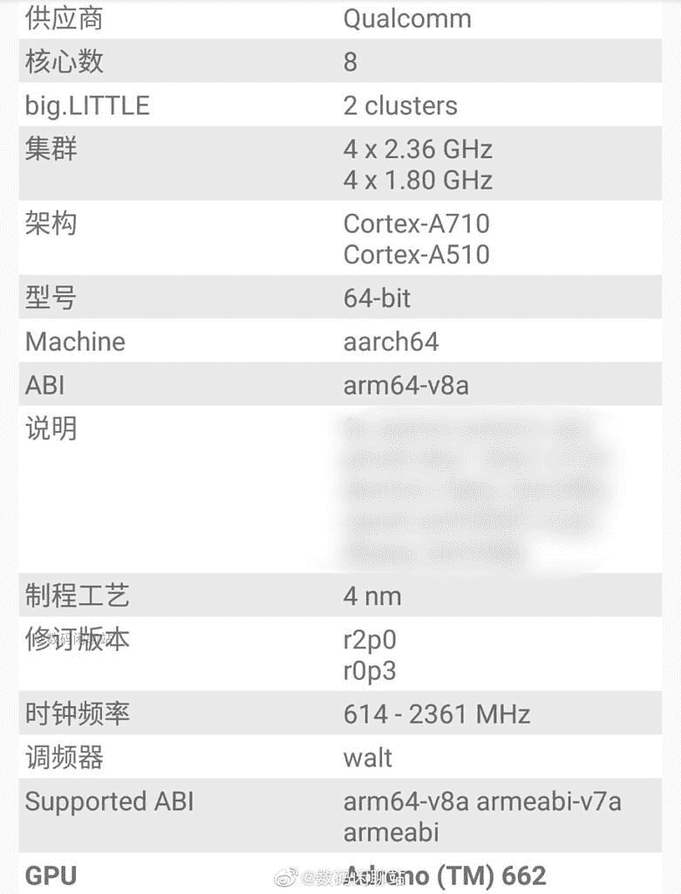

# 即将推出的骁龙 7 系列芯片可能是高端中端产品

> 原文：<https://www.xda-developers.com/qualcomm-snapdragon-7-series-soc-leak/>

# 泄露高通的下一个骁龙 7 系列足球的细节

一款即将推出的骁龙 7 系列芯片的泄露规格显示，它可能是一款高端中端产品。请继续阅读，了解更多信息。

据报道，高通正准备推出一款新的中端骁龙 7 系列芯片组。尽管该公司尚未发布任何关于 SoC 的官方信息，但知名泄密者 *Digital Chat Station* 声称它将采用 ARM Cortex-A710 和 Cortex-A510 内核。

在中国微博平台*微博* , *数字聊天站*最近的一篇帖子中称，即将发布的骁龙 7 系列芯片组将基于 4 纳米制造工艺。但不清楚它将由 TSMC 还是三星制造。据报道，八核芯片组将采用四个主频为 2.36GHz 的 Cortex-A710 性能核心和四个主频为 1.8GHz 的 Cortex-A510 效率核心。该芯片组还将封装 Adreno 662 GPU。

 <picture></picture> 

Credit: Digital Chat Station

基于这些泄露的规格，我们怀疑即将推出的骁龙 7 系列芯片可能是一款高端中端产品，位于旗舰[骁龙 8 代 1](https://www.xda-developers.com/qualcomm-snapdragon-8-gen-1/) 芯片之下。不知道的是，骁龙 8 Gen 1 也使用 Cortex-A710 性能和 Cortex-A510 效率核心。但它用一个更强大的 Cortex-X2 内核替换了 Cortex-A710 内核，使其具有显著的性能优势。

然而，骁龙 7 系列芯片可能无法胜任图形密集型任务，因为骁龙 8 Gen 1 具有更强大的 Adreno 730 GPU。在图形性能方面，它可能与旧的骁龙 888 不相上下(或更好)，后者装有 Adreno 660 GPU。但是我们也不能确定这一点，直到我们得到一个采用这种新芯片的设备。鉴于高通尚未发布官方声明，采用这种芯片的手机上市可能还需要几个月的时间。

即将到来的骁龙 7 系列芯片可以被称为骁龙 7 Gen 1，基于[高通新的简化品牌](https://www.xda-developers.com/qualcomm-mobile-soc-easy-branding/)。然而，我们目前还没有从高通得到关于品牌的确认。一旦我们有了关于即将推出的中端 SoC 的更多细节，我们会尽快通知您。

* * *

**来源:** [微博](https://www.weibo.com/6048569942/Ln9IJv5DV?pagetype=profilefeed)