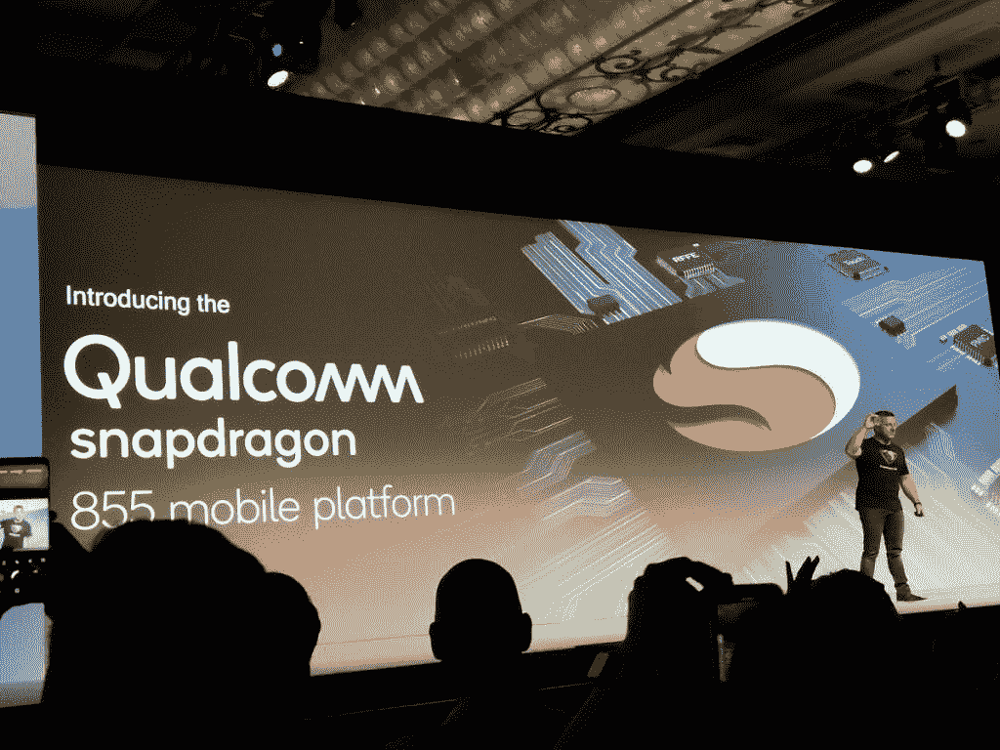

# 高通骁龙 855，骁龙精英游戏，三维声波传感器是官方的

> 原文：<https://www.xda-developers.com/qualcomm-snapdragon-855-snapdragon-elite-gaming-3d-sonic-sensor/>

高通 2018 年骁龙科技峰会今天正式拉开帷幕，高通及其合作伙伴发布了一系列 5G 相关公告。然而，在演讲快结束时，高通公司的移动总经理 SVP 透露了他们下一代旗舰移动平台的名称和一些功能。**高通骁龙 855** 是官方的，它很快就会出现在移动设备上。

高通即将推出的旗舰移动平台将采用更传统的品牌，而不是之前传言的 8150 品牌。毫无疑问，内部平台名称“sm8150”一直是准确的，但该公司选择继续其现有的品牌计划，作为下一个移动平台的营销名称——这与旧的高通旗舰移动平台如 msm8996(高通骁龙 820)或 msm8974(高通骁龙 800)没有什么不同。

正如[之前披露的](https://www.xda-developers.com/qualcomm-samples-flagship-chipset/)，即将推出的高通骁龙 855 移动平台将采用 7 纳米工艺制造。由于兼容高通[骁龙 X50 调制解调器](https://www.xda-developers.com/qualcomm-announces-x16-and-x50-modems-for-next-generation-snapdragon-8xx-devices-and-5g-connectivity/)，该平台也将为 5G 做好准备。与去年[骁龙 845 公告](https://www.xda-developers.com/qualcomm-snapdragon-845-news/)期间的 5G 会谈不同，今年 5G 更接近成为现实。例如，威瑞森[昨天](https://www.xda-developers.com/5g-samsung-galaxy-s10-verizon-2019/)宣布三星将在 2019 年上半年发布 5G 智能手机。美国在为消费者启用 5G 方面仅略落后于韩国，因为据 TechRadar 报道，三家韩国运营商在主要城市的部分地区为企业消费者推出了 5G 网络。借助支持 5G 的骁龙 855 移动平台，一旦运营商准备就绪，您的下一款旗舰智能手机将能够利用高速 5G 网络。

在 2018 年骁龙科技峰会的第二天，高通将为我们提供更多关于新骁龙 855 移动平台的细节。然而，该公司确实让我们先睹为快，看看明天的一些公告。该公司表示，新的移动平台采用了他们的第四代多核人工智能引擎，其人工智能性能是骁龙 845 的三倍。骁龙 855 还配备了**世界上第一个计算机视觉图像信号处理器** (CV-ISP)，以提供新的照片和视频捕捉功能。接下来，该公司推出了**骁龙精英游戏**，这是移动平台中的一系列功能，旨在增强移动游戏体验。最后，该公司宣布了**高通 3D 声波传感器**——一种使用超声波的显示器下指纹传感器解决方案，不同于使用光的光学显示器下指纹传感器。高通表示，他们在 3D 声波传感器中使用超声波比其他方法更安全、更准确。

正如预期的那样，随着 5G 的到来，高通的新发布专注于改善用户体验的核心支柱，包括性能、人工智能、相机、娱乐和连接。除此之外，今天我们没有什么可以告诉你的了。该公司将在整个峰会期间举办活动，提供有关骁龙 855 的更多信息，移动平台的大部分规格和功能将在第二天公开。要了解更多信息，请继续关注 XDA 开发者，因为我们将在本周分享大量的报道和细节！