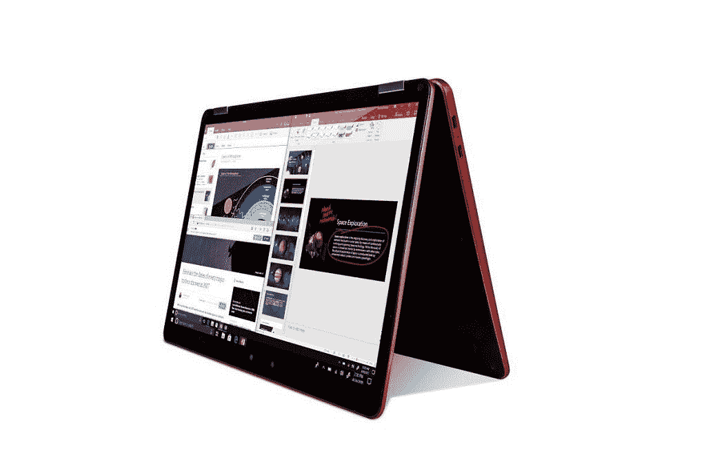

# 高通骁龙 8cx 为永远在线、永远连接的电脑而生

> 原文：<https://www.xda-developers.com/qualcomm-snapdragon-8cx-always-on-always-connected-pc/>

高通在我们的读者中最为人所知的是他们的骁龙移动平台，但在过去的两年里，该公司一直在努力通过引入一种新的产品类别来扩展到笔记本电脑领域:永远在线、永远连接的 PC。将近两年前的今天，微软和高通宣布合作开发运行在骁龙“高端”移动平台上的 ARM Windows 10。我们后来得知，该公司现有的 Snapdragon 835 移动平台[将是第一个在 ARM 上支持 Windows 10 的](https://www.xda-developers.com/snapdragon-835-laptops-windows-10/)。2018 年年中，高通发布了[骁龙 850](https://www.xda-developers.com/qualcomm-snapdragon-850-always-on-windows-10/) ，这是一款专门为 ARM 上的 Windows 设计的移动平台。在今年的[骁龙科技峰会](https://www.xda-developers.com/qualcomm-snapdragon-tech-summit-2018/)上，高通发布了骁龙 8cx，这是一个新的移动平台层，旨在为明年晚些时候上市的高端永远在线电脑提供动力。

凭借始终在线、始终连接的笔记本电脑，高通瞄准了那些需要笔记本电脑在旅途中保持连接，并且电池续航时间轻松持续一整天的用户。采用高通骁龙计算平台的笔记本电脑被设计成轻薄无风扇，就像我们日常使用的智能手机一样。然而，笔记本电脑通常用于更密集的工作，因此需要比我们的智能手机所基于的移动平台更强大。借助骁龙 8cx 计算平台，高通设计了他们迄今为止最强大的平台。正如新的[骁龙 855](https://www.xda-developers.com/qualcomm-snapdragon-855-kryo-485-cpu-adreno-640-gpu-spectra-isp-cv/) 被设计成高通的高端智能手机平台，**新的骁龙 8cx 是一个独立的高端计算平台。**因此，高通骁龙 8cx 不能替代骁龙 850，因为这两种产品将在市场上共存。

 <picture></picture> 

Qualcomm Snapdragon 8cx Reference Design.

## 骁龙 8cx 规格一览

|  | **高通骁龙 8cx** | **高通骁龙 850** |
| **CPU** | CPU 内核:4+4 个高通 Kryo 495(Cortex-A76 @ 2.75 GHz+Cortex-A55) | CPU 内核:4+4 个高通 Kryo 385 (Cortex-A75 + Cortex-A55) |
| **GPU** | 高通 Adreno 6802x 性能提升，能效提高 60% * | 高通 Adreno 630 |
| **记忆和存储** | 内存速度:2133 MHz 内存类型:LPDDR4x，8 通道，最高 16gb 存储:NVME SSDUFS3.0 | 内存速度:1866 MHz 内存类型:4x16bit，LPDDR4xUFS: UFS2.1 Gear3 2L，最高 8GBSD: SD 3.0 (UHS-I) |
| **ISP** | 双 14 位 ISP，高通 Spectra 390 图像信号处理器双 16 MPix 摄像头，30fps ZSL 单 32 MPix 摄像头，30 fps ZSL | 双 14 位 ISP，高通 Spectra 280 图像信号处理器双 16 MPix 摄像头，30fps ZSL 单 32 MPix 摄像头，30 fps ZSL |
| **调制解调器** | 骁龙 X24 LTE2000Mbps DL(目录。20)，316Mbps UL(第 20 类) | 骁龙 X20 LTE1200Mbps DL(目录。18)，150 兆位/秒 UL(第 13 类) |
| **制造工艺** | 7 纳米 FinFET | 10 纳米 LPP FinFet |

*基于高通在各自发布时提供的数字。

高通表示，骁龙 8cx 是他们迄今为止最强大的平台。该平台基于**7 纳米制造工艺**，采用 4x4 **Kryo 495 CPU** 内核，比上一代产品具有更大的系统和三级高速缓存(总共提供 10MB 高速缓存)，允许更快的多任务处理。与骁龙 850 计算平台相比，新的 **Adreno 680 GPU** 承诺性能提高一倍，能效提高 60%(GPU 性能是 Snapdragon 835 的 3.5 倍)。Adreno 680 的晶体管数量增加了一倍，内存带宽从 64 位宽增加到 128 位宽，支持最新的 DirectX 12 API，并支持 VP9 和 h265 解码器。对 CPU、GPU 和 DSP 的改进以及集成的人工智能引擎将改善平台上与人工智能相关的功能。(有关 Hexagon 690 的更多信息，请阅读 Mario Serrafero 关于[高通如何改进人工智能](https://www.xda-developers.com/qualcomm-snapdragon-855-performance-gaming-ai-improvements-explained/)的文章。)该平台支持高通的**骁龙 X24 LTE 调制解调器**，但没有选择[骁龙 X50 5G 调制解调器](https://www.xda-developers.com/qualcomm-snapdragon-summit-2018-5g-news/)(然而，高通表示，5G 支持*正在*走向“这种形式”，这意味着未来的计算平台可能支持 5G)。最后，骁龙 8cx 支持**高通的快速充电 4+** 技术进行快速有线充电。

对于多媒体，骁龙 8cx 支持 120fps 的 4K HDR 视频播放。采用骁龙 8cx 计算平台的电脑最多可以连接两台 4K HDR 显示器。为了传输文件或连接外围设备，骁龙 8cx 支持第二代 **USB 3.1 Type-C** 和第三代**PCI-E**。最后，对于音频，骁龙 8cx 支持高通的 **Aqstic audio** 技术套件，该套件由多个高质量音频编解码器、“智能功率放大器”和其他技术组成。高通的 **aptX 高清蓝牙音频编解码器**也包括在内，用于清晰的蓝牙音频流。

像以前的计算平台一样，骁龙 8cx 是基于 ARM 的。这意味着它运行针对 ARM 优化的 Windows 10，这自然意味着它会有一些限制[因为 Windows 针对 x86 优化。为了更好地支持 ARM 设备，微软](https://www.xda-developers.com/microsoft-windows-10-arm-limitations-revealed/)[之前](https://www.xda-developers.com/qualcomm-always-connected-platform-news/)建立了一个 x86 模拟器，允许大多数 32 位 x86 应用程序不加修改地运行，尽管性能可能无法达到为 ARM 上的 Windows 原生编译的应用程序的水平。幸运的是，新的骁龙 8cx 拥有**完整的虚拟机管理程序和 Windows 10 企业支持**，微软已经[打开了在 ARM 上支持 Windows 的原生 64 位应用程序的大门](https://www.theverge.com/2018/11/16/18098230/microsoft-windows-on-arm-64-bit-app-support-arm64)。高通已经证实，他们正在与谷歌和 Mozilla 合作，分别为 ARM 上的 Windows 优化 Chrome 和 Firefox 浏览器，但仍未透露 Chromebook 上何时会出现骁龙计算平台。ARM 上的 Windows 正慢慢变得越来越引人注目，高通似乎不会因为前两代永远在线、永远连接的个人电脑在评论中表现不佳而放弃这一类别。

高通骁龙 8cx 计算平台正在向客户提供样片，预计将于 2019 年第三季度**推出商用产品**。

## 规格和特性的完整列表

如果您有兴趣阅读完整的骁龙 8cx 的规格和功能列表，请展开下面的切换。

### 高通骁龙 8cx 规格和功能

**高通人工智能引擎**

*   高通 Hexagon 685 DSP
*   高通全方位感知技术
*   人工智能特性
    *   第四代高通人工智能引擎
    *   利用高通 Aqstic 技术增强 Alexa 和 Cortana 的语音助手体验

**调制解调器**

*   高通骁龙 X24 LTE 调制解调器
*   LTE 类别:LTE 类别 20
*   峰值下载速度:2 Gbps
*   最高上传速度:316 Mbps
*   下行链路特性:7x20 MHz 载波聚合、高达 256-QAM、5 个载波上高达 4x4 MIMO、全尺寸 MIMO (FD-MIMO)、最多 20 个空间流
*   上行链路功能:高通骁龙上传+，3x20 MHz 载波聚合，高达 2 个 106Mbps LTE 流，高达 256-QAM，上行链路数据压缩
*   支持的蜂窝技术:LTE FDD、LTE TDD，包括 CBRS 支持、LAA、LTE 广播、WCDMA(DC-HSDPA、DC-HSUPA)、TD-SCDMA、CDMA 1x、EV-DO、GSM/EDGE
*   调制解调器功能
    *   连接待机/即时开机
    *   数千兆位速度，实现几乎无缝的云连接/计算:高达 2Gbps 的 LTE

**无线网络**

*   Wi-Fi 标准:802.11ad、802.11ac Wave 2、802.11a/b/g、802.11n
*   Wi-Fi 频段:2.4 GHz、5 GHz、60 GHz
*   MIMO 配置:2x2 (2 流)
*   Wi-Fi 功能
    *   MU-MIMO
    *   数千兆 Wi-Fi
    *   双频同步(DBS)
    *   集成基带

**摄像机**

*   图像信号处理器:双 14 位 ISP，高通 Spectra 390 图像信号处理器
*   4K HDR 视频捕捉@30fps (10 位色深，rec2020。)
*   单 HFR 1600 万像素摄像头，60 帧/秒 ZSL
*   双 1600 万像素摄像头，30 帧/秒 ZSL
*   单个 32 百万像素摄像头，每秒 30 帧 ZSL
*   4K·HDR 解码速度为 120fps
*   编解码器支持:H.265 (HEVC)、VP9 和 H.264
*   相机功能
    *   最新的 DirectX 12 API
    *   高效视频编码器
    *   影院核心- VP9 和 H.265 解码器
    *   第二代 HDR 回放
    *   双 4K 外部显示器支持

**音频**

*   高通 Aqstic 音频技术
*   高通 TrueWireless 技术
*   高通广播音频技术公司
*   高通 aptX 音频技术:aptX Classic、aptX HD
*   环绕声音频
*   扬声器保护

**显示**

*   最大设备显示支持:4K
*   最大外部显示器支持:两个 4K 显示器

**CPU**

*   CPU 内核:8 个高通 Kryo 495
*   CPU 架构:64 位
*   7 纳米工艺技术

**视觉子系统**

*   高通 adre no 680
*   API 支持 DX12

**射频前端**

*   高通射频前端解决方案
*   高通信号增强自适应天线调谐
*   大功率发射机(HPUE)

**安全**

*   Windows 10 支持:企业版、专业版、家庭版
*   安全功能
    *   改进的加密安全性
    *   提高企业效率的远程管理和位置感知

**内存&存储**

*   内存类型:LPDDR4x，8 通道
*   存储:NVME SSDUFS3.0

**位置**

*   全球应急服务:辅助 GPS、OTDOA(基于 LTE 的定位)
*   卫星系统:全球定位系统、GLONASS、北斗、伽利略、QZSS、SBAS
*   位置特征
    *   位置感知有助于应用程序的准确性
    *   低功耗地理围栏和跟踪
    *   传感器辅助导航
    *   步行导航

**连接规格**

*   蓝牙版本:5.0
*   近场通信:支持
*   USB 版本:USB 3.1

**充电功能**

*   高通快速充电 4+技术

对于那些已经读到这里的人，这里有一些关于该产品营销名称的信息:“cx”在 8cx 中代表“计算”和“极限”