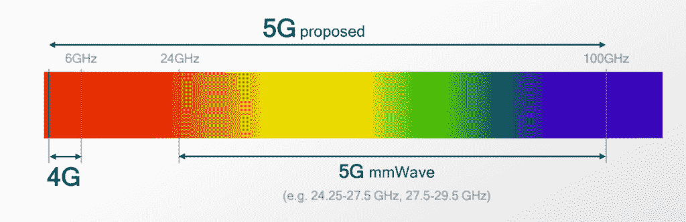

# 7 纳米高通骁龙 X55 5G 调制解调器已先于 MWC 发布

> 原文：<https://www.xda-developers.com/qualcomm-snapdragon-x55-5g-modem-2019-android-smartphones/>

2019 年 MWC 将充满惊喜，高通在这里宣布推出 7 纳米高通骁龙 X55 5G 调制解调器。这是世界上第一个 7 千兆比特每秒(Gbps)的 5G 调制解调器，是世界上第一个 5G 调制解调器的继任者[高通骁龙 X50](https://www.xda-developers.com/qualcomm-announces-x16-and-x50-modems-for-next-generation-snapdragon-8xx-devices-and-5g-connectivity/) ，早在 2016 年就宣布了。它不仅支持从 5G 到 2G 的连接，还支持 5G 新无线电(NR)毫米波和 6GHz 以下的频谱频段。7Gbps 额定带宽与下载速度有关，而它的额定上传速度为 3Gbps。

*“高通科技公司凭借我们的第一代* *5G 移动平台引领了第一波 5G 发布。随着功能和性能的显著发展，我们的第二代* *商用 5G 调制解调器是我们 5G* *技术成熟和领先的真实证明。高通公司总裁 Cristiano Amon 表示:*我们预计我们的 5G 平台将加速 5G 商业势头和力量*2019 年几乎所有的 5G 发布，同时显著扩大全球 5G 部署足迹。*

## 高通骁龙 X55 调制解调器

那么，我们为什么需要高通骁龙 X55 调制解调器呢？高通骁龙 X50 完全能够达到 5Gbps 的速度，但这并不意味着它在实践中对 5G 的速度足够好。高通正试图避免 4G 刚推出时面临的许多陷阱。由于缺乏优化，4G 网络设备的电池寿命非常糟糕，信号接收也很差。高通骁龙 X55 专为节能而设计，支持 6GHz 以下连接的自适应调谐，这也将带来更好的室内覆盖。它也是基于 7 纳米工艺制造的。骁龙 X55 5G 调制解调器还可以轻松集成到任何系统中，该公司声称骁龙 X55 调制解调器可以连接到任何地区的任何 5G 网络。特别提到的地区包括北美、韩国、日本、欧洲和澳大利亚。高通还以设备原始设备制造商的快速认证和上市时间而自豪，所以我们应该很快就会看到骁龙 X55 进入设备市场。不仅仅是智能手机——高通提到了始终联网的个人电脑、笔记本电脑、平板电脑、固定无线接入点、扩展现实设备和汽车应用。高通骁龙 X55 调制解调器预计将于 2019 年底进入商业设备。

[高通骁龙 X24 4G 调制解调器](https://www.xda-developers.com/qualcomm-x24-modem/)承诺最大理论下载速度高达 2Gbps，由于结合了 7 倍载波聚合、最多 5 个聚合 LTE 载波上的 4×4 MIMO、许可辅助接入、FD-MIMO 和其他技术，甚至可以在拥挤的网络上保持高速。但是像新的高通骁龙 X55 这样的 5G 调制解调器理论上可以达到 20 Gbps——是骁龙 X24 的 10 倍。

## 毫米波 QTM525 5G 天线模块

 <picture></picture> 

How Do We Make It Mobile" by Qualcomm.

“当谈到 5G 时，原始设备制造商面临一系列艰巨的设计挑战。支持从 5G 到 2G 的多模操作的需求，以及不断增加的频段组合数量， *带来了前所未有的复杂性，”*高通公司总裁 Cristiano Amon 说道。*“分立调制解调器或射频解决方案已经不够用了。高通科技通过提供全面的调制解调器到天线解决方案，在移动行业中独树一帜，我们在 5G 的各个方面都做出了开创性的努力，并准备让我们的客户拥有这些能力，帮助他们在今年实现第一波 5G 设备的商业化。”*

为了克服这些挑战，高通推出了面向 5G 多模设备的第二代射频前端(RFFE)解决方案。这种新的解决方案将有助于原始设备制造商加快产品上市时间，同时提高电池寿命、通话可靠性和数据传输速度。这款新发布的 RFFE 解决方案包括 QTM525 毫米波天线模块。高通还宣布了 QET6100 包络跟踪器，它支持 100Mhz 的 5G 带宽。还推出了 QAT3555 信号增强自适应天线调谐器，以应对人们对移动设备信号接收不佳的日益担忧。

毫米波描述了网络提供商可以获得的最快 5G 速度的频率。唯一的问题是它覆盖的地理距离要小得多，所以毫米波只能在人口密集的城市中心使用。这就是农村地区对低于 6GHz 的需求所在——它将覆盖更远的距离，代价是吞吐量更低。4G 也在低于 6GHz 的频率下运行，因此最终目标是两个网络将在同一频率下共存，动态频谱共享允许网络提供商更快地部署 5G 网络。这就是新型毫米波天线模块 QTM525 如此重要的原因。这是一款单芯片、14 纳米 5G 收发器，支持 26GHz、28GHz、39GHz 甚至 6GHz 以下的毫米波。它的厚度不到 8 毫米，所以增加多个天线模块不会使手机明显变厚。

## 5G 将于 2019 年和 2019 年在 MWC 举行

虽然 5G 即将到来，但该技术仍处于初级阶段，在大多数场景中完全超过 4G 还需要很长时间才能实现商业可行性。高通打算在今年的 MWC 2019 上展示这项技术，以展示其路线图和 5G 的用例。

*“我们继续推动新的技术创新，这将带来新的性能和效率水平，以及 5G NR 技术的更广泛应用，”*高通技术公司工程副总裁 John Smee 说。高通将展示骁龙 X50 调制解调器如何用于基于云的游戏，[这是一个公司多年来一直致力于完善的系统](https://www.xda-developers.com/googles-cloud-gaming-platform-youtube-integration/)。

支持 5G 的智能手机似乎也要贵得多，在一加要贵几百美元左右。随着高通骁龙 X55 调制解调器的出现，设备制造商可能能够以更低的价格采购其前身，即使它在技术上不如它。5G 的未来令人兴奋，我们将密切关注它。高通已经改进了其测试设施，因此他们可以在标准化之前验证新的 3GPP Release 16+设计，因此我们可以期待未来的更多改进。