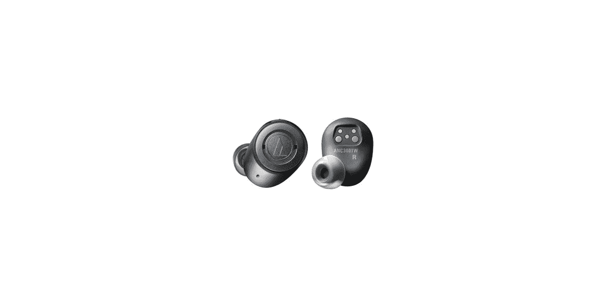

# QuietPoint ATH-ANC300TW 是 Audio-Technica 在具有噪音消除功能的无线耳塞方面的尝试

> 原文：<https://www.xda-developers.com/quietpoint-ath-anc300tw-audio-technicas-wireless-earbuds-noise-cancellation/>

# QuietPoint ATH-ANC300TW 是 Audio-Technica 在具有噪音消除功能的无线耳塞方面的尝试

日本音频设备制造商 Audio-Technica 已经跳上了真正的无线潮流，推出了新的 QuietPoint ATH-ANC300TW 耳塞。

 <picture></picture> 

HyperFocal: 0

随着苹果 AirPods 的推出，越来越多的 Android 制造商已经跳上了真正的无线耳机潮流。在过去的几个月里，Razer 推出了[锤头无线耳塞](https://www.xda-developers.com/razer-hammerhead-true-wireless-earbuds-junglecat-gaming-controller/) , [Realme 推出了 Buds Air，OPPO 推出了 Enco Free](https://www.xda-developers.com/realme-buds-air-india-launch-oppo-enco-free-announced-apac-region-truly-wireless-earphones/) 。但是，不仅仅是智能手机制造商在利用这一趋势。TicWatch Pro 的制造商 Mobvoi 也[发布了 TicPods 2](https://www.xda-developers.com/ticpods-2-pro-wireless-earbuds-voice-controls/) 真正的无线耳塞。现在，日本音频设备制造商 Audio-Technica 也加入了这一潮流，推出了新的 QuietPoint ATH-ANC300TW。

QuietPoint ATH-ANC300TW 真正的无线耳机最近在 CES 2020 上展出。顾名思义，这些真正的无线耳机不同于市场上的任何其他耳机，因为它们提供了主动降噪功能。这款耳机采用 5.8 毫米驱动器，带有 DLC(类金刚石碳)涂层振膜，通过蓝牙提供卓越的音频。数字混合降噪技术利用每个耳塞中的两个麦克风，最大程度地降低了环境噪音。这款耳机内置了一个用于通信的麦克风，以及用于音乐播放控制、接听电话的多功能按钮，还有一个快速试听功能，可以让你通过暂停音乐来听到外界的噪音。

ATH-ANC300TW 与高通 aptX 音频和 AAC 编解码器兼容，以确保通过蓝牙进行高质量的音频播放。它还采用了高通的 TrueWireless Stereo Plus 技术，以提高低延迟性能。这款耳机配有四种尺寸的薄硅胶耳塞，以及一对定制贴合的 Comply 泡棉耳塞。由于 IPX2 防水等级，这款耳机非常适合户外使用，一次充电可使用长达 4.5 小时，充电盒可提供 13.5 小时的额外电量。Audio-Technica 将 QuietPoint ATH-ANC300TW 定价为 249 美元，这款耳机预计将于今年春天上市。

* * *

**来源:[音效师](https://blog.audio-technica.com/ces-2020-debuting-a-ts-newest-audio-products/)**

**输入来自[Engadget](https://www.engadget.com/2020/01/07/audio-technica-ath-anc300tw-anc-earbuds/)**