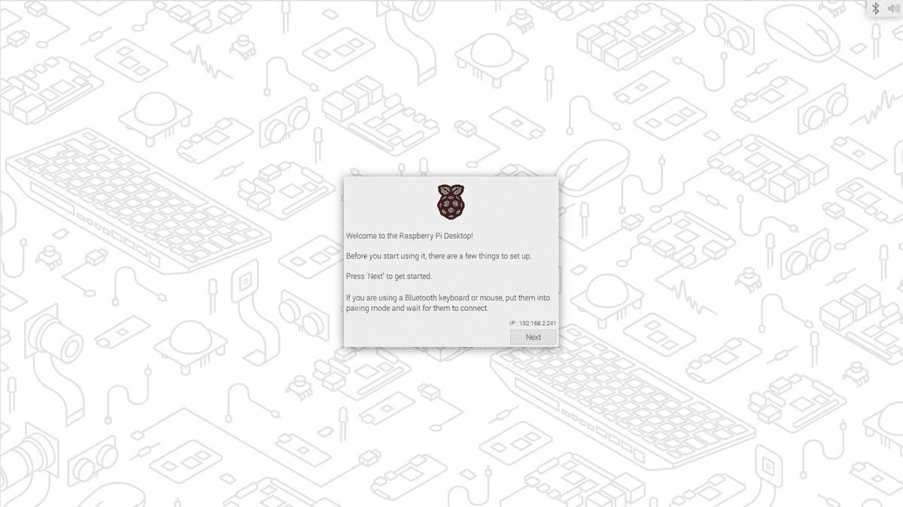

# Raspberry Pi 操作系统增加了蓝牙功能和初始 Wayland 支持

> 原文：<https://www.xda-developers.com/raspberry-pi-os-username-setup-wayland-update/>

Raspberry Pi 系列微机已经正式问世十年了，从教授编程到推动 DIY 项目，它仍然是一个受欢迎的选择。Raspberry Pi 背后的团队一直致力于对默认操作系统的改进，现在有一些变化可供尝试。

最重要的变化是，Raspberry Pi 操作系统将不再使用“Pi”作为默认用户名和个人文件夹，而是在初始设置过程中，您必须设置一个唯一的用户名和密码。Raspberry Pi 在一篇博客文章中表示，默认用户名“可能会使暴力攻击变得稍微容易一些，为了应对这一点，一些国家现在正在立法禁止任何联网设备使用默认登录凭据。”

 <picture></picture> 

The updated setup wizard (Source: Raspberry Pi)

您仍然可以选择将用户名设置为“pi”，这对于一些不是为不同用户名构建的 Pi 应用程序和脚本可能是必需的，但不建议这样做。如果您在没有设置向导的情况下使用 Raspberry Pi OS Lite 映像，您会看到一个更简单的设置用户名的提示，并且可以使用 Raspberry Pi Imager 通过无头设置(其中 Pi 不用于电视或显示器)配置自定义用户名和密码。

设置向导也已更新，支持蓝牙键盘和鼠标的配对。许多较新的 Pi 板支持蓝牙(或使用 USB 蓝牙适配器)，但直到现在，您仍然需要一个有线键盘进行初始设置。

最后，Raspberry Pi 操作系统现在已经初步支持 Wayland 桌面会话。 [Wayland](https://en.wikipedia.org/wiki/Wayland_(display_server_protocol)) 是一种显示技术，它正在慢慢取代 Linux 生态系统中已有 37 年历史的 [X Window 系统](https://en.wikipedia.org/wiki/X_Window_System)，尽管大多数 Linux 发行版在默认情况下仍使用 X，但 Pi OS 正在引入它作为收集反馈的实验选项。屏幕截图、屏幕放大镜、远程桌面工具和其他功能都无法使用。

你可以在下面的源代码链接中了解如何启用 Wayland 和更改现有的 Raspberry Pi 操作系统用户名。这些变化在最新的 Raspberry Pi 操作系统映像中可用。

**来源:** [树莓派](https://www.raspberrypi.com/news/raspberry-pi-bullseye-update-april-2022/)