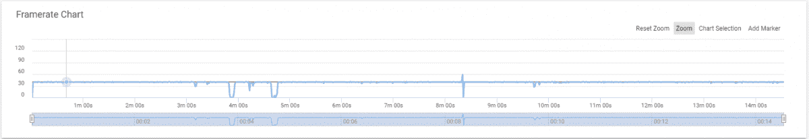
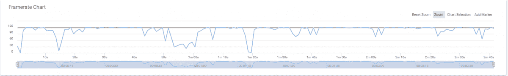
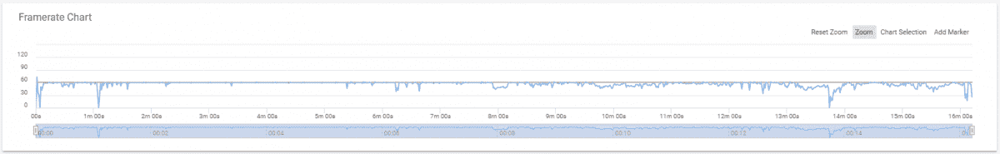

# Razer Phone 2 游戏、性能和电池寿命评测

> 原文：<https://www.xda-developers.com/razer-phone-2-review-testing-the-battery-life-and-performance-of-the-gaming-powerhouse/>

当谈到 Android 手机游戏时，真正的竞争者寥寥无几。在新的[高通骁龙 855](https://www.xda-developers.com/qualcomm-snapdragon-855-performance-gaming-ai-improvements-explained/) 移动平台于今年晚些时候开始在旗舰 Android 智能手机中发货之前，高通骁龙 845 是 Android 上游戏的最佳移动平台。高通的 Adreno 630 GPU 是目前最快的移动 GPU，分别超过 Exynos 9810 和麒麟 980 移动平台中的 Mali G72 和 Mali G76。因此，像 Razer Phone 2 这样的最好的游戏智能手机使用高通的骁龙 845 是理所当然的——但是 Razer Phone 2 到底有多棒呢？Razer Phone 2 被宣传为周围最好的游戏智能手机之一，不仅仅是在游戏性能上，而是在显示硬件，音频性能和电池寿命上。我们一直在测试这款设备——包括基准测试和真实使用——这样你就可以决定 Razer Phone 2 是否物有所值。

[**雷蛇手机 2 论坛**](https://forum.xda-developers.com/razer-phone-2)

* * *

## Razer Phone 2 规格

| 

种类

 | 

规格

 |
| --- | --- |
| 规模 | 158.5 x 78.99 x 8.5mm 毫米 |
| 中央处理器 | 高通骁龙 845 @ 2.8GHz |
| 国家政治保卫局。参见 OGPU | 肾上腺素 630 |
| 随机存取存储 | 8GB (LPDDR4X) |
| 后置摄像头 | 12MP(带 OIS 的 f/1.75 宽)+ 12MP (f/2.6 长焦)双音 LED 闪光灯，双自动对焦相位检测，2160p @ 60FPS 视频录制 |
| 前置摄像头 | 800 万像素 f/2.0 瓦/ 1080p 视频录制 |
| 储存；储备 | 64GB/128GB(仅缎面玻璃),支持 microSD |
| 显示 | 5.72 英寸 1440×2560 16:9 IGZO LCD 514 PPI 120hz 宽色域(WCG)645 尼特最大 Corning Gorilla Glass 5 |
| 声音的 | 无 3.5 毫米耳机插孔(包括 USB-C 至 3.5 毫米耳机插孔适配器、24 位 DAC)、带双放大器和杜比 Atmos 的立体声前置扬声器 |
| 电池 | 4,000mAh 电池，带高通快充 4.0+，快速无线 Qi 充电 |
| 港口 | USB 类型-C |
| 指纹扫描仪 | 是(侧面安装) |
| 软件 | [安卓 8.1](https://www.xda-developers.com/tag/android-oreo/) 奥利奥(即将升级到[安卓派](https://www.xda-developers.com/tag/androidpie/) |
| 连通性 | 带 VoLTE 的单个 SIMNFCBluetooth 5.0 wi-Fi 802.11 a/b/g/n/acLTE |
| 法官 | 

*   GSM: 850/900/1800/1900
*   WCDMA: B1/2/3/4/5/8
*   TDD-LTE: B38/39/40/41/48
*   FDD-LTE:B1/2/3/4/5/7/8/12/13/14/17/18/19/20/26/28/29/30/32/66/71

 |

## 高通骁龙 845 和 Adreno 630 GPU

值得注意的是，Razer Phone 2 的大部分功率将来自其强大的高通骁龙移动平台。值得称赞的是，Razer 已经做了许多自己的软件优化，以充分利用 Razer Phone 2 运行的硬件。他们还推出了自己的冷却系统，以保持设备长时间高性能运行。不过，该设备的原始计算能力来自机载的高通骁龙 845。骁龙 845 移动平台包括 Adreno 630 GPU，相比其前身骁龙 821 性能提升了 30%，效率也提高了 30%。

移动游戏现在处于一个很好的位置，像 [PUBG Mobile](https://www.xda-developers.com/oppo-pubg-mobile-tournament-india/) 和[堡垒之夜 Mobile](https://www.xda-developers.com/fortnite-mobile-now-supports-android-devices-with-the-snapdragon-670-and-710/) 这样的游戏正在崛起，像 [Dolphin Emulator](https://www.xda-developers.com/dolphin-emulator-android-update-bug-fixes/) 这样的平台模拟器是他们有史以来最好的。其他 Android 手机游戏，如沥青、死亡触发器和新的[使命召唤战争传说](https://www.xda-developers.com/download-call-of-duty-mobile-android-beta/)也提供了一些有趣的游戏体验，Razer Phone 2 应该像冠军一样处理它们——这都是因为 Razer 的软件优化，但主要是因为它包装的令人印象深刻的硬件。

* * *

## 第一印象

我对 Razer Phone 2 的第一印象主要集中在它给人的感觉有多大。雷蛇手机 2 矮胖；很重，而且很*长方形*。这款手机需要一些时间来适应，特别是来自小米 Mi Mix 2S 和 OnePlus 6。虽然一开始我不喜欢它的设计，但我记得 Razer Phone 2 是为更多铁杆手机游戏玩家设计的。在*实际玩游戏*的时候学会了欣赏设计。它不是一个外观，但它很实用，这种设计在一定程度上使雷蛇手机 2 **如此令人满意，以至于实际上*使用*** 。它的重量就像一个控制器，显示屏两侧的大型扬声器格栅和挡板确保您不会意外地用手掌触摸显示屏。它还可以确保您不会意外挡住扬声器，因为它们正对着您。

这种设计对于设备是为谁而设计是有意义的，这可能是为什么 Razer Phone 2 的**背面看起来如此美丽**。我有镜面玻璃版，它的背面是一整块黑色反光玻璃，中间有 Razer 的标志。它看起来真的很华而不实，超越了其前身的设计。背面看起来很漂亮，这让我相信雷蛇*意识到正面并不好看，这是一个功能性设计的选择。如果是这样的话，我倾向于同意这个决定，因为我认为 Razer Phone 2 首先是一款手持游戏设备，其次是一款智能手机。*

智能手机的人体工程学与其性能一样重要，尤其是对于打算长时间手持的智能手机。两只手横着握着，老实说**感觉刚刚好**。音量按钮位于中央，这样你就不会不小心碰到它们，指纹传感器和电源按钮也是如此。

120Hz 1440p 显示屏在支持它的游戏中非常漂亮，即使只有正常的 Android UI 元素，也很难解释它在菜单中导航和在社交媒体中滚动有多令人满意。值得注意的是，与 2018 年发布的任何其他旗舰智能手机相比，16:9 的显示屏似乎有些过时，但 Razer Phone 2 获得了通行证，因为它是一款用于多媒体消费的手机，尤其是游戏。游戏和大多数视频仍然主要是为 16:9 显示器制作的，所以 Razer Phone 2 不会裁剪任何内容或显示任何偏离中心的内容。

Razer 第一眼就把这个设备钉死了，但是在显微镜下是怎样的呢？

## 游戏性能

*使用 [GameBench](https://gamebench.net) 记录的游戏帧率数据，这是一项出色的服务，可以帮助您分析 Android 和 iOS 上的游戏性能。GameBench 有桌面客户端和移动客户端。我们使用 Android 手机客户端进行审查。*

### PUBG 移动

PUBG Mobile 可能是 Android 上最受欢迎的竞技射击游戏，它比大多数可用的游戏都有更高的技能上限(如果你不与机器人对抗的话)。你不想在玩的时候面对掉帧的情况，你希望能够听到你周围的一切。玩 PUBG 时，大而高分辨率的显示屏是天赐之物，在 Razer Phone 2 上看起来很棒。Razer Phone 2 的**扬声器声音也很大**，所以在游戏中听到你周围的敌人绝对没有问题。

 <picture></picture> 

PUBG's framerate over time

PUBG 很少低于 40FPS，这是我能让它达到的最大 FPS。这是开发商腾讯的责任，因为它限制了它，我们现在几乎无法进一步提高它。PUBG 是流行的 PC 对战皇家第一人称射击游戏的一个令人惊讶的好端口，就像在 PC 上一样，你会想要你能聚集的任何优势。高 FPS 是实现这一点的最佳方式，在一个反应时间很重要的游戏中，Razer Phone 2 **不会妨碍你玩**。PUBG 使用大约 1GB 的内存，对于 8GB 内存的 Razer Phone 2 来说绝对没有问题。它像冠军一样处理它。

## 口袋妖怪 Go

这是一款可以真正使用 Razer Phone 2 的 120Hz 显示屏的游戏，它**看起来很华丽**。动画很流畅，很少丢帧，1440p 显示屏显示出大量细节。我在口袋妖怪里跳上三分钟给我的朋友送些礼物；然后我在我的库存里玩了一圈，滚动了一下我的口袋妖怪列表，试着看看它运行得怎么样。

 <picture></picture> 

Pokemon Go's framerate over time

虽然 Pokemon Go 并不总是保持 120FPS，但它肯定比 PUBG 一直以更高的帧速率运行。显然，这是因为没有 40FPS 的上限，但即使是这样，丢失的帧通常也只能达到 60 帧，甚至只有 90 帧。

## 海豚模拟器

Android 上的仿真简直是一个奇迹。您可以在智能手机上玩任天堂 DS 游戏、NES 游戏、SNES 游戏、任天堂 64 游戏、Dreamcast 游戏、PSX 游戏等等。我认为真正能让 Razer Phone 2 物有所值的一个模拟器是 Dolphin Emulator，它可以让你模拟 GameCube 和任天堂 Wii 游戏。根据游戏的不同，即使是现代旗舰智能手机也经常与这款手机发生冲突，所以我想我应该用超级粉碎兄弟争吵来测试一下。我印象深刻。

 <picture></picture> 

Super Smash Bros. Brawl's framerate over time

首先，值得一提的是，大部分的 FPS 下降来自地图加载。唯一没有下降的是最后右边的那个*，它似乎无缘无故地下降了。当我完成我的测试时，它再次拾起它自己并暂时回到角色选择菜单。如果你有一个 USB Type-C 适配器和一个像 Xbox 控制器这样的有线控制器，你可以在 Razer Phone 2 上使用控制器，那么 Super Smash Bros. Brawl 会变得更好。(某些控制器也可以无线配对。)有很多选项，但这是我个人使用的。如果可以的话，我建议你找一个蓝牙解决方案，这样你仍然可以插上你的耳机。仿真在 Razer Phone 2 上取得了成功，新的超级马里奥兄弟也有类似的表现。马里奥赛车 Wii 在图形上被破坏了，但即使是*和*也运行良好。*

 *Razer Phone 2 是一个用于仿真的**性能怪兽**，我不能给它足够的赞美。如果你曾经想玩 Wii 游戏(在合理的范围内)或 GameCube 游戏，那么你在这里不会出错。

总的来说，游戏性能，正如所料，是一流的。我也尝试了 ARK: Survival Evolved 和 Asphalt 9，它们都没有任何性能问题。这是我迄今为止使用的安卓智能手机上最好的游戏体验，即使是音频质量也明显优于包装盒中包含的 THX 制造的 DAC。就听音乐而言，它非常棒，在这种情况下，它几乎弥补了耳机插孔的不足。用我的森海塞尔 Momentum 2.0 耳机，这无疑是我有过的最好的**音频体验。**

## 存储速度

智能手机的存储速度和内部的芯片组一样重要，在某些情况下甚至更重要。智能手机的存储速度可以决定它的成败，因为它可以让一部在纸上快速移动的智能手机感觉缓慢和迟缓。雷蛇手机 2 **成功通过了这次测试**。

* * *

## 电池寿命和温度

一部高通骁龙 845 和一块 4000 毫安的电池应该可以让你的手机轻松使用一整天。我与我们的贡献者之一 Eric Hulse 进行了交谈，他在发布后购买了这款手机，虽然他对 Razer Phone 2 的电池续航时间的体验一般被描述为良好的**,但他没有使用 SIM 卡，这将扭曲结果。我还与 *PocketNow* 的 Jaime Rivera 进行了交谈，他将他的 Razer Phone 2 评测单元的电池寿命描述为**异常**。然后我与 TK Bay 交谈，他为 XDA 电视台评估了这款设备，他说他只是觉得它“一般”对他来说，这没有好坏之分，他见过电池寿命更长的智能手机。简而言之，对于我接触过的用过 Razer Phone 2 的人来说，它是一个大杂烩。然而，根据我的经验，我发现它的电池寿命低于我习惯的平均水平。**

 **一开始，我也想不通为什么。是设备背面巨大的背光标志吗？或者，这可能只是试图拥有市场上最快的设备的一种权衡。如果是 120Hz 的显示器呢？该设备自带 90Hz 可变刷新率，但我做的第一件事是将其提升到 120Hz。当然，我们预计允许设备达到 120Hz 的刷新率可能会减少电池寿命。

*60Hz 显示*

如果上面的续航看起来还过得去，那是因为确实如此。7 小时 32 分钟的 PC Benchmark 电池寿命测试是令人尊敬的，特别是对于 1440p 显示器上的 4,000 mAh 电池。需要说明的是，这是在 60Hz 下运行的，就像其他所有 Android 智能手机显示屏一样。下面是我们切换到 120Hz 刷新率模式时的情况。

*120 赫兹显示*

完全脱离合成基准测试，与设备处于 60Hz 模式时相比，120Hz 显示屏大大降低了电池寿命。然而，值得注意的是，该系统实际上使用了**可变刷新率**，因此当您将其设置为 120Hz 时，可能会有一些情况下它会下降到 90Hz、60Hz 甚至更低。

这些是我的电池统计数据，应该有助于描绘我的一般使用情况。**我是手机**的重度用户，尤其是在通勤时，我的信号从差到好不等。尽管如此，在那次旅行中，我还是让手机表现得更好。信号强度当然是一个很大的因素，但它从未对我拥有的其他手机的电池寿命*产生如此大的影响。我最常使用的智能手机是 Snapchat、Facebook Messenger、YouTube 和 Spotify，其中大多数都是电池。将 Razer Phone 2 降至 60Hz 并使用两天给了我比以前更好的体验，但它仍然比我的其他手机 Mi Mix 2S 和一加 6T 差，尽管有 4000 毫安时的电池。简而言之，**您的里程可能会有所不同。***

回想起来，最大刷新率为 120Hz 的手机的电池寿命可能不如配备 60Hz 显示屏的同类设备长，这是有道理的。Android 智能手机有时甚至难以保持 60 帧/秒的速度。顺便说一句，当我们谈论 Android 智能手机的帧率时，你的手机在技术上可以达到 60FPS，但仍然看起来很滑稽。这是因为帧之间的时间本身是最重要的。对于一个完美的 60FPS，你的设备需要每 16.67 毫秒推一个新帧(1 秒分为 60 部分)。如果这种情况发生变化，那么你可以让一些帧相对于其他帧在时间上靠得更近，产生一种矛盾和不一致的感觉，同时保持表面上一致的 60FPS。现在把它调到 120 赫兹。忽略帧渲染所需的更高精度，您的手机现在必须更加努力地工作，才能在任何给定时间在显示器上渲染两倍的帧。然而，Razer Phone 2 使用可变刷新率，因此显示器不应该总是以最耗电的 120Hz 刷新率运行。

这里还有一个问题，你的续航体验是差还是优。Razer Phone 2 没有耳机插孔，所以如果你的电池电量不足，并且你正在使用 USB-C 端口来连接耳机，你要么需要暂停游戏来给手机充电，要么买一副蓝牙耳机。我希望情况不是这样，因为游戏手机需要根据它的用途更频繁地充电。不是每个人都会玩前置扬声器的音频输出，尤其是当你像我一样通勤的时候。

Razer Phone 2 值得称赞的是，它像冠军一样处理温度。在该公司透露 Razer Phone 2 将有一个玻璃背板后，你可能会表示担忧，但 Razer Phone 2 的冷却效果非常好，你不会有过热或类似问题。值得注意的是，120Hz 刷新率模式的功耗使温度升高了几摄氏度。

## 雷蛇游戏助推器

对于游戏手机上预装的应用程序，我不知道该期待什么。Razer Cortex 应用是我预料中的游戏应用市场，但 Game Booster 让我大吃一惊。我以为它会是一些噱头的功能，让你在运行游戏或其他东西之前杀死所有的应用程序，但事实证明它确实很有用。看看下面。

对于每款游戏，您都可以选择处理器的频率、显示分辨率和显示刷新率。这些选项给我留下了深刻的印象，特别是因为一些游戏可能不需要所有的权力来运行。Razer 的 Game Booster 应用程序确实令人印象深刻，**这是我从来不知道我需要在游戏手机上使用的应用程序**。你可以控制智能手机上的游戏大概会消耗多少电量。

## 结论

Razer Phone 2 让我印象深刻。这不仅仅是一部背面有巨大 RGB 标志的手机，鉴于该公司在游戏产品方面的声誉，我有一半的预期是这样。正如我们已经确定的，回到最初的 Razer 手机，该公司已经在他们的智能手机上投入了[巨大的努力](https://www.xda-developers.com/razer-phone-display-analysis/)。它可能会要求很高的起价，但如果手机游戏是你的特权，那么 Razer Phone 2 比当今许多旗舰智能手机都好。它运行起来很酷，持续性能很好，显示也很漂亮。在我看来，Razer Phone 2 在它的目标上是成功的。

对于 Razer Phone 2 的另一种观点，请查看 XDA YouTube 频道上 TK Bay 的评论。***