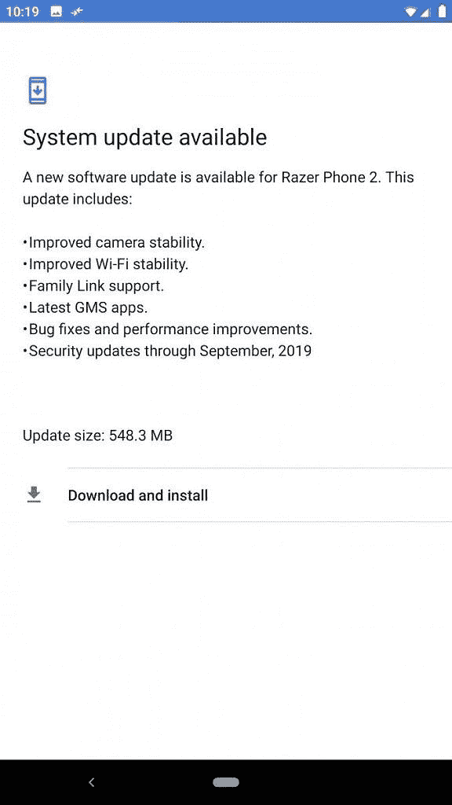

# Razer Phone 2 更新推出 9 月安全补丁

> 原文：<https://www.xda-developers.com/razer-phone-2-update-september-security-patches/>

# Razer 推出了 Razer Phone 2 的更新，9 月份发布了安全补丁

我们总是很高兴看到 Razer 设备收到更新。Razer Phone 2 现在正在更新 2019 年 9 月的安全补丁。

Razer 是一家在 Android 生态系统中处于独特地位的公司。智能手机并不是他们业务的主要部分。尽管他们在 2017 年[收购了一家智能手机公司](https://www.xda-developers.com/nextbit-has-officially-been-acquired-by-razer/)，但该公司只生产了两款智能手机，都属于小众的“游戏手机”类别。软件支持对这些设备来说有点冒险，所以当我们看到更新时总是令人兴奋。Razer Phone 2 现在正在进行更新。

**[【Razer phone 2 xd a 论坛】](https://forum.xda-developers.com/razer-phone-2)**

随着 Razer 的智能手机业务未来[仍然有点不确定](https://www.xda-developers.com/razer-phone-3-not-cancelled-report/)，我们总是很高兴看到它的设备收到更新。据 *Reddit* 上的用户称，Razer Phone 2 现在正在更新【2019 年 9 月的安全补丁。Razer Phone 2 在夏季开始接收 Android Pie [，但自那以后就没有看到太多更新。](https://www.xda-developers.com/razer-phone-2-android-pie-update/)

 <picture></picture> 

via u/Rox598

除了每月的安全补丁，Razer 还包括了许多额外的增强功能。相机稳定性和 Wi-Fi 稳定性都得到了提高。[现在支持家庭链接](https://www.xda-developers.com/digital-wellbeing-integration-family-link-parental-controls/)。最新的谷歌移动服务应用程序已经添加。最后，常见的 bug 修复和性能改进已经发布。下载量为 548.3MB，你可以[点击这里](https://android.googleapis.com/packages/ota-api/razer_aura_cheryl2/288873db70839632b560514eab1a2109bc0bac12.zip)为你的手机下载 OTA 压缩文件。

* * *

**来源:[Reddit](https://www.reddit.com/r/razerphone/comments/dho726/razer_phone_2_update_now_live_mr2_global/)**