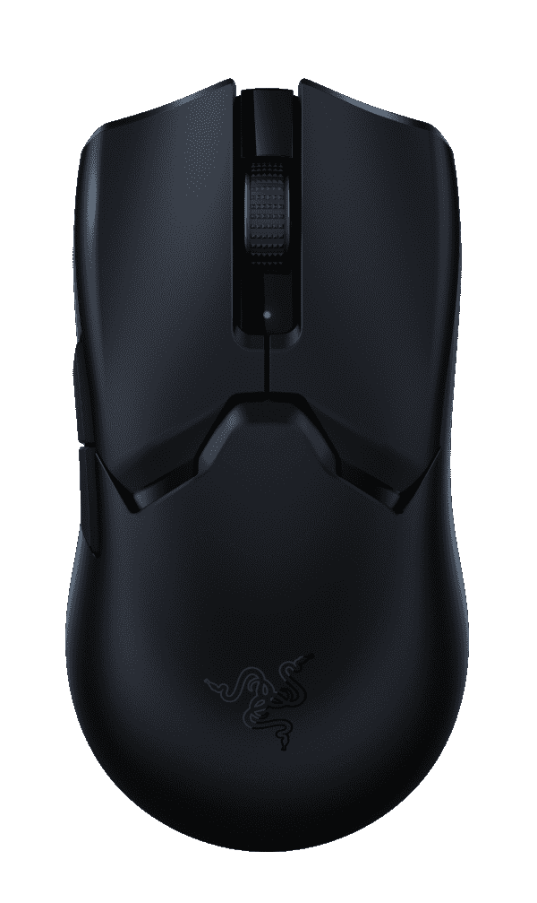

# 新的 Razer Viper V2 Pro 可能是迄今为止最好的无线游戏鼠标

> 原文：<https://www.xda-developers.com/razer-viper-v2-pro-announced/>

Razer 不断推出新硬件，并发布了其最新的——也可能是有史以来最好的——游戏鼠标 Viper V2 Pro。与其前辈一样，Viper V2 Pro 与电子竞技专业人士合作设计，成为竞技游戏的**鼠标。从表面上看，一切都差不多，但有一些小变化。不过，真正的更新是在下面。**

从设计开始，[蝰蛇 V2 Pro](https://razer.a9yw.net/c/2233363/642901/10229?subId1=UUxdaUeUpU41396&subId2=exda&u=https%3A%2F%2Fwww.razer.com%2Fgaming-mice%2Frazer-viper-v2-pro) 保留了对称的外形。然而，不幸的是，它不再是真正的双手通用的鼠标。可编程按钮现在只在左手边，可以用右手拇指操作。这意味着也有更少，但根据目标受众，这可能不是什么会被错过的东西。现在被省略的那些的定位从来没有真正使它们使用起来舒服，但这次左撇子将会错过，这有点令人失望。

凭借蝰蛇 V2 专业版，雷蛇在最苛刻的游戏玩家会欣赏的关键领域加倍努力。蝰蛇 V2 专业版现在甚至比它已经轻得离谱的前辈轻了 20%，只有 58 克，而这一切都没有牺牲制造质量。此外，电池寿命更长，使用了 Razer 最新一代的开关，传感器甚至更快更准确。

他们称之为 Focus Pro 30K 光学传感器，它很好地描述了它的全部内容。DPI 高达 30，000，但更重要的是，分辨率精度为 99.8%。Razer 的智能功能回来了，包括智能跟踪，运动同步和不对称截止，后者得到了显著增强。它现在支持 26 种不同的截止水平，而在旧型号中只有三种。这意味着可以更好地控制起飞和着陆距离，以适应个人的游戏风格。

第三代光学鼠标开关承诺没有双击问题和无去抖延迟。它们现在的点击量为 9000 万次，比上一代产品增加了 25%。Razer 表示，这些因素的结合是 Viper V2 Pro 的关键驱动力。

“在鼠标的整个开发过程中，我们一直在收集玩家的重要反馈，我们一次又一次地听到重量、传感器和开关是最重要的。我们在这三个方面都加倍努力，结果不言自明:尝试一下，你就永远不会放弃。”

蝰蛇 V2 Pro 还更新了充电功能，现在使用 USB-C，旧的无线充电器似乎不再使用了。DPI 开关位于底部，不会造成伤害，如果您需要的话，还有一个无线加密狗扩展器，您可以选择黑色或白色。价格？蝰蛇 V2 专业版将于 5 月 10 日上市，售价 150 美元。

我用了一段时间 Razer Viper Ultimate，因为它真的很好。我希望它能让我成为一名更好的游戏玩家，但轻巧的机身、尺寸和设计以及性能都令人难以置信。蝰蛇 V2 专业版应该是又一个进步，所以它真的可能最终成为竞技游戏玩家的冠军。它看起来肯定是最新的 [Razer Blade](https://www.xda-developers.com/razer-blade-2022/) 游戏笔记本电脑的有力伴侣。

 <picture></picture> 

Razer Viper V2 Pro

##### 雷蛇蝰蛇 V2 专业版

Razer 为专业游戏玩家设计的最新鼠标建立在使 Viper 变得非常好的一切之上，并将其提升了一个档次。