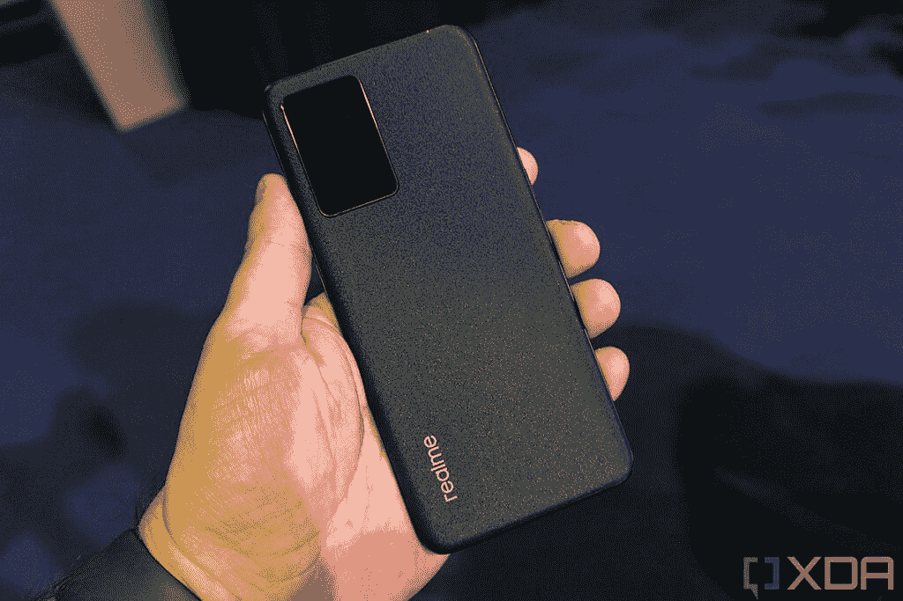
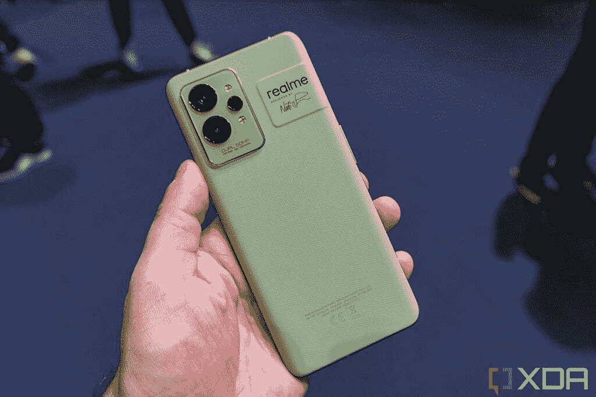
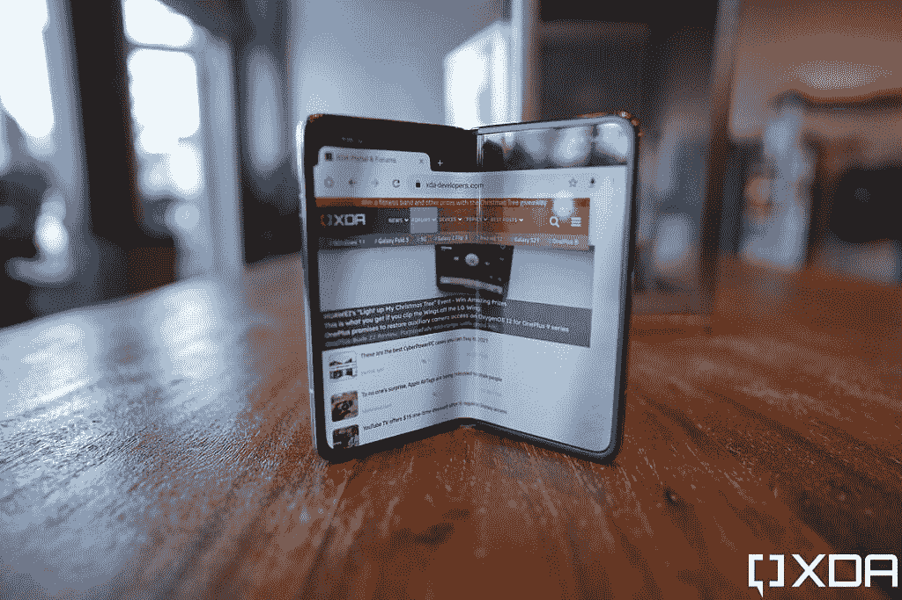
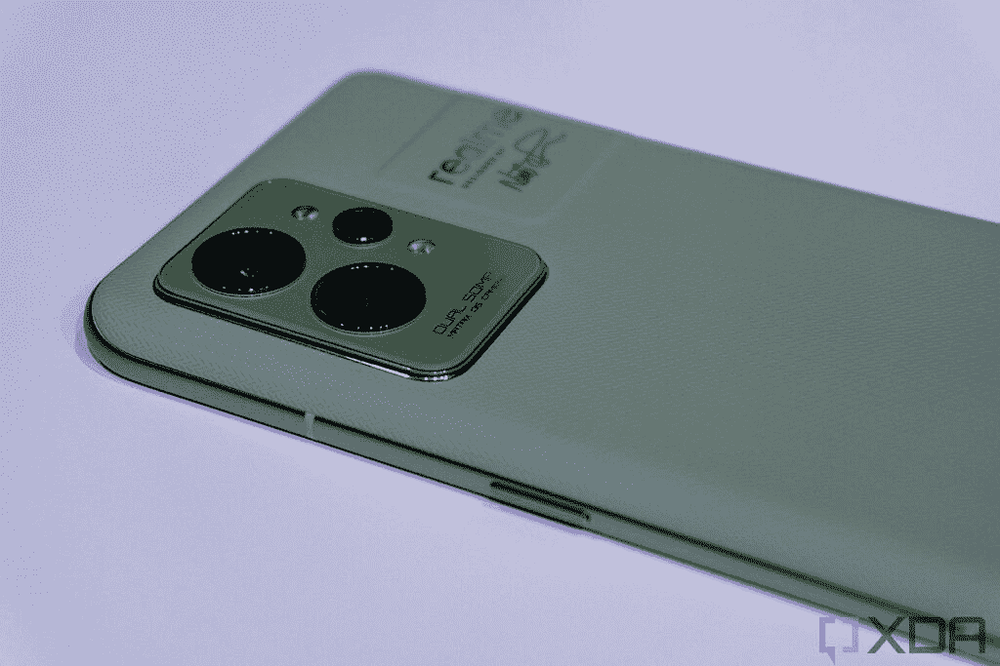

# 采访:Realme 副总裁谈快速充电，美国的可用性，等等

> 原文：<https://www.xda-developers.com/realme-interview-vp-gt-2-pro/>

在今年的世界移动通信大会上，Realme 宣布了其最新的旗舰手机 [Realme GT 2 Pro](https://www.xda-developers.com/realme-gt-2-pro-global-launch/) ，以及 GT 2。在巴塞罗那的活动上，在我酒店的 14 层，可以俯瞰整个城市，我有机会与 Realme 副总裁兼 Realme 国际集团总裁**mad hav Sheth**先生坐在一起。

有很多事情要宣布。Realme GT 2 Pro 配备了[骁龙 8 第 1 代](https://www.xda-developers.com/qualcomm-snapdragon-8-gen-1/)芯片组，双 50MP 摄像头，以及€749 的 120Hz QHD 显示屏。GT 2 的€售价为 549 英镑，骁龙售价为 888 英镑；此外，他们都是€100 关闭了有限的时间，使他们€449 和€649 的 GT 2 和 GT 2 专业。

该公司还推出了 150 瓦的充电器，其母公司 OPPO 及其兄弟公司一加也是如此。但在我进入产品之前，我想问一下美国的供货情况，主要是因为主题介绍。

***披露:*** *Realme 赞助我在世界移动通信大会上的旅行和住宿。*

* * *

## Realme 及其在美国的计划

Rich: 我想对你在主题演讲开始时说的一些话提出质疑。你讲了一个故事，讲的是一个波兰人因为当时买不到 Realme 设备而感到沮丧。还有一张幻灯片说，高端设备不等于苹果和三星。那么，你会对买不起手机的美国消费者说些什么呢？

**马达夫:**同样的事情。Realme 目前只存在于全球三分之一的 60 个国家。我认为我们有很多事情要做。当然，看到某些品牌在美国的增长，我相信像 Realme 这样的品牌肯定有机会。有一个品牌最近在美国发展迅速，那就是 TCL。我已经看到了这一点，我们肯定想进入美国市场。

这很好，因为人们需要更多的选择。对于高端设备，我们得到的只有苹果和三星，还有一些较小的选择，如谷歌和一加。

* * *

## 150W SuperDart 充电，并把充电器放在盒子里

主题演讲中提到的另一件事是将充电器放在盒子里。显然，我们已经看到苹果和三星等公司移除了充电砖，所以随着 150W UltraDart 充电的宣布，我真的想知道该公司对此有多投入。

 <picture></picture> 

Realme GT Neo 3

**Rich:** 你还对盒子里包括充电器做了评论。显然，GT 2 Pro 的包装盒中有一个充电器。这是对未来的承诺吗？你还宣布了 150W 充电，所以这将是在与 GT Neo 3 的盒子里吗？

Madhav: 那也将在盒子里。我不是说有充电器或者没有充电器是一件好事。如果我余生只给你一个 18W 的充电器，也许我会把充电器从盒子里拿出来。但是，如果我改变电压和解决方案的容量，现在是 65W 或 150W，消费者会去哪里购买这款充电器呢？所以，重点是，基本上我必须让这些充电器可用，它们不应该回到旧的速度，即 18W。

什么是技术？技术就是让他们安心。通过移除充电器，每个人都有自己的策略，所以他们在做什么无可奉告，但他们可能是对的，因为如果你永远只给一个充电速度，那就没问题。因为之前两代或者三代的充电器都是一样的。同样的充电技术，同样的充电速度，为什么还需要另外一个充电器？随着新技术和新的充电速度，我想我必须将充电器与手机一起提供。

**Rich:** 我其实在评测三星的 Galaxy S22 Plus 的时候也说过类似的话。他们现在正在做 45W 充电，但它不在盒子里，如果真的是关于电子垃圾，他们会让你把旧充电器换成新的。

所以，关于充电性能。什么时候才算够了？我们现在是 150 瓦，这应该可以让你的手机在 15 分钟内达到 100%。OPPO 刚刚宣布了 240W 充电，九分钟让你充满电。我们什么时候才是好的？

马达夫:我认为五分钟或十分钟已经足够了。我相信充电技术会发展到下一个水平，更重要的是电池可以维持的小时数，而不是速度。这正是我们希望通过软件优化来实现的。昨天，我们提到了 LTPO 屏幕，这意味着触摸响应会根据您的使用情况进行调整。从 1Hz 移动到 90Hz 或 120Hz 或 240Hz，这样可以节省 1.5 小时的电池寿命。我觉得 150W 到 240W 对人不会有太大影响。差别肯定是从 65W 到 150W，因为那大约是 30 分钟的充电时间差别。那很好。

事情就是这样。如果我问用户他们想要什么样的手机，他们只会说他们需要更好的手机。你不知道更好的定义。没人知道。理解是什么让它变得更好是最重要的旅程之一。

* * *

## Realme GT 2 Pro 冷却室

Realme GT 2 Pro 配备了改进的冷却室，保证更好的散热，这意味着更好的持续性能。这是特别有趣的，因为骁龙 8 代 1 可以运行热。

我认为改善体验的一件事是 GT 2 Pro 中的冷却室。我不想说骁龙 8 代 1 有过热问题，但它可以运行热，即使与骁龙 888 相比。你发现这很有帮助吗？

**Madhav:** 任何性能指标评测分数超过百万的高端处理器都会产生热量，所以这取决于我们如何控制它。

 <picture></picture> 

Realme GT 2 Pro

**Rich:** 目前还没有很多骁龙 8 设备可以与之相比。但是你发现冷却室有助于产生更高的基准分数和更持久的性能吗？

**Madhav:** 我们试图用 8 Gen 1 来做的是，由于所有这些处理器都采用 1+3+4 设计，所以更高时钟速度的主内核会产生大量热量。如果你看看它的散热面积，它相当大，所以你可以获得持续的性能。这是手机上最大的一个，金属框架也有助于散热。

此外，我们使用的热凝胶中含有金刚石颗粒，因为金刚石非常适合导热。但如果你追求高性能，它就像一辆汽车。如果你用的是 V6 发动机，它会产生热量和动力，所以关键在于你如何控制它。

显然我们会对它进行测试，但我想知道它与其他骁龙 8 设备相比如何，以及它们如何处理冷却。

**Madhav:** 我真诚地建议您去与市场上的任何 8 代 1 芯片组进行比较，在一段时间内，您将会看到它所带来的持续性能和帧速率。真的让人印象深刻。

* * *

## Realme 可折叠怎么样？

 <picture></picture> 

Find N foldable smartphone made by sister company OPPO

**Rich:** 所以稍微偏离一下话题，我们什么时候才能看到真正的可折叠手机？

马达夫:现在什么都没有。正如我常说的，创新绝不是因为你的产品与众不同就给你它。与众不同是好事，但必须有用。我不是说[可折叠手机](https://www.xda-developers.com/best-foldable-phones/)没有用，但它是不同的，从第一代到第三代，有很多改进。肯定好多了。我们得看看可折叠手机玩游戏会怎么样？如果屏幕之间的线条不同，内容会发生什么变化？我们不想在体验上妥协。但我们正在努力确保我们有正确的体验，但今年我们将创新 150W 充电和下显示相机。我认为显示器下的摄像头将会很大，因为人们已经说过他们甚至不想要屏幕上的这个小孔。我们希望他们有一个无缝的显示屏。

你能从中期待什么样的体验？我们有一些展示不足的摄像机，但你仍然可以看到它。你仍然可以看到相机在哪里。例如，我知道 TCL 展示了一款无损的显示器下摄像头。

拥有一个原型和一个最终的设计有很大的不同。当它最终发行时，肯定会是一次不可思议的经历。

* * *

## 概述 GT 2 Pro 的公告，价格，以及缺乏长焦镜头

**Rich:**2022 年 Realme 阵容概述？GT，或者说 Neo 这个品牌的重点是什么？我们刚刚在外面谈论这个，像印度这样的地区有很多 Realme 品牌，而其他地区想看到更多。

**马达夫:**一个是商业，一个是创新方面。GT 系列将高端顶尖的最新创新推向市场。对于 Neo，我们有类似的产品，但在一段时间后价格会更低。所以，GT Neo 3 比 GT 系列低一个档次，但体验差不多。如果你看到 GT 2 专业版，那是顶级的骁龙 8，但 GT 2 是骁龙 888。GT Neo 3 可能是，我还不确定，但可能是，骁龙 870。

 <picture></picture> 

Realme GT 2 Pro

**有钱:**但是那台是 150W 充电。

马达夫:我们想让某些事情民主化。某些创新基于规模经济。为了让它变得非常实惠，我必须在业务中引入规模经济。

说到定价，€449 是令人惊叹的时刻之一。€649，虽然时间有限，然后是€549 和€749。这太疯狂了。

马达夫:我们希望人们信任我们。如果他们出钱，我们希望他们信任我们。营销的东西不会持久，留下来的是公司和产品的价值观。这两件事是留在人们心中的。

这让我想起了 2014 年的一加，当时他们推出了 349 美元的 Snapdragon 800 芯片组手机。但他们不再这样做了，所以我真的很高兴看到 Realme GT 2 上€449 的价格标签。

回顾一下 GT 2 Pro，€649，120 赫兹 LTPO 2K 显示器，骁龙 8 代 1，双 50MP 传感器。但是没有长焦镜头？

**马达夫:**无长焦镜头。我们通过主摄像头中的软件来实现。为了充分利用长焦，你应该使用 DSLR。但如果想体验长焦，通过主镜头可以得到 3 倍或者 5 倍。因此，我们通过软件获得了一个具有长焦功能的主相机，以及一个 50MP 的超宽相机，具有 150 度的视野。我认为我们拥有两个世界的优势，我认为随着世界再次走向外部，超宽更有意义。

* * *

我相信看到 Realme 提供的东西将会非常令人兴奋。作为 BBK 旗下的一家公司，它与 OPPO、一加、Vivo 和 iQOO 等其他品牌并列，因此有很多相似之处，但也有不同之处。

例如，在 2014 年，一加是以无与伦比的价格提供优质规格的公司。随着一加以 969 美元的价格提供其当前一代旗舰产品，看到€649 美元的 Realme GT 2 Pro 和€449 美元的 Realme GT 2，真是一股新鲜空气。事实上，GT 2 将成为市场上最便宜的手机之一。

事实上，看到该公司未来的发展将是令人兴奋的，因为它似乎准备好了增长和征服全球市场。接下来我们应该看到的是 GT Neo 3，它将配备 150W 充电。