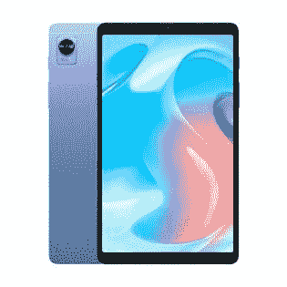

# Realme 将价格实惠的 Realme Pad Mini & Buds Q2s 带入印度市场

> 原文：<https://www.xda-developers.com/realme-pad-mini-buds-q2s-india-launch/>

Realme 今天在印度揭开了其首款 150W 快速充电手机——Realme GT Neo 3 的外壳。除了价格实惠的旗舰产品，该公司还在该地区推出了 Realme Pad Mini 和 Realme Buds Q2s。如果你想买一款价格实惠的平板电脑或 TWS 耳塞，这里有你需要知道的关于 Realme 最新产品的所有信息。

## Realme Pad Mini

Realme Pad Mini 是一款入门级 Android 平板电脑，面向学生和注重价格的买家。它采用 8.7 英寸的液晶显示器，配有厚边框，分辨率为 1340x800。在内部，它装有一个 Unisoc T616 八核处理器，配有高达 4G 的 RAM 和 64GB 的存储空间。

 <picture></picture> 

Realme Pad Mini

在相机部门，Realme Pad Mini 提供了 800 万像素的后置摄像头和 500 万像素的自拍相机。该平板电脑由 6400 毫安时电池支持，支持 18W 有线快速充电。其他值得注意的功能包括双频 Wi-Fi 支持、蓝牙 5.0、USB Type-C 端口、3.5 毫米耳机插孔和双扬声器。

在软件方面，Realme Pad Mini 基于 Android 11 运行 Realme 为平板电脑定制的 Android 皮肤——Realme UI for Pad。

## 真实芽 Q2s

像 Realme Pad Mini 一样，Realme Buds Q2s 也是一对经济实惠的 TWS 耳塞，具有时尚的设计和一些高级功能。耳塞装在一个鹅卵石形状的充电盒里，有一个透明的盖子。它们具有 10 毫米动态低音增强驱动器，并提供 ANC 支持。

Realme 声称，Buds Q2s 一次充电可提供 30 小时的总播放时间(包括充电外壳)，并提供快速充电支持，可以在短短 10 分钟内获得 3 小时的额外播放时间。耳塞还具有通话环境噪音消除、88 毫米超低延迟游戏模式、智能触摸控制和 IPx4 认证。

## 定价和可用性

Realme Pad Mini 将于 5 月 2 日开始在印度销售。它将有两种颜色可供选择——蓝色和灰色。这款平板电脑将提供两种 RAM/存储配置，仅适用于 Wi-Fi 和 LTE 型号。以下是定价详情:

*   3GB+32GB (Wi-Fi): ₹10,999
*   3GB+32GB (LTE): ₹12,999
*   4GB+64GB (Wi-Fi) ₹12,999
*   4GB + 64GB (LTE): ₹14,999
*   从 5 月 2 日到 5 月 9 日，₹2000 停止销售所有车型。

Realme Buds Q2s 将于 5 月 2 日开始通过 Realme 的网站、Flipkart、亚马逊和线下零售渠道在该地区销售。这款耳塞有三种颜色——夜黑、纸绿、纸白——将在₹1,999.上市