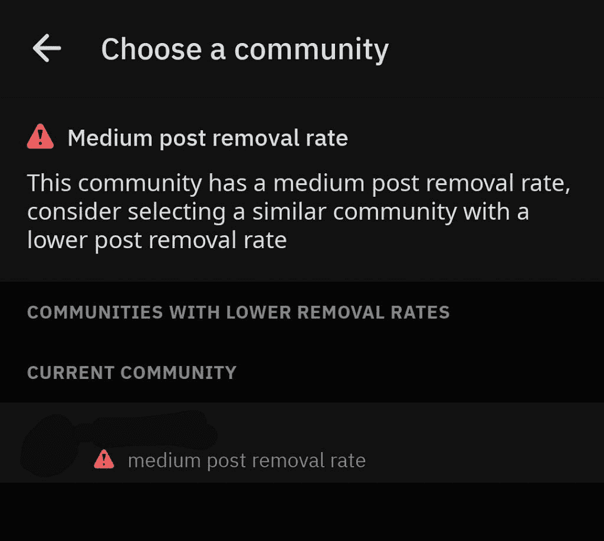

# [更新:官方] Reddit 测试在发布到高度节制的子编辑之前显示警告

> 原文：<https://www.xda-developers.com/reddit-tests-posting-warnings-moderated-subreddits/>

**更新 1(美国东部时间 2019 年 8 月 28 日下午 5:05):**这个实验为一位 Reddit 用户上线，他在/r/ModSupport subreddit 上发了一个帖子。这引起了许多版主的注意，并引起了 Reddit 管理员的回应。更多细节见下文。

Reddit 是世界上最受欢迎的社交新闻聚合和讨论网站。虽然大多数 Redditors 更喜欢不同的第三方客户端访问网站，但 Reddit 自己的官方应用自推出以来一直越来越受欢迎。这款应用程序在这段时间里也获得了新的功能，突出的功能如[黑暗模式切换](https://www.xda-developers.com/reddit-for-android-android-q-dark-mode/)得到了普通用户的广泛喜爱和赞赏。现在，为了帮助用户和版主互动和管理高度审核的子编辑，Reddit 正在测试额外的警告，这些警告将在用户通过官方应用在这些子编辑中发帖之前出现。

APK 拆卸通常可以预测应用程序未来更新中可能出现的功能，但我们在这里提到的任何功能都可能不会出现在未来的版本中。这是因为这些特性目前还没有在实时构建中实现，并且可能会被开发人员在未来的构建中随时引入。

像 [/r/science](https://www.reddit.com/r/science/) 和 [/r/history](https://www.reddit.com/r/history/) 这样的子编辑是非常严格的，只接受那些符合质量阈值的帖子，而拒绝和删除那些不符合的帖子。不经常向这些子编辑发帖的用户仍然不知道这些提交质量阈值。因此，来自这些不知情的提交者的大量帖子被丢弃，版主通常会得到通知。这只会导致用户因为失去所有努力的结果而感到沮丧，而版主有更多的行动需要审核。推测不同的消息，一个可能在第一次提交之前显示，另一个可能在用户提交失败后试图重新提交时显示。

Android v3.35.0 的官方 Reddit 应用程序似乎将运行一个实验，向用户显示一个警告，指导他们在提交帖子到 subreddit 之前阅读规则。我们在代码中发现了两个不同的消息，这两个消息也根据子编辑的提交删除率而不同，即低、中或高。

```
 <string name="label_posting_difficulty">Posting difficulty</string>
<string name="high_post_removal_rate_header">High post removal rate</string>
<string name="high_post_removal_rate_label">high post removal rate</string>
<string name="high_post_removal_rate_message_treatment_1">This community has a high post removal rate, please read the community rules</string>
<string name="high_post_removal_rate_message_treatment_2">This community has a high post removal rate, consider selecting a similar community with a lower post removal rate</string>
<string name="medium_post_removal_rate_header">Medium post removal rate</string>
<string name="medium_post_removal_rate_label">medium post removal rate</string>
<string name="medium_post_removal_rate_message_treatment_1">This community has a medium post removal rate, please read the community rules</string>
<string name="medium_post_removal_rate_message_treatment_2">This community has a medium post removal rate, consider selecting a similar community with a lower post removal rate</string>
<string name="low_post_removal_rate_label">low post removal rate</string> 
```

subreddit 规则的按钮位于 reddit 应用程序的提交屏幕上，非常方便，因此用户应该很容易在错误提交之前点击并阅读规则。尽管存在 Reddit 的桌面网站和第三方应用程序解决方案，但官方应用程序的采用率一直在稳步上升，因此这一变化应该会让很多用户受益。

*感谢 PNF 软件为我们提供了使用许可 [JEB Decompiler](https://www.pnfsoftware.com/?aid=xdadev) ，这是一款针对 Android 应用的专业级逆向工程工具。*

* * *

## 更新 Reddit 官方回应

Reddit 用户/u/ [Vullein070](https://www.reddit.com/user/Vullein070) 通知/r/ [ModSupport subreddit](https://www.reddit.com/r/ModSupport/comments/cwmqnj/this_community_has_a_medium_post_removal_rate/eyddsoo/) 他们创建了一个备用帐户来测试一些东西。当他们试图在一个未命名的子编辑上发布帖子时，他们发现了关于帖子删除率的新的提交前警告。

 <picture></picture> 

Credits: /u/Vullein070

这一变化激怒了 Reddit 的许多版主，他们认为这一功能将使用户远离他们的社区，为了解决这些抱怨，Reddit 管理员[hideheived](https://www.reddit.com/user/HideHideHidden)[解释了](https://www.reddit.com/r/ModSupport/comments/cwmqnj/this_community_has_a_medium_post_removal_rate/eyddsoo/)该公司新功能背后的原因。他们解释说，这是一个“小规模和短期的实验”，让公司“了解[他们]是否可以减少大型社区中被删除的帖子数量。”管理员指出，这只是“他们尝试鼓励更好的用户行为的各种测试之一。”这个删除率警告的目的是减少在“具有更严格规则集的社区”中提交的“低努力内容”的数量不仅如此，该功能还将帮助用户“找到对他们的内容更宽容的互补社区。”管理员正在积极地与子编辑中关心的版主合作，看看如何改进这个功能。