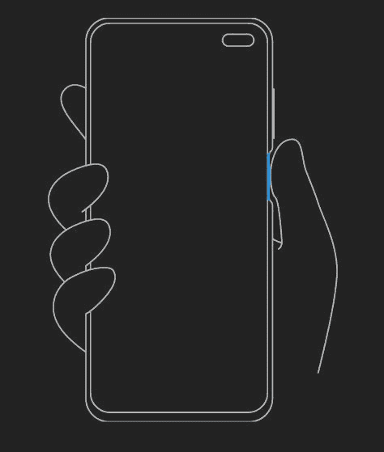

# Redmi K30 可能有 120Hz 显示屏，侧面指纹和索尼 IMX686

> 原文：<https://www.xda-developers.com/redmi-k30-120hz-display-side-mounted-fingerprint-sony-imx686/>

面对来自 Realme 等品牌的日益激烈的竞争，小米正在开发配备旗舰级硬件的中档智能手机。 [48MP 四摄像头红米 K20](https://www.xda-developers.com/xiaomi-redmi-k20-pro-launch-india/) 和 [108MP 五摄像头小米 Note 10](https://www.xda-developers.com/xiaomi-mi-note-10-mi-note-10-pro-redmi-note-8t-arrive-europe/) 是小米高端中端战略的完美例子，所以当小米[第一次证实](https://www.xda-developers.com/redmi-k30-5g-support/)红米 K30 的存在时，我们一直期待听到证实它将继续这一趋势的细节。上个月我们了解到，即将推出的 K30 将拥有[双打孔前置摄像头](https://www.xda-developers.com/xiaomi-redmi-k30-5g-dual-punch-hole-front-cameras/)，这一设计此前只属于 Galaxy S10+。现在，我们发现的证据表明，Redmi K30 可能具有 120Hz 显示刷新率和索尼新的 IMX686 图像传感器等高级功能。我们还了解到，该设备可能还有一个侧面安装的指纹扫描仪。

## 红米 K30——代号“凤凰？”

在我深入任何细节之前，我想澄清一些重要的事情:*本文中讨论的功能都不能保证在 Redmi K30 上首次出现。*本文提到的所有功能 120Hz 显示屏、侧置指纹扫描仪和索尼 IMX686 图像传感器——肯定会出现在*一款代号为“凤凰”的*小米智能手机上，这款手机*可能是*红米 K30。目前，唯一将代号为“凤凰”的小米设备与 Redmi K30 联系起来的是我们发现的侧装指纹扫描仪渲染，它显示了一个带有双打孔前置摄像头的设备——就像 Redmi K30 一样。

*感谢 XDA 成员 [kacskrz](https://forum.xda-developers.com/member.php?u=8240900) 在 [MIUI 11](https://www.xda-developers.com/download-miui-11-xiaomi-redmi-note-7-pro-poco-f1/) 代码中首次发现这些功能。他与我们分享了他的发现，我们证实了他发现的所有代码和文件确实存在于最新的 MIUI 11 夜间版本中。*

**侧装式指纹扫描仪**

在 MIUI 11 的最近版本中，增加了一个名为“isBroadSideFingerprint”的新方法，如果设备的代号与“phoenix”或“picasso”匹配，则返回 true。我们目前对“毕加索”了解不多，但当我们在那台设备上了解到更多信息时，我们会跟进。无论如何，伴随这段代码的字符串告诉我们，“宽边”指的是设备的右侧:“指纹传感器位于您设备的右边缘。”此外，标题为“core_scan_gesture_broadside”的图形显示了一款普通智能手机，配有双打孔前置摄像头和右侧安装的指纹扫描仪。

 <picture></picture> 

core_scan_gesture_broadside

由于小米已经确认了 Redmi K30 具有双打孔设计(见本文顶部的特色图片)，我们假设这个图形是按照 Redmi K30 的相似性制作的。然而，情况并非总是如此。尽管如此，我们仍然可以期待*小米至少有两款*智能手机采用双打孔设计和侧装式指纹扫描仪。

**120Hz 显示刷新率**

上个月，[我们发现](https://www.xda-developers.com/xiaomi-120hz-display-smartphone-high-refresh-rate-rumor/)小米正在开发一款 120Hz 显示屏的智能手机。这是基于一个隐藏的设置，我们发现将刷新率从 60Hz 改为 120Hz。我们强迫设置显示，但显然没有用，因为没有小米设备有高刷新率显示。然而，我们现在知道哪种小米设备会有这样的显示屏:代号为“凤凰”的设备。如果设备代码名称与“phoenix”匹配，一个名为“isSuppotHighFrameRate”的方法(是的，有一个错别字，不，不是我们写的)将返回 true 由于高刷新率设置被定义为仅在 60Hz 和 120Hz 之间切换，我们预计“phoenix”将具有支持 120Hz 刷新率的显示器。

**索尼 IMX686 图像传感器**

本月早些时候，索尼在其微博页面上发布了一则关于其即将推出的 IMX686 图像传感器的预告。我们很好奇为什么索尼只在中国社交媒体网站微博上分享了一个预告，但我们现在有了一个好主意。小米即将推出的 Redmi K30 可能是第一款采用 IMX686 的设备，因此索尼在这款智能手机下个月即将在中国推出之前，正在研究这款传感器。我们不知道 IMX686 的很多细节，只知道它应该是一个 6000 万像素的图像传感器。

我们发现的“凤凰”拥有索尼 IMX686 的证据来自高通的一个相机图书馆。该库中包含以下字符串:“phoenix_imx686”、“phoenix_s5k3t2”、“phoenix_gc02m1_depth”和“phoenix_gc02m1_front”S5K3T2 是三星的 20MP 图像传感器，虽然我们没有太多关于 GC02M1 图像传感器的信息。我们也不确定这 4 个是否是设备上仅有的图像传感器。

**上市日期**

据 [*今日印度*](https://www.indiatoday.in/technology/news/story/it-is-official-redmi-k30-is-launching-next-month-1620450-2019-11-19) 消息，红米 K30 将于下月公布。我们不知道 Redmi K30 是否会在印度或欧洲推出，但鉴于 Redmi K20/Mi 9T 的过去历史，我们预计它将在国际上推出。然而，中国和国际/印度型号之间可能会有差异，因为中国的 Redmi K30 将支持 SA/NSA 5G。

我们在 MIUI 11 中发现了“phoenixin”和“picassoin”的代号，所以我们知道这些设备将在印度推出。尽管如此，我们还没有找到将“凤凰”和红米 K30 联系起来的确凿证据，而且我们仍然不太了解“毕加索”如果我们有新的发现，我们会告诉你的。

* * *

*感谢 PNF 软件为我们提供了使用 [JEB Decompiler](https://www.pnfsoftware.com/?aid=xdadev) 的许可，这是一款用于 Android 应用的专业级 rever* *se 工程工具。*