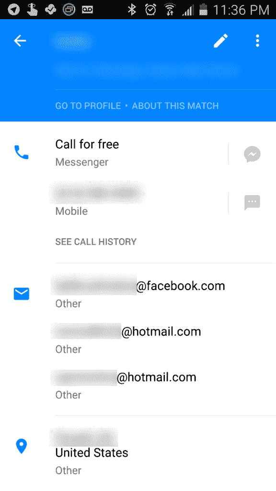
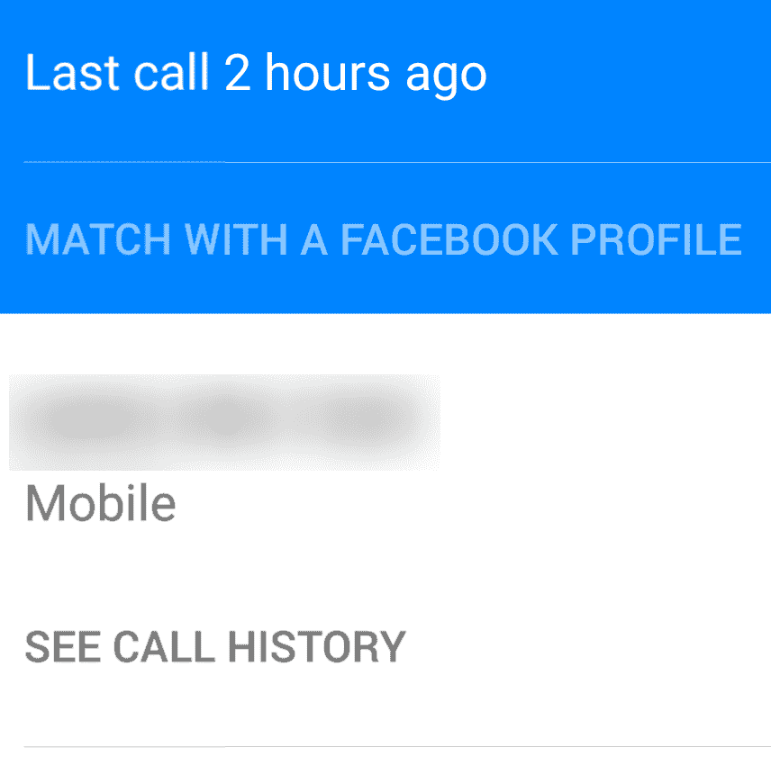

# 脸书的 Hello 拨号器评论

> 原文：<https://www.xda-developers.com/review-hello-facebook-dialer-bye-to-your-privacy/>

脸书以发布许多整合到其核心服务中的实验性应用而闻名。Groups、脸书在工作、Facebook Home (yuck)等网站得到的评价参差不齐，但在某种程度上它们有自己的定位。当谈到这个新的应用程序，一个简单地称为“你好”的拨号器时，脸书试图抓住智能手机功能的核心——也就是说，成为电话。他们声称他们的解决方案让你的手机*【真正智能】*。脸书以前也做过这样的声明，当回顾他们在脸书的手机宣传[和它如何戏剧性地失败](http://www.cnet.com/news/heres-why-the-facebook-phone-flopped/)时，我们记得带着世界上所有的怀疑来看他们的应用程序和任务声明。这次我们来看看这个所谓的“智能”拨号器。

让我先说一下，我的手机上没有脸书应用程序，所以我测试了该应用程序是否集成了脸书应用程序。我非常高兴地得知，该应用程序并不真正需要 Messenger 或脸书来使体验变得有价值，但如果你想利用它们的理想用途，最好你有它们。继续安装:这个应用程序要求*很多权限*，我指的是*很多权限*。现在，以脸书为例，我们可以看到*一些*明确定义权限的原因。对于这个 app，我不能。有些是有意义的，但有些如“拍照和视频”、“录制音频”和“在没有通知的情况下下载文件”在一个作为拨号快捷方式而不是成熟的社交媒体平台的应用程序上就没什么意义了。我将把隐私和安全的部分留给其他人，但我觉得有必要提到这一点。他们的许可证文档只需点击一下，但是让我警告你，它长得离谱，你可以全速滚动几分钟。

现在这些事情都过去了，我想提一下我对这个应用程序的第一印象是它看起来很棒。设计整洁有序，标签是典型的好方式，用户界面在某种意义上违背了脸书的传统。当谈到拨号应用程序时，这是受欢迎的，因为它使通话体验更简单。该应用程序会借用您默认的常用联系人，因为它会共享同步的数据，所以不存在迁移问题。我要从整体 UI 中批评的一点是缺少一个有色的状态栏(他们的 Play Store 视频清楚地显示了这一点)——但这仅仅是一个令人恼火的棒棒糖。该应用程序也非常流畅，在 Android 5.1 上，它的启动速度与普通 Android 拨号器相同，因此性能也不是问题。

但是这个 app 有什么意义呢？Play Store 视频声称其优势之一是*“看到谁在给你打电话，即使我你的手机上没有保存那个电话号码”。*第二点可能会涉及到一些用户的隐私，除非我错过了什么，否则我在应用程序中找不到任何可以选择退出的设置(值得注意的是，大多数设置和偏好菜单都与其他脸书服务相同并共享)。当谈到*“看谁在打电话”*部分时，脸书吹捧预览谁在打电话的能力——自从翻盖手机有了第二块屏幕以来，我们就有了这种能力。这绝对令人难以置信的一面是，默认情况下，脸书的来电显示覆盖图出现在你的原生来电显示图顶部，这意味着在你接电话之前，你有一个额外的屏幕和任务。这种好的设计我无论如何不能考虑，但至少你可以禁用功能。

 说到联系人，该应用程序会提取您的列表，并尽可能将所有信息与脸书联系人结合起来。通过这种方式，你可以选择一个朋友，就像在其他一些服务中一样，在那里看到他们的脸书账户——但现在是自动的，优先接收电话和信息。还有一件事可能会让那些重视隐私的人担心:你可以在那里看到你朋友的电子邮件，但不仅仅是你已经知道的那些，甚至不仅仅是他们曾经在脸书注册的那个。我见过至少有 3 封电子邮件的联系人详细信息页面，这是我以前从未见过的，而且在脸书的主要服务中，我显然无法访问这些电子邮件。在你惊慌之前，**已经有办法通过各种同步服务导出脸书联系人的电子邮件**。但现在，任何人联系或骚扰你都比以往任何时候都容易。之后，我立即去复查并修改了我的隐私设置。

 如前所述，服务集成独立于应用程序。也就是说，如果你没有 Messenger 并试图发送消息，该应用程序会指引你到 Play Store。不过，在 Messenger 应用程序之外也可以打电话，这是一个很好的优势——它可以直接呼叫人们的 Messenger 应用程序。显然，如果匹配，你可以直接进入某人的个人资料，如果联系人号码没有与脸书账户匹配的号码，你可以自己匹配。让我换个说法:**其他人可以在未经你同意的情况下，通过将你的电话号码与你的账户进行匹配，将你的电话号码透露给脸书**。这个无害的功能可以被抽象为脸书可以用来违背你的意愿获取你的电话号码的最聪明的方法之一。再说一次，我不会过多地触及这个问题，因为我们希望以后能深入研究它，但是如果你重视你的隐私或者对脸书有妄想症，这个想法应该引起警惕。

其他功能呢？好吧，实际的拨号器可以显示你的联系人，因为你输入他们的名字与大多数其他拨号器的号码，但一次一个名字，不像股票拨号器。你可以搜索你附近的人(幸运的是，如果你没有他们的号码，你就看不到他们的号码)或企业，这样你就可以看到他们的详细信息和/或给他们打电话。这是一个毫无价值的功能，因为谷歌现在在语音控制方面做得更好。

综上所述，脸书的 Hello Dialer 并不差:它有一个实用好看的用户界面，一些有用的功能，而且启动速度很快。当你试图理解这一切时，你会意识到脸书臭名昭著的隐私出游在这里比以往任何时候都更加明显。当你考虑 Google Now 的功能时，该公司声称使该应用脱颖而出的许多功能要么设计糟糕，要么侵入性强，要么根本不相关。我已经在 TouchWiz 和 CM12.1 上测试了这个应用程序，我不得不说我更喜欢这两个 rom 的股票拨号器。即使抛开脸书的部分，它们也只是更实用或更直观。这个应用程序似乎有点误导，可能只是另一个借口，把更多的脸书放在你的手机里。一些人声称它是谷歌语音的替代品，但对脸书服务的依赖使它无法接近谷歌的 VoIP 解决方案。当你考虑到一些顶级拨号器的侵扰性要小得多，而且实际上没有额外的权限时，脸书的应用程序看起来并不像它应该的那样有创造性和吸引力。所以我很抱歉脸书，我要和你好说再见了——我希望它不会像你希望的那样流行起来，[因为那会证明你是对的](http://www.theregister.co.uk/2010/05/14/facebook_trust_dumb/)。

你能在手机上获得这项脸书服务吗？下面就让我们知道吧！

 <picture></picture> 

Do you need a dialer with all those permissions?