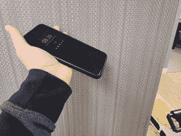
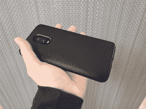
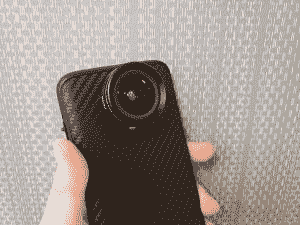
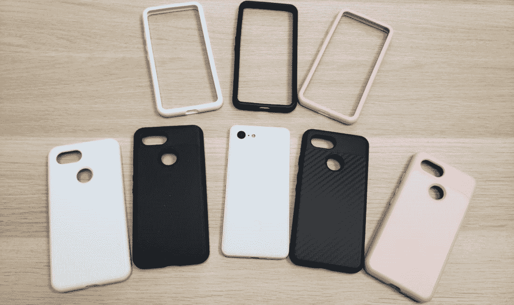
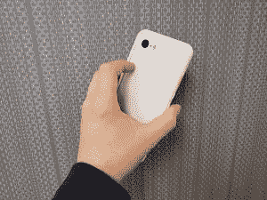
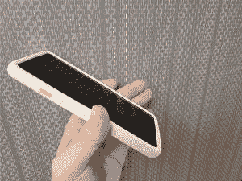
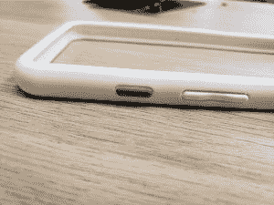
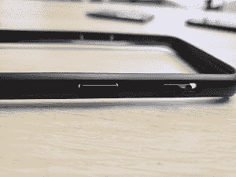

# 一加 6T 和谷歌 Pixel 3 的 RhinoShield CrashGuard 和 SolidSuit 实践

> 原文：<https://www.xda-developers.com/rhinoshield-pixel-3-oneplus-6t/>

* * *

## *固体套装*

* * *

一加 6T、谷歌 Pixel 3 和 Pixel 3 XL 的 SolidSuit 保护套提供全身保护解决方案，起价 29.99 美元。一加 6T 有两种颜色可供选择，包括经典黑色和碳黑色。谷歌 Pixel 3 有碳纤维、经典黑色、经典白色和经典腮红粉色可选。这些箱子是一个整体外壳，由 RhinoShield 的标志性震动扩散蜂窝设计组成。

这些箱子很轻，由塑料制成，摸起来很柔软，但拿着时会有一种抓握感。所有端口都完美对齐，包括超大的充电端口，可以在其中安装更大的适配器。

[第四段]

 <picture></picture> 

SolidSuit for OnePlus 6T

[/第四段][第四段]

 <picture></picture> 

SolidSuit for OnePlus 6T

[/第四段][第四段]

 <picture></picture> 

SolidSuit for OnePlus 6T with Lens

[/第四段][第四段]

 <picture></picture> 

SolidSuit for OnePlus 6T with ShockSpread Design

[/第四段]

明年 1 月，SolidSuit 保护套也将推出印花设计。此选项允许您将自定义图形添加到案例中。

 <picture></picture> 

CrashGuard and SolidSuit cases for OnePlus 6T, Google Pixel 3 and Pixel 3XL

Pixel 3 的 SolidSuit 保护套正处于最后的设计阶段，但 RhinoShield 计划在两侧添加纹理以改善握持感。他们还将在内表面添加哑光涂层。

RhinoShield 提供了两种不同类型的镜头，可与 SolidSuit 外壳兼容:4K 高清广角+微距和广角+微距。每个镜头都有一个镜头盖，不用时可以防止灰尘和划痕，还有一个小的携带袋。这些镜片配有一个快速简单的镜头适配器，使戴上和摘下镜片变得超级无痛。使用大多数智能手机镜头套件，你至少会受到镜头边缘的一些干扰，最终会遮挡住照片的边角。你不会在 RhinoShield 镜片上发现这些，因为它们对你的手机来说足够大了。

* * *

## *防撞装置*

* * *

防撞保险杠售价 24.99 美元，是一种超轻和最小的碰撞保护解决方案。这些箱子非常适合一加 6T、谷歌 Pixel 3 和 Pixel 3 XL。保险杠紧密贴合，并围绕手机边缘弯曲，以适应轮廓。

对于这样一个最小的情况下，防撞提供了令人印象深刻的 11 英尺的冲击保护。保险杠的紧密贴合将确保您的手机不会弹出，即使您将它掉落。你也可以高枕无忧，因为你知道你的保险杠不会像市场上的许多其他保险杠一样随着时间的推移而变松。

[第四段]

 <picture></picture> 

CrashGuard for Google Pixel 3

[/第四段][第四段]

 <picture></picture> 

CrashGuard for Google Pixel 3

[/第四段][第四段]

 <picture></picture> 

CrashGuard for Google Pixel 3 with Swappable Power Button

[/第四段][第四段]

 <picture></picture> 

CrashGuard for Google Pixel 3

[/第四段]

上面显示的 Pixel 3 防撞保险杠是保险杠设计的最终版本。电源按钮盖可以拆除，并替换为六种不同的颜色。

对于屏幕保护器，您可以选择冲击保护屏幕保护器或钢化玻璃屏幕保护器。每种解决方案都设计用于防撞装置或 SolidSuit 外壳。如果你有防撞保险杠，你也可以应用背板保护盖，这样你的手机的每一寸都得到保护。

这些屏幕保护器起价 19.99 美元。选择适合自己的屏幕保护器，并将其与您最喜欢的 RhinoShield 保护套配对。

[**店铺鼻盾**](https://rhinoshield.io)

###### 我们感谢 RhinoShield 赞助了这篇文章。我们的赞助商帮助我们支付与运行 XDA 相关的许多费用，包括服务器成本、全职开发人员、新闻撰稿人等等。虽然您可能会在门户内容旁边看到赞助内容(这些内容将始终被标记为赞助内容),但门户团队对这些帖子不承担任何责任。赞助内容、广告和 XDA 仓库完全由一个独立的团队管理。XDA 绝不会通过接受金钱来赞扬一家公司，或以任何方式改变我们的观点或看法，从而损害其新闻诚信。我们的意见不能被收买。