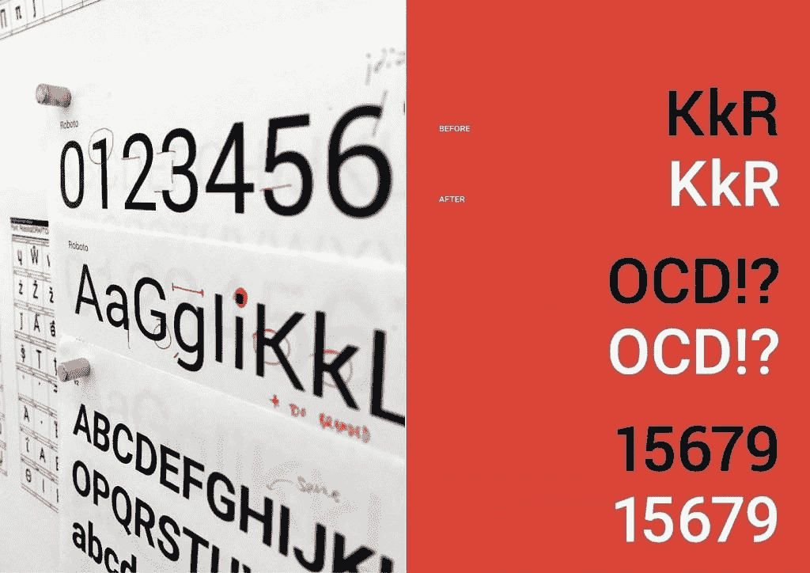
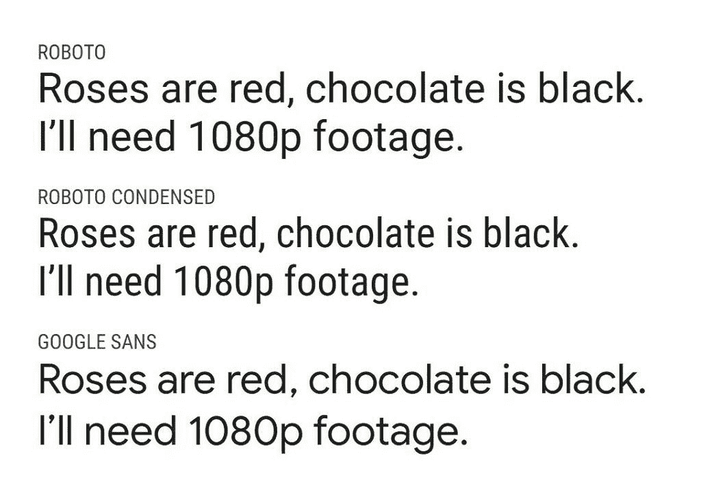

# Android 默认字体 Roboto 的兴衰

> 原文：<https://www.xda-developers.com/roboto-android-fall-rise-default-font/>

人们很容易忽视字体在软件设计中的重要性，尤其是在设计图形用户界面的时候。然而可悲的是，即使是有史以来最好的字体，包括 Helvetica(可以说是有史以来最受欢迎的简洁字体)，如果它们被扫描并在电脑上使用，就像它们被创造出来用于印刷一样，也会变成一团浆糊。好的操作系统图形用户界面，尤其是那些驱动智能手机的图形用户界面，要求字体大小可以随意调整，可读性强，有吸引力，无论是用在微型电池电量计中还是放大的主屏幕小部件中；要在数字屏幕上制造出每一种尺寸都可以识别的字体不再是一件不可能的事。Adobe 成功地用 Source Pro 系列字体做到了这一点，Apple 创建了旧金山，Google 推出了 Google Sans 和 Roboto。然而，更值得称赞的是，后者慢慢成为业余爱好者和专业人士的最爱，由于其自由的特性，从杂志到广告牌，到处都是它的身影。

## 介绍和初始故障

早在 2011 年，当 Roboto 首次由谷歌推出 Android 4.0 冰淇淋三明治和赫萝设计语言时，免费字体几乎是一个笑话。他们中的大多数将是业余的或被放弃的专业项目或流行印刷字体的改编，他们经常会有这样或那样的缺陷，这将破坏他们在任何项目中使用的功能。机器人也不例外。更糟糕的是，尽管谷歌和克里斯蒂安·罗伯逊(Roboto 的首席设计师)希望公众相信，*的字体几乎没有自己的字符*，并受到了许多印刷杂志和巨头的批评。例如,《印刷日报》的米尔科·亨伯特在[关于 Roboto](https://typography-daily.com/blog/2011/10/19/the-roboto-controversy/) 的文章中做了很好的报道。

有了 Roboto，谷歌经常被指责抄袭经典，比如 Helvetica、DIN 和 Univers——无论你走到哪里，你都可以在街上找到这些字体。同样值得注意的是，当时 Android 的主要竞争对手 iOS 使用的是 Helvetica (Neue)的修改版来处理文本显示。不管这些小争议，Android 一直使用这个版本的 Roboto 作为其主要系统字体，直到 Android 4.4 KitKat，这将是最后一个使用赫萝主题的主要版本。接下来发生的事情在很多方面改变了游戏规则，它对 Roboto 的处理就是其中之一。

## 材料设计与“机器人 2014”

作为对最初批评的回应，罗伯逊宣布 Roboto 是一个“正在进行的工作”，并回到了绘图板。随着 Android 5.0 Lollipop 的发布，谷歌引入了名为 Material Design 的新设计语言，这将成为 Android 上各种 GUI 的代名词。这一重大改革的一部分是一种易于使用的几何字体，同时能够在一个小空间内传达大量信息，一个完全重塑的机器人扮演了这一角色。

 <picture></picture> 

A sample image from Google Developers Blog showcasing the differences between the old and 2014 Roboto versions.

这个版本的 Roboto 很新鲜:它有自己独特的视觉标识，无论是在屏幕上还是在印刷品上看起来都很壮观，并且它的源代码和免费商业使用许可证一起向公众发布。例如，曾经因为无耻地抄袭 Helvetica 的大写字母 R 而受到批评的东西，现在有了自己独特的 R 字形。Roboto 现在也有了高信息密度——也就是说，字形是可读的，但又足够窄，可以在给定的屏幕区域内形成比大多数其他字体更多的单词。很快，新的 Roboto 成为了 Android 操作系统和谷歌其他软件项目的一个特征，一个光滑的薄变体装饰着操作系统的锁屏，一个轻型变体为许多第三方应用程序界面和图层主题提供动力，一个更友好的常规变体可以在其他地方找到。整体字体的两个新系列也发布了:Roboto Condensed，具有更高的信息密度，旨在用于小型 UI 元素和可穿戴设备，以及 Roboto Slab，对原始字体的可读性进行了更像书籍的处理。

随着这种新字体的接受，谷歌字体和 T2 字体松鼠等服务越来越受欢迎，这些平台为个人和商业目的提供完全免费的字体文件，设计师们开始在开源许可证下上传更多高质量的字体，部分原因是受到罗伯逊成功制作免费字体的鼓舞，免费字体颠覆了昂贵的印刷行业。很快，即使是最有经验的设计师也发现自己在使用 Roboto 和专有字体文件，用于数字和印刷目的。

## 安卓派及其他

随着 Android 9.0 Pie 的推出，谷歌开始用谷歌 Sans 的修改版[取代 Android GUI 中的某些文本元素。与 Roboto 不同，Google Sans 是专有的，不能用于部署在 Android 操作系统之外的任何第三方项目。虽然 Google Sans 更友好，更具几何风格，但 Roboto 的常规字体仍被用作整个操作系统中除标题之外的主要字体，因为前者在较小尺寸下可读性较差，并且字形之间缺乏清晰的区别。](https://www.xda-developers.com/google-sans-font-chrome-os/)

 <picture></picture> 

A comparison between Roboto, Roboto Condensed, and Google Sans. Note the lack of distinction between the lowercase L and uppercase I glyphs in the latter.

现在，[随着 Android 10 积极推动通用可访问性](https://www.xda-developers.com/google-accessibility-live-caption-android-q-live-relay-live-transcribe/)和易用性，像 Roboto 这样简洁易读的字体仍然是谷歌为该操作系统的 GUI 提供字体的最佳选择。然而，谷歌似乎正在慢慢地用谷歌 San 取代它，每次操作系统和材料主题的新迭代，都让用户对这种被许多人认为是破碎的设计语言提出更多批评。

Roboto 最后一次更新是在 2018 年[的 GitHub](https://github.com/google/roboto) ，可以从谷歌字体下载[。](https://fonts.google.com/specimen/Roboto)