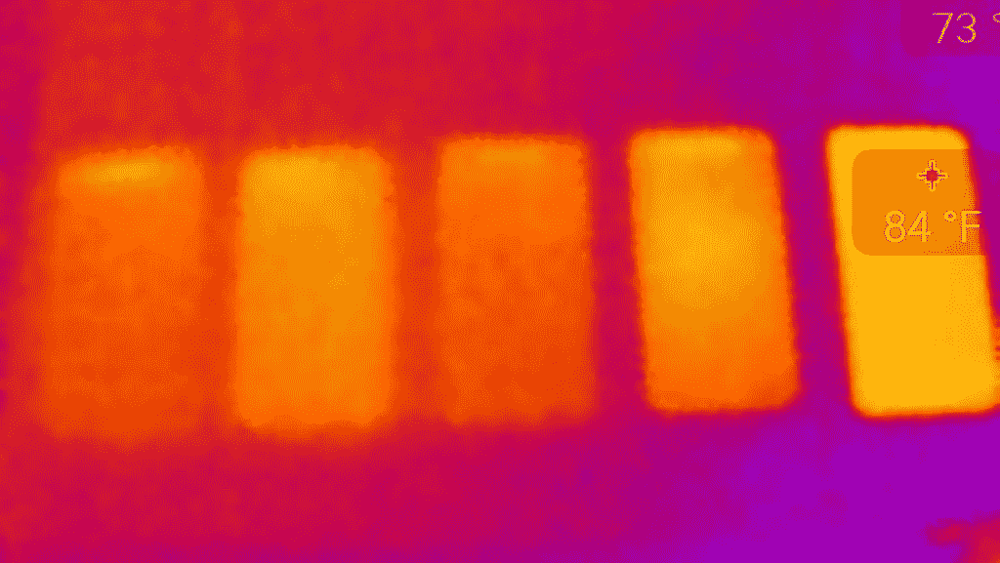
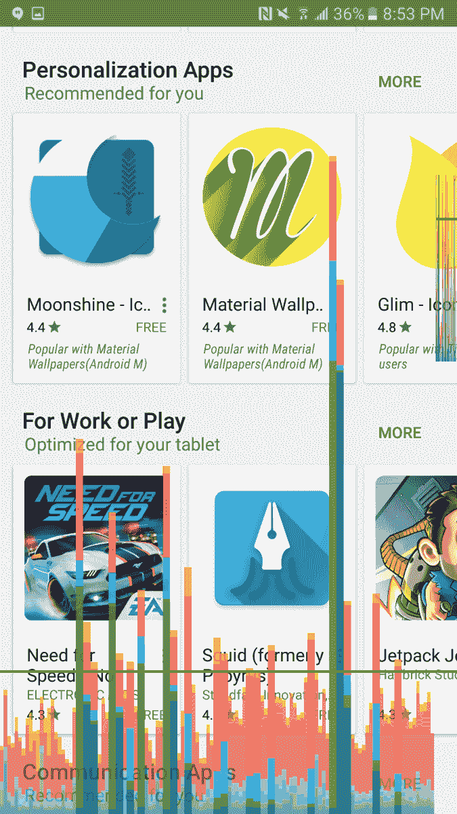

# S7 边缘节流和散热:比较 SD820、810、808、A9 和 Exynos 7420 的压力测试

> 原文：<https://www.xda-developers.com/s7-edge-throttling-thermals-benchmark-stress-tests-of-sd820-810-808-exynos-7420/>

现在 Galaxy S7 和 S7 Edge 已经到达消费者手中，由于我们的第一组测试，我们终于可以开始探索 [Snapdragon 820](http://xda-developers.com/tag/snapdragon-820) 的本质了。

虽然[再多的单器件测试也无法揭示 820](http://www.xda-developers.com/the-letv-max-pro-is-not-the-phone-youre-looking-for/) 的真正本质，但我们至少可以看到 820 在 S7 和 S7 Edge 中的表现，从而得出这种特定封装的最终性能结论。因为我们是在 S7 Edge 及其防水机身中测试 Snapdragon 820，并通过 TouchWiz 和 Samsung 配置进行更改，所以不要推断我们的结果:这些分数和温度不会揭示 820 从现在起在每款旗舰中的表现，因为许多混淆变量会有所不同。

我们的样本包括 5 款采用不同处理器的设备:iPhone 6S Plus (Apple A9)、S7 Edge (Snapdragon 820)、Note5 (Exynos 7420)、Moto X Pure(骁龙 808)和 Nexus 6P (Snapdragon 810)，以及 HTC One M9 (Snapdragon 810)，但热成像除外。我们发现了一些有趣的结果，希望与大家分享，为我们的深入测试和后续 S7 Edge 审查做准备。事不宜迟，我们开始吧。

* * *

## 中央处理器

| 

极客工作台

 | 

1

 |  | 

2

 |  | 

3

 |  | 

4

 |  | 

5

 |  | 

6

 |  | 

7

 |  | 

8

 |  |
| --- | --- | --- | --- | --- | --- | --- | --- | --- | --- | --- | --- | --- | --- | --- | --- | --- |
| **装置** | 单核 | 多核 | 单核 | 多核 | 单核 | 多核 | 单核 | 多核 | 单核 | 多核 | 单核 | 多核 | 单核 | 多核 | 单核 | 多核 |
| iPhone 6S Plus | 2520 | 4410 | 2527 | 4415 | 2526 | 4414 | 2529 | 4402 | 2525 | 4407 | 2529 | 4414 | 2528 | 4412 | 2512 | 4401 |
| 银河 S7 Edge | 2337 | 5309 | 2307 | 5179 | 2341 | 5341 | 2336 | 5335 | 2338 | 5379 | 2341 | 5362 | 2327 | 5359 | 2312 | 5281 |
| 注释 5 | 1476 | 5127 | 1480 | 5148 | 1476 | 5141 | 1474 | 5147 | 1480 | 5018 | 1472 | 5115 | 1472 | 5071 | 1475 | 4984 |
| 摩托车 x 纯 | 1245 | 3440 | 1247 | 3526 | 1253 | 3511 | 1251 | 3502 | 1217 | 3445 | 1213 | 3388 | 1249 | 3481 | 1218 | 3371 |
| Nexus 6P | 1249 | 4348 | 1242 | 4613 | 1255 | 4591 | 1186 | 4503 | 1149 | 4219 | 959 | 3647 | 1018 | 3908 | 1001 | 3801 |
| HTC M9 | 1307 | 3911 | 1284 | 3943 | 1243 | 3885 | 1217 | 3832 | 1186 | 3826 | 1163 | 3860 | 1147 | 3660 | 1068 | 3563 |

在我们连续进行了 8 次 Geekbench 测试后，我们得到了第一组结果。这是一个 CPU 密集型测试，也是跨平台的，允许我们比较 Android 和 iOS 的分数。

对于那些不熟悉分数细分的人来说，单核分数衡量单个内核的性能，而多核分数同时衡量多个内核的性能。这种区别很重要，因为 Snapdragon 820 比 Snapdragon 810 (8)和 808 (6)封装的内核更少(4 个)，但功能更强大，这在单核分数中有所反映。

在这些测试中，S7 中的 Snapdragon 820 表现令人惊讶，几乎没有节流的迹象，Nexus 6P 和 HTC One M9 连续出现最高降幅，并在最终得分中出现最高降幅。事实证明，Note5 自始至终都非常高效，反映了我们去年对 [Note5 进行深入审查](http://www.xda-developers.com/failed-potential-the-note5-xda-review/)所获得的结果。Exynos 7420 再次证明了它的实力，足够幸运的是，s 7 中的 Snapdragon 820 不仅获得了高于所有其他设备的分数，而且*保持了这些分数*，并一路领先到最后。下面你可以看到一个对比图，展示了 CPU 压力测试后的热性能。

 <picture></picture> 

Order: iPhone 6S Plus, S7 Edge, Note5, Moto X Pure, Nexus 6P

这张图片很有说服力，因为它显示了每部手机的相对热效率，排名正如我们所预期的那样，与我们两次测试的最终结果一致。iPhone 6S Plus(左一)和 Note5(左三)表现出非常好的热效率(83°F | 28.3°C)。正如我们在 [Note5 评论](http://www.xda-developers.com/failed-potential-the-note5-xda-review/)中提到的，这款设备即使在压力下也很少发热。Nexus 6P 在 95 华氏度|35 摄氏度时最热，其次是 Moto X Pure 在 88 华氏度|31.1 摄氏度，然后是 S7 Edge。值得注意的是，S7 Edge 成功地在性能和散热之间保持了良好的平衡，达到了 84°F | 28.9°C，而 X Pure 和 Nexus 6P 表现出不太稳定的性能。总的来说，在这次 CPU 测试中，S7 Edge 保持了与 Note5 相似的冷静。

* * *

## 国家政治保卫局。参见 OGPU

| 

3D 标记

 | 

初始温度(华氏度)

 | 

1

 | 

2

 | 

3

 | 

4

 | 

5

 | 

最终试验(华氏度)

 |
| --- | --- | --- | --- | --- | --- | --- | --- |
| iPhone 6S+ | 90/32.2 | 2759 | 2561 | 2469 | 1900 | 2076 | 104/40 |
| 银河 S7 Edge | 90/32.2 | 2511 | 2519 | 2480 | 2103 | 2090 | 99/37.2 |
| 注释 5 | 90/32.2 | 1258 | 1246 | 1244 | 1199 | 1232 | 97/36.1 |
| 摩托车 x 纯 | 91/32.8 | 1023 | 973 | 995 | 1001 | 968 | 91/32.7 |
| Nexus 6P | 95/35 | 1330 | 1180 | 1283 | 1185 | 1141 | 97/36.1 |
| HTC M9 | 93/33.9 | 1401 | 1266 | 1338 | 1144 | 1082 | 97/36.1 |

骁龙 820 中最新的 Adreno 处理器承诺[高达 40%](http://www.xda-developers.com/snapdragon-820-debut-qualcomms-comeback-packs-a-big-punch/) 的更好性能，考虑到移动 GPU 已经变得多么强大，这没有什么可嘲笑的。我们通过 3DMark 运行了我们的样本，发现 820 确实给 S7 Edge 带来了比 Nexus 6P 和 Galaxy Note5 相当大的增长。但与我们的 CPU 结果不同，S7 Edge 无法在后续测试中保持领先。值得注意的是，我们让设备在 76 华氏度|24.5 摄氏度的房间中冷却 30 分钟，但初始温度仍然不完全相等，可能是由于之前测试的最终温度和手机的材料。

Snapdragon 820 S7 Edge 在开始和结束时都遥遥领先于所有其他 Android 设备，正如所承诺的那样，显示了 GPU 性能的健康增长。但 S7 Edge 在这次测试中也出现了一些最严重的性能下降，诚然，这次测试比 Geekbench 激烈得多。相比之下，Nexus 6P 表现更好，Note5 也保持了它的表现。然而，M9 从 1401 年到 1082 年出现了大幅下滑。每次测试结束时，我们再次测量温度:

令人惊讶的是，iPhone 6S Plus 在这些测试中最受欢迎，S7 Edge 位居第二。两者都在与 Note5 相同的温度下开始测试，note 5 没有变得那么热，但在 5 轮测试中保持了分数。Nexus 6P 让我们感到惊讶的是，它只比初始温度高了 2 华氏度，对此我们没有明确的解释；可能是这样，因为这是一个 GPU 密集型测试，而且是 CPU 而不是 Adreno 430 遇到了架构问题；热量管理和节流不是问题，因为 430 仍然是一个强大的移动 GPU。

* * *

# 结束语

我们重申:[这绝不代表 820 本身](http://www.xda-developers.com/the-letv-max-pro-is-not-the-phone-youre-looking-for/)，因为有几个混淆的变量在起作用，包括但不限于专有/软件修改、后台服务、内部硬件分配、设备容量等。这也绝不是详尽的分析，而只是我们深入测试的开始。然而，到目前为止，我们可以发现 S7 Edge 显示的一些有趣的行为。

 首先，骁龙 820 确实带来了理论性能的显著提升，这是我们在 2015 年看到的非常受欢迎的升级。事实上，我们发现高通已经在很大程度上控制了 CPU 节流。进一步的测试可能会揭示不同的结果；如果是这样的话，我们会回来报告的。GPU 得分也有显著提高，但令人失望的是，S7 Edge 无法在长期压力下保持其图形性能。话虽如此，这里的含义并不太显著，到目前为止，我们还没有遇到 Gear VR 软件/性能的问题。

也许最有趣的是，[但并不令人震惊的是](http://www.xda-developers.com/this-is-touchwiz-lag-and-it-better-not-show-its-face-in-the-s7/)，我们仍然设法在[用户界面](http://www.xda-developers.com/this-is-the-new-touchwiz-on-the-galaxy-s7edge-gallery/)中找到滞后，包括随机的口吃和丢帧。事实上，我们的 go-to GPU profiling 测试显示，在 Play Store 中滚动时有许多跳过的帧，明显多于我们运行库存或接近库存软件(Nexus 6P，OnePlus 2)的 810 设备。我们还遇到了随机输入锁定，性能没有受到影响，但我们只是在几秒钟内无法与 UI 交互(两位 XDA 编辑报告了相机应用程序和设置菜单上重复出现的情况)。

我们接触这款设备的时间不长，即将到来的发现可能会揭示更多关于 S7 Edge 的本质，进而进一步了解 Snapdragon 820 在各种情况下的行为。有关 S7 和 S7 Edge 的更多报道，请继续关注我们即将发布的深入评论**。**

 **[**查看 XDA 银河 S7 Edge 论坛> >**](http://forum.xda-developers.com/s7-edge)**