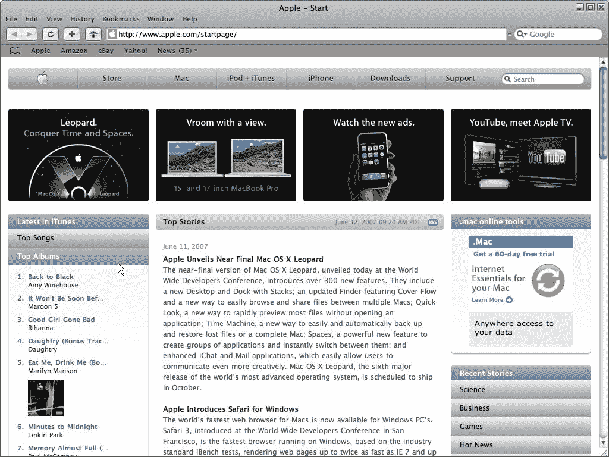
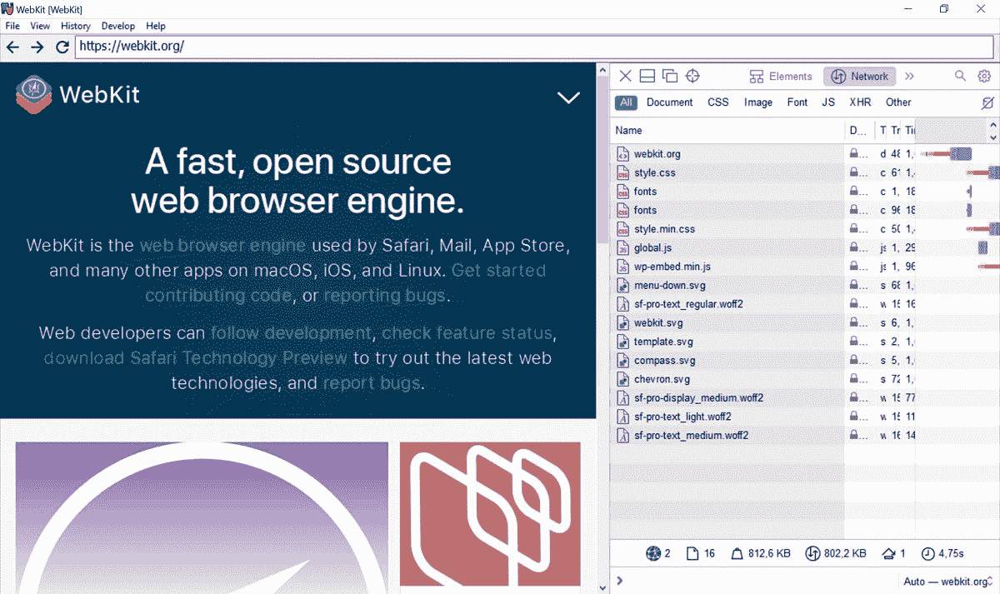

# 苹果是时候为 Windows 带回 Safari 了

> 原文：<https://www.xda-developers.com/safari-for-windows-editorial/>

在过去的十年里，网络发生了巨大的变化:网络应用变得越来越普遍，算法现在决定了大多数人如何接收内容，全球又有数十亿人联网。谷歌在那段时间也变得更加主导，偶尔会以有害的方式利用其在网络生态系统和浏览器市场的地位。关于如何控制谷歌的权力，有很多想法，但我的想法是:苹果应该让其 Safari 网络浏览器再次跨平台。

你可能还记得，Safari 网络浏览器曾经适用于[微软 Windows](https://www.xda-developers.com/windows-11/) ，此外还有 [macOS](https://www.xda-developers.com/macos-monterey) (当时被称为 Mac OS X)以及后来的 iPhone 和 iPad。苹果多年前就停止了 Safari 的 Windows 版本，但现在恢复它可能是谷歌 Chromium 引擎浏览器的最佳替代品之一。

## Windows 实验

2003 年 1 月，苹果发布了 Safari 网络浏览器的第一个版本，作为 Mac OS X 10.3“Panther”的一部分，此前微软与苹果达成了为期五年的协议，将 Internet Explorer 作为 Mac 上的默认网络浏览器。尽管网络浏览器是新的，但驱动它的技术却不是——苹果使用 KHTML 渲染引擎作为起点来创建 Safari 的 WebKit 引擎。

该浏览器最初是 Mac 专用的，但当 2007 年第一代 iPhone 问世时，它也包括 Safari。同年发布了第一个 Windows 版本 Safari 3.0。然而，Windows 版本*并没有那么好*。最初的版本包括一个针对任意代码执行的安全漏洞，该漏洞在不到 48 小时后作为 Safari 3.0.1 进行了修补。

 <picture></picture> 

Safari 3.0 Beta on Windows (Credit: NetworkComputing.com)

Safari 在 Windows 上也感觉格格不入。苹果在 Safari 端口上使用了与 iTunes for Windows [相同(糟糕)的兼容层，在 Windows 上重新实现了 Cocoa UI、Core Foundation、核心图形库——类似于在 Linux 上使用 Wine 运行 Windows 程序。结果是应用程序可以工作，但与其主机操作系统的设计或预期功能不匹配。](http://www.roughlydrafted.com/RD/RDM.Tech.Q2.07/A35C23B9-BD22-4478-BC30-4111CFC360B5.html)

尽管存在早期的安全问题和可疑的软件架构，Safari for Windows 还是一款不错的网络浏览器。苹果公司宣称它的速度是 Internet Explorer 7 的“两倍”，是 Mozilla Firefox 2 的 1.6 倍(两者都是在配备 Windows XP 和 1GB 内存的英特尔酷睿 2 双核系统上测试的)。

苹果继续为 Mac 和 Windows 发布新的 Safari 版本，但当 Safari 6.0 在 2012 年作为 Mac OS X Mountain Lion 的一部分发布时，Windows 版本缺失了。苹果后来悄悄地删除了 Windows Safari 的下载链接，似乎标志着这款浏览器在非苹果平台上的存在结束了。最终版本是 2010 年发布的 Safari 5.1。

## 东山再起

快进到 2022 年，网络生态系统在很多方面都变得更好，但也远非完美。Web 应用程序比以往任何时候都更加强大，这主要归功于谷歌 Chrome 中新 API 的加速开发。然而，谷歌现在对网络浏览器有着重大影响——Opera 和微软放弃了开发自己的渲染引擎，转而使用谷歌的 Chromium 引擎，而 Brave 和 Vivaldi 等新竞争者从一开始就使用 Chromium。

基于 Chromium 的网络浏览器有能力改变浏览器界面和引擎，所以谷歌不能完全控制它们的工作方式。然而，远离谷歌上游代码的每一步都使得采用 Chromium 的新变化更加耗时。这使得开发变得更加繁重，更重要的是，它会导致 Chromium 中的安全补丁需要很长时间才能在一些浏览器中出现。一个例子是 Android 的 Kiwi 浏览器，它在 Chrome 77 上停留了一年多。

网络需要权力的平衡来保持开放的平台

网络需要权力的平衡来保持一个开放的平台，但现在只有两个主要的网络浏览器不是基于 Chromium: Mozilla Firefox 和 Apple Safari。Firefox 使用自己的 Gecko 引擎，该引擎近年来在性能上有了显著提高。Safari 仍然使用 WebKit，虽然 Safari 的受欢迎程度很大程度上是因为它是 iOS 和 iPadOS 上唯一允许的真正浏览器，但它近年来也成为了 Chrome 的有力竞争对手。苹果将 Safari 带到更多平台可能会从 Chrome 和其他基于 Chrome 的浏览器那里夺回一些市场份额。

Christian Schaefer 在去年的一篇博客文章中指出，苹果仍然支持 Windows 上的 WebKit 引擎，主要用于嵌入式应用程序和微软的 Playright 测试平台。新版本甚至放弃了基于 iTunes 的怪物兼容层，支持跨平台的 Cairo 图形库。然而，这些 WebKit 的最小版本仅用于站点测试，不具备常见的浏览器功能，如同步、标签或扩展。

 <picture></picture> 

Playwright WebKit on Windows (Credit: Christian Schaefer)

苹果将 Safari 移植到更多平台上，除了开放网络的健康之外，还有其他原因。有数百万人使用 iPhone 或 iPad，但使用 Windows PCs 而不是 Mac 电脑。将 Safari 保留给 macOS 可能会鼓励其中一些人购买 Mac，但 Windows(和其他平台)上的 Safari 也可能会成为亏损的领导者，鼓励未来购买苹果硬件——就像近 20 年前最初的 Windows iTunes 一样。这也是谷歌的一个策略:Chromebook 的销售得益于 Chrome 浏览器的流行，这本身只会让 Chrome 更受欢迎。

苹果近年来也更愿意将自己的服务和应用带到其他平台上，即便是以一种有限的方式。iCloud 适用于 Windows，iCloud web 应用程序可以在大多数 web 浏览器中运行，FaceTime 通话现在可以通过非苹果设备的链接加入，Apple Music 有一个 Android 应用程序，等等。

Safari for Windows 可能会给 Chromium 浏览器带来一些急需的竞争，同时也为苹果设备带来更多互联体验。苹果仍然有很多理由不这么做，但我当然希望看到它发生。