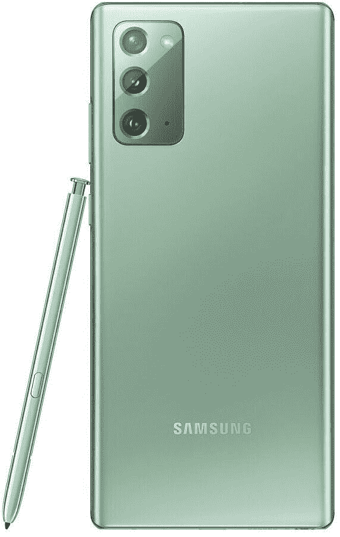

# 三星承诺为其旗舰产品更新 3 代 Android 操作系统

> 原文：<https://www.xda-developers.com/samsung-3-years-android-os-updates-galaxy-note-20/>

三星刚刚结束了今年的第二次 [Galaxy Unpacked](https://www.xda-developers.com/tag/galaxy-unpacked/) 活动，这家韩国科技公司发布了 5 款新设备: [Galaxy Note 20 和 Note 20 Ultra](https://www.xda-developers.com/samsung-galaxy-note-20/) 、 [Galaxy Tab S7 和 Tab S7+](https://www.xda-developers.com/samsung-galaxy-tab-s7/) 、 [Galaxy Z Fold 2](https://www.xda-developers.com/samsung-galaxy-z-fold-2/) 、 [Galaxy Buds Live](https://www.xda-developers.com/samsung-galaxy-buds-live/) 和 [Galaxy Watch 3](https://www.xda-developers.com/samsung-galaxy-watch-3/) 。最激动人心的消息之一(至少对我们来说)来自活动结束时，三星表示他们承诺从发布之日起为“多达 3 代”提供操作系统更新。这意味着三星将最终提供与谷歌为其 Pixel 手机提供的相同水平的软件支持。

Galaxy Note 20、Galaxy Tab S7 和 Galaxy Z Fold 2 都将搭载三星基于 Android 10 的 One UI 2.5 软件。在今天宣布之前，我们预计三星会将这些设备分别升级到 Android 11 和 Android 12。现在，我们可以期待三星一直提供到 Android 13 的更新。三星没有明确指出这项政策适用于哪些设备，但我们可以假设他们指的是他们今天宣布的所有新的移动 Android 设备。

事实上，右下角的小字文本提到，这项政策适用于 Galaxy S10 以后的旗舰机型，因此这意味着它将包括 Galaxy S10 系列、Galaxy Note 10 系列、Galaxy S20 系列、新的 [Galaxy Z Flip 5G](https://www.xda-developers.com/samsung-galaxy-z-flip-5g-qualcomm-snapdragon-865-plus-launch/) ，可能还包括第一代 Galaxy Z Flip 和 Galaxy Fold。三星告诉 [*The Verge*](https://www.theverge.com/2020/8/5/21355777/samsung-android-os-update-promise-galaxy-phones-3-generations) 该政策适用于 S、N 和 Z 系列，但 A 系列设备将只接受支持“直到硬件允许”(这可能意味着他们不会提供超过高通为其 bsp 提供的支持，至少在一系列采用骁龙芯片组的设备上。)

三星使用了“一代”而不是“几年”这个词，因为前者消除了歧义:Android 版本不会在每年的同一时间发布，三星不想让客户混淆他们的设备是否会获得特定的更新。如果三星选择说“几年”，那么一些用户可能会觉得购买一款在下一次 Android 大更新之前发布的设备是被欺骗了。

谷歌预计将于 9 月 8 日为其 Pixel 智能手机[发布稳定版 Android 11，但我们不知道三星将于何时发布自己的 Android 11 版本。三星对用户界面进行了大量修改，并在谷歌的 Android 版本上添加了许多功能，因此预计他们需要一些时间来准备下一个版本的 One UI。不过，至少在安全更新方面，三星已经在](https://www.xda-developers.com/stable-android-11-update-september-8th/)[为其最新的旗舰和中档智能手机提供最新的安全补丁级别](https://www.xda-developers.com/august-2020-security-update-google-pixel-samsung-galaxy-s20-more-samsung-phones/)方面变得相当迅速。

我们赞扬三星的这一决定，因为他们现在在 Android 设备制造商中因其软件支持水平而脱颖而出。希望这将迫使其他设备制造商提供类似水平的支持。我们没有理由为一部新的智能手机支付超过 1000 美元，并期待任何更低的价格。

 <picture></picture> 

Samsung Galaxy Note 20

##### 三星 Galaxy Note 20

释放 Galaxy Note 20 安全知识的 3 代更新，将保持您的手机更长时间的安全，稳定和可用。在 8 月 20 日发布日预购！

**[三星 Galaxy Note 20 论坛](https://forum.xda-developers.com/galaxy-note-20)**| |**|[三星 Galaxy Note 20 Ultra 论坛](https://forum.xda-developers.com/galaxy-note-20-ultra)**

**[三星 Galaxy Z Fold 2 论坛](https://forum.xda-developers.com/samsung-galaxy-z-fold-2)| |****[三星 Galaxy Tab S7 / Tab S7+论坛](https://forum.xda-developers.com/galaxy-tab-s7)**

*本文于美国东部时间下午 12:53 更新，提供了有关三星更新承诺的更多信息。更新了标题，将“年”改为“代”，因为这是三星在演示中使用的措辞。*