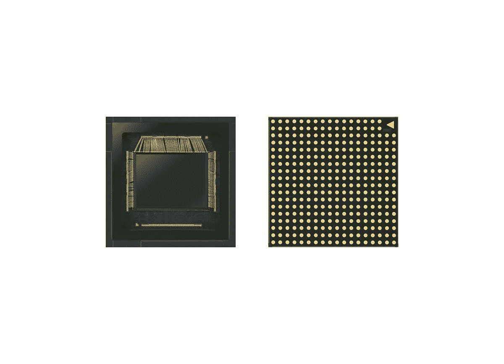

# 三星宣布推出具有双像素自动对焦功能的 50MP ISOCELL GN1 图像传感器

> 原文：<https://www.xda-developers.com/samsung-50mp-isocell-gn1-image-sensor-dual-pixel-autofocus/>

在过去的几年里，智能手机相机中的高像素传感器已经成为常态。华为以 40MP 传感器领先。然后索尼在 2018 年推出了 [48MP IMX586](https://www.xda-developers.com/sonys-imx586-48mp-smartphone-camera/) Quad Bayer 传感器。该传感器最终被 2019 年大量流行的中端、旗舰和廉价智能手机所使用。随着第一批 6400 万像素传感器分别以 [ISOCELL GW1](https://www.xda-developers.com/samsung-64mp-isocell-sensor-smartphones/) 和索尼 IMX686 的形式发布，无情的前进继续着。然而，三星并不满足于此。该公司去年宣布了 [108MP ISOCELL Bright HMX](https://www.xda-developers.com/samsung-isocell-bright-hmx-108mp-camera-sensor-xiaomi/) ，这是一个新的突破，最终被用于小米 Note 10。略微升级的 ISOCELL HM1 出现在该公司的 halo 旗舰产品 Galaxy S20 Ultra 中。在智能手机相机行业，主要的相机传感器现在都来自索尼或三星，它们已经成为市场上的两大主导者。现在，三星宣布了另一种用于智能手机的高像素传感器，即 50MP ISOCELL GN1。有趣的是，它有双像素自动对焦。下面我们来深究一下这个新闻公告的背景。

虽然由于像素宁滨，高百万像素传感器似乎是一个双赢的局面，但事情并非如此简单。首先，48MP 或 64MP 或 108MP 传感器没有 48MP/64MP/108MP 的彩色分辨率。这种传感器的 Quad Bayer 和[Nona Bayer](https://www.xda-developers.com/samsung-galaxy-s20-ultra-108mp-nona-binning-camera/)(Galaxy S20 Ultra)滤镜意味着，在现实中，48MP Quad Bayer 传感器只有 12MP 的彩色分辨率。这些传感器可以产生高分辨率的四路拜耳输出，但结果通常不是最佳的，因为它们不应该这样使用。相反，设备制造商仍然继续在默认情况下以像素分级的 12MP/16MP/27MP 模式出货他们的手机。这些传感器的另一个主要问题是，到目前为止，这些高像素传感器还不支持双像素 PDAF。除了 [LG V60 ThinQ](https://www.xda-developers.com/lg-v60-thinq-dual-screen-review/) 之外，所有配备如此高像素传感器的手机都依赖于传统的相位检测自动对焦(PDAF)。

双像素 PDAF 是一种广泛用于 DSLRs 和无反光镜相机的自动对焦技术，首次引入智能手机相机是在三星 Galaxy S7 上。它意味着图像传感器使用传感器中 100%的像素进行自动对焦，显著提高了对焦系统的速度和精度。Galaxy S20 Ultra 配备了 108MP 高分辨率传感器，实际上是自 Galaxy S7 以来第一款缺少双像素 PDAF 系统的三星旗舰产品，这一点显而易见。在发布会上，评测人员指出了 Galaxy S20 Ultra 在速度和准确性方面的各种自动对焦问题([评测](https://www.xda-developers.com/samsung-galaxy-s20-ultra-review/))，这些问题阻碍了用户体验。三星随后推出了一个更新来解决这些问题，但反馈仍然保持不变，即它们是否已经完全修复。此外，由于 PDAF 与双像素 PDAF 的硬件特性，S20 Ultra 的 108MP 传感器永远无法像标准 Galaxy S20 和 Galaxy S20+的传统 12MP 主传感器那样快速或准确地聚焦([评论](https://www.xda-developers.com/samsung-galaxy-s20-plus-review/))。很明显，高百万像素传感器需要结合双像素自动对焦，以防止未来手机中出现任何此类问题，而 50MP ISOCELL GN1 正是如此。

 <picture></picture> 

Samsung 50MP ISOCELL GN1 image sensor

50MP ISOCELL GN1 是一款大型 1/1.3 英寸传感器，具有相对较大的 1.2μm 像素。该传感器的尺寸实际上略大于 Galaxy S20 Ultra 中使用的 108MP ISOCELL HM1，其光学格式为 1/1.33”。三星指出，GN1 是该公司第一款同时提供双像素和 Tetracell 技术的图像传感器。据称，更大的像素尺寸将图像传感器的性能带到了一个“新的水平”，结合了更高的感光度，以获得更好的弱光照片和 DSLR 级别的自动对焦速度。据该公司称，双像素技术创造了 1 亿个相位检测光电二极管，用于快速自动对焦和光信息，可转换为高达 1 亿像素。

需要在细节丰富的高分辨率照片和更大的像素之间取得平衡，以便在弱光环境下拍摄更好的照片。ISOCELL GN1 在这两者之间取得了相对务实的平衡，就像 OPPO Find X2 Pro 中的索尼 imx 689([第一印象](https://www.xda-developers.com/oppo-find-x2-pro-hands-on-first-impressions/))和一加 8 Pro ( [评测](https://www.xda-developers.com/oneplus-8-pro-review-never-settle-on-hardware/))。根据三星的说法，它可以同时满足多种需求。

GN1 有 1 亿名 PDAF 特工。三星的双像素技术将两个光电二极管并排放置在一个像素内，可以从不同角度接收光线进行相位检测。凭借传感器的所有活动像素作为自动对焦代理，GN1 可以从每个角落即时检测并聚焦到一个物体上，即使在光线较暗的情况下。在静态图像捕捉期间，通过合并像素内两个光电二极管的输出来创建单像素输出。该公司还提供了一种软件算法，可以从每个光电二极管中获取光线信息，以产生堪比 100MP 的图像分辨率(这似乎是超分辨率的一个例子)。

ISOCELL GN1 自然也采用了三星的 Tetracell 技术，这只是该公司对 4 合 1 像素宁滨的名称(另一方面，Galaxy S20 Ultra 使用 9 合 1 像素宁滨，即诺娜宁滨)。三星将其描述为一种像素合并技术，可以提高像素捕捉和处理更多光线的能力。它的“有效像素大小”增加了一倍，达到 2.4μm，感光度增加了四倍，可以拍摄明亮的 1250 万像素照片。感光度的提高是因为 1.2μm 的像素尺寸，高于其他高分辨率图像传感器的标准 0.8μm 像素尺寸。另一方面，IMX689 的像素尺寸略小，为 1.12μm，而 [OmniVision OV48C](https://www.xda-developers.com/omnivision-ov48c-new-48mp-image-sensor/) 的像素尺寸也是 1.2μm，但它还没有进入任何手机摄像头。即使在极低的光线下，GN1 也能产生明亮清晰的效果。

该传感器还带有 Smart-ISO，可智能选择最佳 ISO。此外，它还具有实时 HDR，使其能够在多次同时曝光中捕捉场景，以及基于陀螺仪的 EIS，以拍摄运动中的清晰照片和视频。GN1 支持最高 8K 分辨率、30fps 的视频录制。值得注意的是，这比 Galaxy S20 Ultra 的 108MP 传感器的能力更高，后者仅支持 24fps 的 8K。

三星表示，ISOCELL GN1 本月开始大规模生产。然而，根据著名泄密者 Ice Universe 的说法，这种传感器不会被用于即将到来的 Galaxy Note 20+。Galaxy Note 20+ [将采用与 Galaxy S20 Ultra 相同的 108MP HM1 传感器](https://twitter.com/UniverseIce/status/1262585882864783360)，但它将添加一个新的传感器，以完全解决对焦问题。理论上，这应该可以防止自动对焦的问题。50MP 传感器也不会出现在 [Galaxy Fold 2](https://www.xda-developers.com/samsung-galaxy-fold-2-may-have-an-s-pen-120hz-display-512gb-storage/) 上。不过，预计它最终会出现在三星的高端手机中。

* * *

**来源:[三星](https://news.samsung.com/global/samsung-introduces-1-2%CE%BCm-50mp-isocell-gn1-with-faster-auto-focusing-and-brighter-images%5C)**