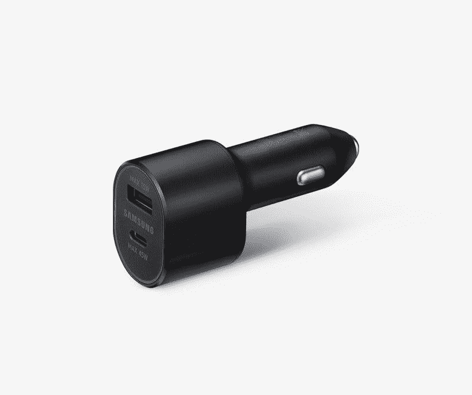

# 新的三星配件包括两个 25W 快速充电电源组和一个 45W 车载充电器

> 原文：<https://www.xda-developers.com/samsung-accessories-25w-fast-charging-power-banks-45w-car-charger/>

周二对科技界来说是一个重要的日子。三星 Unpacked 2020 是一个全面的事件，因为三星推出了旗舰产品 [Galaxy S20 系列](https://www.xda-developers.com/samsung-galaxy-s20-specs-features-pricing-availability/)，翻盖 [Galaxy Z Flip](https://www.xda-developers.com/samsung-galaxy-z-flip-launch-specs-features-pricing-availability/) 垂直折叠手机，以及 [Galaxy Buds+](https://www.xda-developers.com/samsung-galaxy-buds-plus-wireless-earbuds-launch/) 无线耳塞。Galaxy S20 系列包括标准 Galaxy S20、Galaxy S20+和 Galaxy S20 Ultra。这些手机有很多升级，并配有超高的价格标签。三星的 Galaxy S 系列是世界上最畅销的 Android 旗舰手机系列，他们有一整套配件生态系统。三星 Galaxy S20 5G 系列在美国的第一方配件页面现已上线。伴随着许多案例，它详细介绍了三星悄悄推出了两个 25W 快充 10,000mAh 银行和一个 45W 车载充电器。

第一个电源组叫做 25W 无线电池组，电池容量为 10,000mAh。它有两个 USB Type-C 端口，用户可以通过 USB Type-C 功率传输标准(USB-C PD)以高达 25W 的充电速度为手机充电。它还具有 Qi 无线充电功能，用户可以将手机、智能手表或无线耳机放在电源组上充电。这个几个月前获得了 FCC 认证。

第二个电源组被命名为 25W 电池组。它还具有 10，000mAh 的电池容量，兼容手机的有线充电速度为 25W。这里的主要区别是它没有无线充电，同时保留了两个 USB Type-C 端口。三星提到，当两个设备同时充电时，两个电源组不支持 25W 快速充电。

 <picture></picture> 

Samsung 45W wall charger

第三个新品是一个 45W 的车载充电器。它被命名为“双超快速汽车充电器。”它有两个 USB 端口。第一个是输出 15W 功率的标准 USB Type-A 口，另一个是输出 45W 的 USB Type-C 口。它带有一根 5A USB Type-C 到 USB Type-C 电缆，这是 45W 充电所必需的。三星的 45W 壁式充电器捆绑了同样的电缆。三星 Galaxy S20 Ultra 是该公司继[三星 Galaxy Note 10+](https://www.xda-developers.com/samsung-galaxy-note-10-review/) 之后第二款支持 45W 快速充电的手机，但三星没有在包装盒中捆绑 45W 充电器。相反，必须单独购买，因为盒子里只有一个 25W 的充电器，与标准的 Galaxy S20 和 Galaxy S20+相同。后两款手机都支持 25W 快充，而不是 45W。45W 车载充电器将在 25W 为 25W 充电速度的设备充电，因为这是这些手机支持的最大功率。

三星在 Galaxy Note 10+和 Galaxy S20 Ultra 上依靠 USB Type-C Power Delivery 3.0 进行 45W 充电。这并不是一帆风顺的，因为许多用户报告说，Galaxy Note 10+拒绝用许多第三方充电器以甚至 25W 的功率充电。如果用户想要在三星手机上快速充电，PPS 支持是绝对必须的。至少该公司没有像许多中国竞争对手那样使用专有的快速充电标准。

三星尚未透露这两种电源组或壁式充电器的定价和供货细节。预计这一信息将在 Galaxy S20 的官方发布日期(美国时间 3 月 6 日)前后发布，这是合理的。考虑到三星强大的设备生态系统的历史，这些配件预计将被广泛使用。

* * *

**Via: SamMobile ( [1](https://www.sammobile.com/news/samsung-25w-fast-charging-power-banks-listed/) ， [2](https://www.sammobile.com/news/samsung-new-car-charger-supports-45w-super-fast-charging/) )**